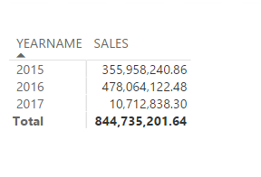
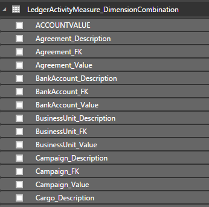
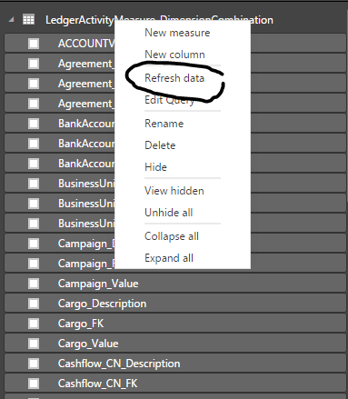
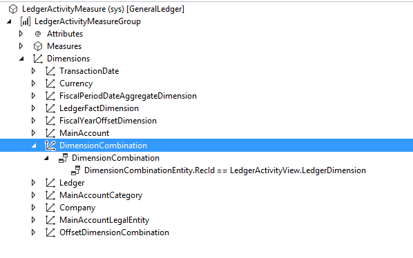
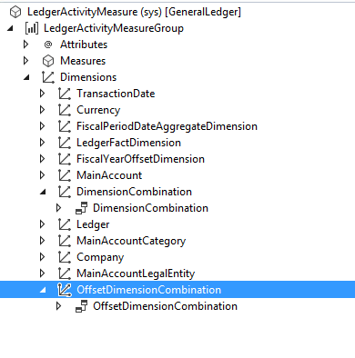

---
# required metadata

title: Add financial dimensions to aggregate measurements
description: This topic explains how a power user can include financial dimensions in ready-made Power BI reports.
author: MilindaV2 
manager: AnnBe
ms.date: 06/16/2017
ms.topic: article
ms.prod: 
ms.service: dynamics-ax-platform
ms.technology: 

# optional metadata

# ms.search.form:  
audience: Developer, IT Pro
# ms.devlang: 
ms.reviewer: sericks
ms.search.scope:  Operations, Platform
# ms.tgt_pltfrm: 
# ms.custom: 
ms.assetid: c04e0a7b-1747-4b88-b729-fd820f8ab600
ms.search.region: Global 
# ms.search.industry: 
ms.author: milindav
ms.search.validFrom: 2017-06-30
ms.dyn365.ops.version: Platform update 8
---

# Add financial dimensions to aggregate measurements

[!include[banner](../includes/banner.md)]

This feature lets power users include financial dimensions in ready-made Microsoft Power BI reports. Power users can also create new Power BI reports that use financial dimensions.

Financial dimensions are user-defined configuration data that enables the ledger chart of accounts to retain additional information. By adding financial dimensions, a user can configure additional data fields that will be included with the chart of accounts and financial reports. Therefore, the ledger chart of accounts can be sliced and diced based on those fields. This feature provides powerful financial reporting. For example, you can explore ledger data by using the new financial dimensions that you've added. Because no financial dimensions are included in the ready-made Power BI reports when they are released, you must include these additional fields to the ready-made reports. 

After financial dimension fields are included in the report, you can share the report with other users. Those other users can modify existing visuals, such as charts, by including all or some of the financial dimension fields.

> [!NOTE]
> This feature is available in Microsoft Dynamics 365 for Finance and Operations, Enterprise edition (July 2017). Platform update 8 or later is also required. 

## How does this feature work?

The Entity store is an operational data warehouse that lets power users create reports. Whenever the Entity store is updated, all available financial dimensions are included in it. We will look at an example from the **Ledger Activity** aggregate measurement that contains General ledger journal-level details.

The following list shows some of the tables are filled in the Entity store when it's updated. Tables that have changed are bold.

- LedgerActivityMeasure\_LedgerActivityMeasureGroup
- LedgerActivityMeasure\_TransactionDate
- LedgerActivityMeasure\_Currency
- LedgerActivityMeasure\_FiscalPeriodDateAggregtateDimension
- LedgerActivityMeasure\_LedgerFactDimension
- LedgerActivityMeasure\_FiscalYearOffsetDimension
- LedgerActivityMeasure\_MainAccount
- **LedgerActivityMeasure\_DimensionCombination**
- LedgerActivityMeasure\_Ledger
- LedgerActivityMeasure\_MainAccountCategory
- LedgerActivityMeasure\_Company
- LedgerActivityMeasure\_MainAccountLegalEntity
- **LedgerActivityMeasure\_Agreement**
- **LedgerActivityMeasure\_BankAccount**
- **LedgerActivityMeasure\_BusinessUnit**
- **LedgerActivityMeasure\_Campaign**
- **LedgerActivityMeasure\_Cargo**
- **LedgerActivityMeasure\_Cargo\_CN**

Notice that, for each financial dimension that is defined in your system, you might see a corresponding table in the Entity store.

If you examine the LedgerActivityMeasure\_DimensionCombination table, you will notice that the list of fields has been expanded and now includes additional fields. Each new field corresponds to a financial dimension. For an example, here are some of the additional fields:

- Agreement\_FK
- Agreement\_Description
- Agreement\_Value
- BankAccount\_FK
- BankAccount\_Description
- BankAccount\_Value
- BusinessUnit\_FK
- BusinessUnit\_Description
- BusinessUnit\_Value

If a user defines a new financial dimension that is named **vendor**, when the Entity store is updated, a new table is added that is named LedgerActivityMeasure\_Vendor.

The LedgerActivityMeasure\_DimensionCombination table will also contain the following new set of fields:

- Vendor\_FK
- Vendor\_Description
- Vendor\_Value

## How a Power BI report author can create reports that use financial dimensions

A business user can create a new report that uses financial dimensions by using Power BI desktop. Existing reports that use financial dimensions can be updated so that they include additional fields.

In this example, we will use Power BI desktop to create a report that uses the Ledger Activity measure group. 

1. In a development environment, connect to the Entity store database by using Power BI desktop. 
2. Select the following tables:

    - LedgerActivityMeasure\_LedgerActivityMeasureGroup
    - LedgerActivityMeasure\_FiscalPeriodDateAggregtateDimension
    - LedgerActivityMeasure\_DimensionCombination

3. Use the **Manage relationships** option in Power BI desktop to define the following relationships between table fields:

    - Define a join between **LedgerActivityMeasure\_LedgerActivityMeasureGroup.LEDGERDIMENSION** and **LedgerActivityMeasure\_DimensionCombination.DIMENTIONCOMBINATIONRECID**.
    - Define a join between **LedgerActivityMeasure\_LedgerActivityMeasureGroup.LEDGERGREGORIANDATEID** and **LedgerActivityMeasure\_FiscalPeriodDateAggregateDimension.LEDGERPERIODGREGORIANDATEID**.

4. Create a matrix report that uses the **Sales** and **YearName** fields. The report should resemble the following example.

    

    Next, we will add financial dimension values.

5. In the list of fields in Power BI desktop, expand the **LedgerActivityMeasure\_DimensionCombination** table. You will see that the list of dimension fields is expanded into table fields, as shown here.

    

6. Include the **BusinessUnit\_Description** field in the report. Your report should now show sales by business unit, as shown in the following example.

    

    Notice that you have the **BusinessUnit\_description** field and the **BusinessUnit\_Value** field. The value field lets you to get a numerical value that can be used to sort columns.

7. Define a new financial dimension, and update the Entity store. 
8. When the update is completed, right-click the **LedgerActivityMeasure\_DimensionCombination** table, and then select **Refresh data**. Notice that the new financial dimension that you defined is reflected in the list of fields that are available for reporting.

    

9. You can include the new financial dimension fields in the report.

### Creating reports that use expanded Financial dimension tables

As we discussed earlier, new tables were created in the Entity store. Each financial dimension field is also added to a new table. The new tables contain individual fields for the name, value, and description.

Notice that the new tables contain a key that can be used to join them with the LedgerActivityMeasure\_DimensionCombination table that is used to create the report. If you want to use fields from these additional tables, just include them in the report and relate them by using the keys.

1. Open the report that you created earlier.

    We will now add a financial dimension table to the report.

2. In Power BI desktop, click **Recent Sources** on the menu, and then select the **AXDW** data connection. Table navigator is shown.
3. Select the **LedgerActivityMeasure\_LegalEntity** table for the report.

    > [!NOTE]
    > If you're using a development or demo environment, you see this table because **LegalEntity** is a financial dimension that is defined in demo data. If you're working with your own data, the tables that you see will correspond to financial dimensions that you've defined.

    We will now relate the selected table to existing tables in the report. 

4. In the report, open the **Manage relationships** dialog box.
5. Join **LedgerActivityMeasure\_DimensionCombination.LegalEntity\_FK** to **LedgerActivityMeasure\_LegalEntity.KEY\_**.

If you select a different dimension table in step 3, you must relate the corresponding **FieldName\_FK** field from the combination table to the **KEY\_** field in the dimension table.

## How a developer can enable financial dimensions

Before users can see expanded financial dimensions in the Entity store, a developer must enable the use of financial dimensions in aggregate measurements. As a best practice, financial dimensions should be included when you model any aggregate measurement that involves financial data. To include financial dimensions, create an aggregate dimension that is based on “financial dimension tables.” As we saw earlier, an aggregate dimension that you create by using financial dimension tables will be expanded at runtime.

### What are financial dimension tables?

Financial dimension tables are base tables that contain financial dimension data. Examples include **DimensionAttributeValueCombination** and **DimensionAttributeValueSet**.

If you use a table, a view, or an entity that is based on those two tables, the fields of the aggregate dimension will be expanded at runtime.

Consider the following example from the LedgerActivityMeasure aggregate measurement.

DimensionCombination is an aggregate dimension that is modeled by using the DimensionAttributeValueCombination base table. In this case, the developer has referenced the aggregate dimension by using the LedgerActivityMeasureGroup measure group.

At runtime, new dimension fields are added (that is, the DimensionCombination table is expanded) as new financial dimensions are defined in the system.

### Creating role-playing financial dimensions

When you report by using ledger data, you might require reporting on primary accounts and offset accounts. For an example, if a ledger transaction involves the transfer of an amount from one account to another account, the primary account is the "from" account, whereas the offset account is the "to" account. This pattern is known as the *role-playing dimensions* pattern.

Both primary accounts and offset accounts must be associated with transaction data. Therefore, you must expand financial dimension fields of both primary accounts and offset accounts. We will now see how you can meet this requirement. Consider the following example.

We have modeled two dimension references for LedgerActivityMeaureGroup. The first reference, DimensionCombination, is joined by using the **LedgerDimension** field. We saw this pattern earlier in this topic.

The second reference, OffsetDimensionCombination, is another reference to the same dimension. We have reused the DimensionCombination aggregate dimension and given it a new name. In the second case, we can join by using the **OffsetLedgerDimension** field.

At runtime, the system will expand both these dimensions with additional fields. Therefore, you can report on primary and offset dimension fields.
