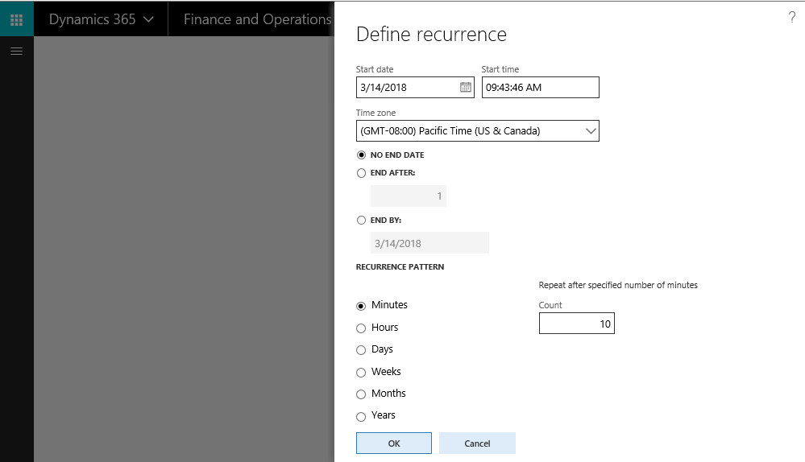

---
# required metadata

title: Schedule updates of entity store models
description: This topic explains how system administrators can use built-in tools to manage the frequency at which data models are refreshed with the latest updates available in the transactional database.
author: tjvass
manager: AnnBe
ms.date: 04/09/2018
ms.topic: article
ms.prod: 
ms.service: dynamics-ax-applications
ms.technology: 

# optional metadata

# ms.search.form:
# ROBOTS:
audience: IT Pro
# ms.devlang: 
ms.reviewer: sericks
ms.search.scope: Operations
# ms.tgt_pltfrm: 
# ms.custom:
ms.search.region: Global
# ms.search.industry:
ms.author: tjvass
ms.search.validFrom: 2018-3-31 
ms.dyn365.ops.version: Platform update 16
---

# Schedule updates of entity store models

[!include[banner](../includes/banner.md)]

[!include[banner](../includes/pre-release.md)] 

## Refreshing models
System administrators use built-in tools to manage the frequency at which data models are refreshed with the latest updates available in the transactional database. Microsoft Dynamics 365 for Finance and Operations supports both a full and incremental synchronization strategy that can be used to keep models up to date.

- **Full synchronization** – Existing data in the entity store is deleted and the entire model is materialized during the background process.
- **Incremental refresh** – Updates to the transactional database, including object deletes, are synchronized with the entity store models.
	
It is the responsibility of the system administrator to manage the entity store model refresh schedule based on the unique needs of the deployment. The built-in tooling provides detailed messaging based on run-time analysis of the models to help identify cases where a full-synchronization is required to ensure the entire model is synchronized with the latest updates available in the Finance and Operations transactional database.

## Administrator tasks
This section describes the activities associated with managing entity store models using the built-in administration tools.

### Perform a full synchronization
The first thing you'll want to do after bringing the environment online is identify the models which are required by the application. It's incorrect to assume that all of the models are necessary, as this can waste time updating unused models. See [Power BI content](https://docs.microsoft.com/en-us/dynamics365/unified-operations/dev-itpro/analytics/power-bi-home-page) in Finance and Operations to familiarize yourself with the out-of-box solutions available in the application suite.

> [!IMPORTANT]
> We strongly recommend that you **disable** synchronization for both the **ProjecCostRevenueAnalysis** and **VendPaymentBIMeasure** entity store models. Both of these application models have been flagged for poor performance during the synchronization process.

Use the following steps to perform a full-synchronization of the entity store for the models used by the application.

1. Go to the **Entity Store** page (**System administration** \> **Setup** \> **Entity Store**).
2. Select the entity store models related to all areas accessible in the application.
3. Click **Refresh** at the top of the page.
4. Click **OK** in the **Configure refresh** dialog box.
	
This process may take up to an hour depending on the size and breadth of the application deployment. You can track the status of the background synchronization process by visiting the batch jobs area and searching for jobs with a description like **Deploy measurement**. When the process is complete, you can begin to use the entity store model for embedded analytical workspaces and reports, as well as reports hosted on PowerBI.com.

### Start the incremental refresh processing engine
After performing the initial full-synchronization process, you're ready to begin adjusting the model refresh schedule to accommodate users' interactions with reports and embedded analytics. The incremental refresh engine runs in the background using a system batch job. System administrators must start the process to utilize the incremental refresh option. Use the following steps to turn on the incremental refresh engine for models.

1. Go to the **Change based alerts** page (**System administration** \> **Setup** \> **Alerts** \> **Change based alerts**).
2. Click **Run in the background** to expand the batch job options.
3. Set the **Batch processing** option to **True** to enable the background processing.
4. Click **Recurrence** text to establish the processing frequency.
5. Select the **No end date** option.
6. Under **Recurrence pattern**, select the processing frequency.

> [!NOTE]
> We recommend that you start with a recurring pattern of **10 minutes** and refine as needed. Try to avoid selecting a frequency that doesn't allow for an incremental process to complete.

Here's a screenshot of the dialog box that is used to manage the frequency of the incremental refresh processing engine.

After the processing engine is initialized, you're ready to begin enabling select models for incremental refresh.

#### Activate the incremental refresh option for selected models
After performing the initial full-synchronization process, you're ready to begin adjusting the model refresh schedule to better accommodate users' interactions with reports and embedded analytics. You'll want to enable the incremental refresh option for models that contain data that must be refreshed more often than once a day. For starters, it's best to keep the default latency settings used to trigger a full-synchronization. Use the following steps to turn on the incremental refresh option for a given entity store model.

1. Go to the **Entity Store** page.
2. Select the entity store models related to all areas accessible in the application.
3. Click the **Edit** button at the top of the page.
4. Select the check box in the **Incremental updates** column to enable the incremental refresh option.

> [!NOTE]
> The incremental refresh option is **not** available for all application entity store models. Enhancements are being delivered as part of platform updates to expand the aggregate model patterns supported by the incremental refresh process. An alert icon is placed next to models the still require a full synchronization. Provide a lower latency for any models that are used to deliver near real-time results.
