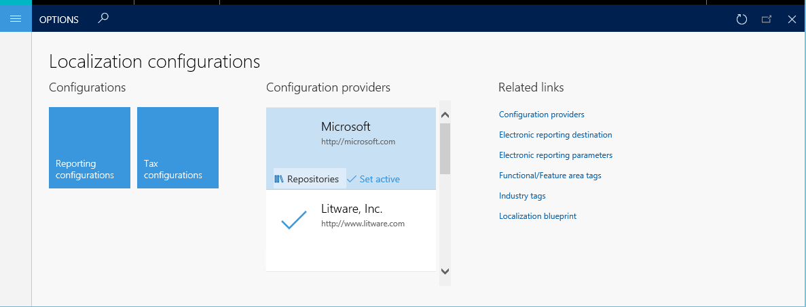
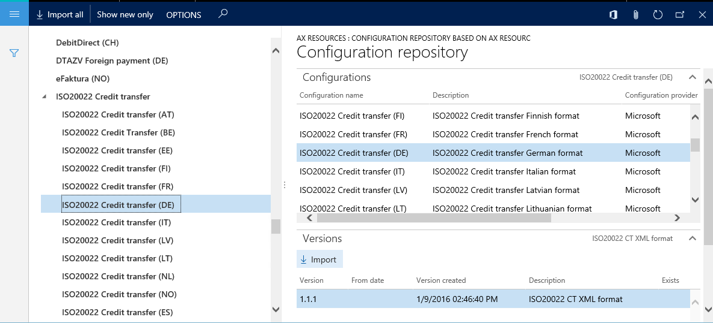

---
# required metadata

title: Download Electronic reporting configurations from Lifecycle Services
description: This topic explains how to download Electronic reporting (ER) configurations from Microsoft Dynamics Lifecycle Services (LCS).
author: NickSelin
manager: AnnBe
ms.date: 06/20/2017
ms.topic: article
ms.prod: 
ms.service: dynamics-ax-platform
ms.technology: 

# optional metadata

ms.search.form: ERSolutionImport, ERWorkspace
# ROBOTS: 
audience: Application User, IT Pro
# ms.devlang: 
ms.reviewer: kfend
ms.search.scope: Core, Operations
# ms.tgt_pltfrm: 
ms.custom: 105843
ms.assetid: dc44dea2-22ce-401e-98b9-d289e0e2825b
ms.search.region: Global
# ms.search.industry: 
ms.author: nselin
ms.search.validFrom: 2016-05-31
ms.dyn365.ops.version: AX 7.0.1

---

# Download Electronic reporting configurations from Lifecycle Services

[!include [banner](../includes/banner.md)]

This topic explains how to download Electronic reporting (ER) configurations from Microsoft Dynamics Lifecycle Services (LCS).

This tutorial guides you through the process of downloading the newest version of Electronic reporting (ER) configurations from Microsoft Dynamics Lifecycle Services (LCS).

1.  Sign in to Finance and Operations by using one of the following roles:
    -   Electronic reporting developer
    -   Electronic reporting functional consultant
    -   System administrator

2.  Go to **Organization administration** &gt; **Electronic reporting**.
3.  In the **Configuration providers** section, select the **Microsoft** tile.
4.  On the **Microsoft** tile, click **Repositories**. 
5.  On the **Configuration repositories** page, in the grid, select the existing repository of the **LCS** type. If this repository doesn't appear in the grid, follow these steps:
    1.  Click **Add** to add a new repository.
    2.  Select **LCS** as the repository type.
    3.  Click **Create repository**.
    4. If prompted, follow the authorization instructions.
    5.  Enter a name and description for the repository.
    6.  Click **OK** to confirm the new repository entry.
    7.  In the grid, select the new repository of the **LCS** type.

6.  Click **Open** to view the list of ER configurations for the selected repository. 
7.  In the configurations tree in the left pane, select the ER configuration that you require.
8.  On the **Versions** FastTab, select the required version of the selected ER configuration.
9.  Click **Import** to download the selected version from LCS to the current Finance and Operations instance. **Note:** The **Import** button is unavailable for ER configuration versions that are already present in the current Finance and Operations instance. 

**Note:** Depending on the ER settings, configurations are validated after they are imported. You might be notified about any inconsistency issues that are discovered. You must resolve those issues before you can use the imported configuration version. For more information, see the list of related articles for this topic.

Additional resources
--------

[Electronic reporting overview](general-electronic-reporting.md)

