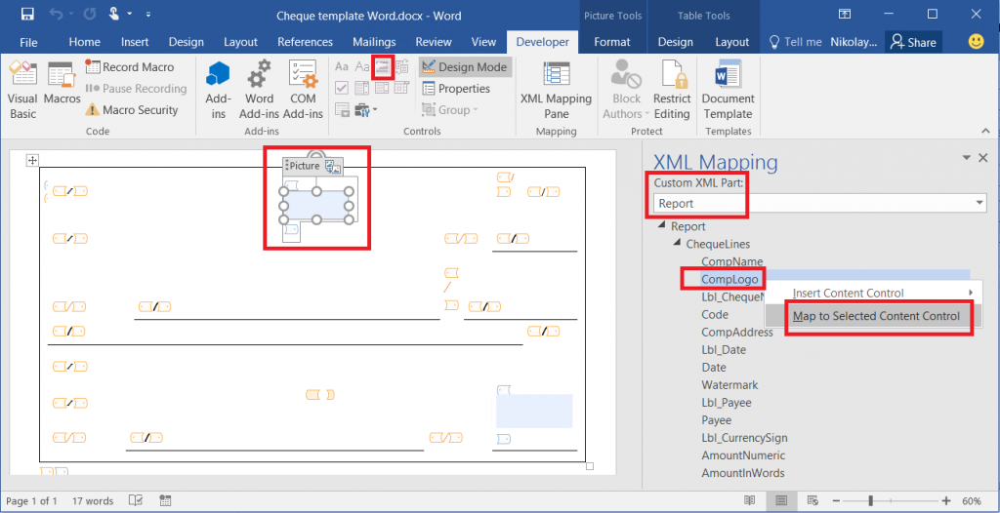
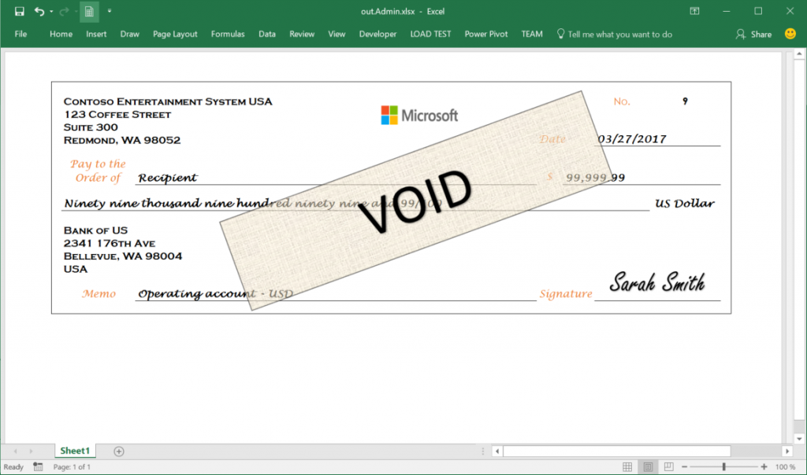

---
# required metadata

title: Embed images and shapes in business documents that are generated by using the Electronic reporting tool 
description: This topic explains how to use the Electronic reporting (ER) tool to generate business documents in Microsoft Excel and Microsoft Word format that have embedded images and shapes.
author: kfend
manager: AnnBe
ms.date: 06/20/2017
ms.topic: article
ms.prod: 
ms.service: dynamics-ax-platform
ms.technology: 

# optional metadata

ms.search.form: 
# ROBOTS: 
audience: Developer
# ms.devlang: 
ms.reviewer: sericks
ms.search.scope: Operations
# ms.tgt_pltfrm: 
ms.custom: 27621
ms.assetid:
ms.search.region: Global
# ms.search.industry: 
ms.author: mrolecki
ms.search.validFrom: 2016-02-28
ms.dyn365.ops.version: July 2017 update

---

# Embed images and shapes in business documents that are generated by using the Electronic reporting tool
You can use the Electronic reporting (ER) tool to design reports that you can run to generate required electronic documents. You can use Microsoft Excel or Microsoft Word documents to specify the layout of a report. The ER Operations designer lets you attach the Excel or Word document as a template for the report. The named elements in the attached template are associated with the format elements of the ER report. Format elements of the report are bound to data sources. These elements specify the data that will be entered, at run time, in the documents that are generated.

This new functionality goes beyond existing ER capabilities for creating documents in Microsoft Office formats. For more information, play the following task guides. You can find these task guides under the 7.5.4.3 Acquire/Develop IT service/solution components (10677) business process.

- ER Design a configuration for generating reports in OPENXML format
- ER Design a configuration for generating reports in Microsoft WORD format

## Embed an image in an Excel document
First, you must add a placeholder for the image in an Excel document. Open an Excel workbook, and add a picture as a placeholder for the image that you will add later. Then use the ER tool to add a new ER format configuration to include the report that you’re designing. Attach the Excel workbook as a template for the format of the report, and then import the content of the workbook into the ER format. The format definition will be created automatically. The image placeholder that you added will be included in the ER format definition as a **CELL** element.

**Note:** You can manually specify the format definition instead of importing it. When you save your changes, the format will be validated.

Next, bind the **CELL** element of the ER format to the field from the format’s data source that provides the picture’s data in binary format at run time. When an ER data model is used as a format’s data source, the data type of the field must be **CONTAINER**. Currently, an ER data model field that has the **CONTAINER** data type can be bound to several types of data sources that return images in binary format. You can access a field in a data table and a file that is attached to the data table’s record by using the Document management framework.

**Important:** If you want to fill the image placeholder in the document that you’re creating by using the Excel template, the ER format must contain the **CELL** element that refers to the named picture element in the Excel template. Otherwise, no image placeholder will appear in the report’s output. If the binding of a **CELL** element returns no data at run time, the document that is generated will show the image placeholder from the template. To hide an image in the document that you’re generating, define a **CELL** element, and specify that the **Enabling** expression should return a value of **FALSE**.

**Important:** In the Excel template, use a unique name for every element. These elements include pictures and cells. If you duplicate an element name, the content of the report that is generated will be ambiguous and confusing.

## Embed a shape in an Excel document
First, you must add a placeholder for the shape in an Excel document. Open an Excel workbook, and select **Shape**, **Text box**, or **WordArt** as a placeholder for the shape. Then use the ER tool to add a new ER format configuration to include the report that you’re designing. Attach the Excel workbook as a template for the format of the report, and then import the content of the workbook into the ER format. The format definition will be created automatically. The shape placeholder that you added will be included in the ER format definition as a **CELL** element that refers to the named Excel shape element.

**Note:** You can manually specify the format definition instead of importing it. When you save your changes, the format will be validated.

Next, bind the **CELL** element in the ER format to the field from the format’s data source that provides the data at run time. This data can be converted to a text string. When the **CELL** element in the ER format refers to a shape element in the Excel template that supports text, the text that is provided through this binding at run time will be shown in a shape in the document that is generated.

**Important:** If you want to use the Excel template that includes the shape placeholder to generate a new document, the ER format must contain a **CELL** element that refers to the Excel shape element. Otherwise, no shape placeholder will appear in the report’s output. If the binding of a **CELL** element that refers to the named Excel shape element returns no data at run time, the document that is generated will show the text of the shape placeholder from the Excel template. To hide a shape in the document that you’re generating, define a **CELL** element that refers to the named Excel shape element, and specify that the **Enabling** expression should return a value of **FALSE**.

**Important:** In the Excel template, use a unique name for every element. These elements include shapes and cells. If you duplicate an element name, the content of the report that is generated will be ambiguous and confusing.

## Embed an image in a Word document
**Important:** You can reuse the ER format that uses an Excel template to create documents that include embedded images. In the ER format, make sure that a name is specified for the **CELL** element that refers to a named picture element in Excel, and that is bound to a data source that returns a picture at run time.

First, you must configure the Word document’s layout. Use the **Picture Content** control to create a placeholder for the embedded image. To access this control, you must first make the **Developer** tab visible on the Word Ribbon.

Next, delete the Excel template from the ER format, and attach the Word template document. Update the reference to the template, and save your changes. The structure of the current ER format is saved to the Word template as a new custom XML part that is named **Report**.

Next, save the Word template for the current ER format to your local computer. Open the template, and open the **XML Mapping** pane. Find the custom XML part that is named **Report**, and then point to the **CELL** element in the ER report that is bound to a data source that returns an image in binary format. Map this XML part’s item to the selected **Picture Content** control, and save your changes.

Finally, delete the Word template from the ER format, and attach the Word document that includes the mapped custom XML parts. Update the format reference to the template, and save the changes that you made to this ER format.

## More information
To become familiar with the details of this feature, play the set of task guides, **ER Make reports in MS Office formats with embedded images**. These task guides show how you can embed the images of a company logo and an authorized person’s signature in the payment checks that are generated by using the ER tool in Excel and Word documents.

The following table lists the files that are required in order to complete the **ER Make reports in MS Office formats with embedded images** task guides. [Download](https://go.microsoft.com/fwlink/?linkid=851448) and save the files to your local computer.

| Description                                          | File name                   |
|------------------------------------------------------|-----------------------------|
| ER data model configuration                          | Model for cheques.xml       |
| ER format configuration                              | Cheques printing format.xml |
| Company logo image                                   | Company logo.png            |
| Signature image                                      | Signature image.png         |
| Alternative signature image                          | Signature image 2.png       |
| Microsoft Word template for printing payment checks  | Cheque template Word.docx   |
| Microsoft Excel template for printing payment checks | Cheque template.xlsx        |

The following graphic provides an example of the test printout for a payment check that is generated from the Excel template. 

