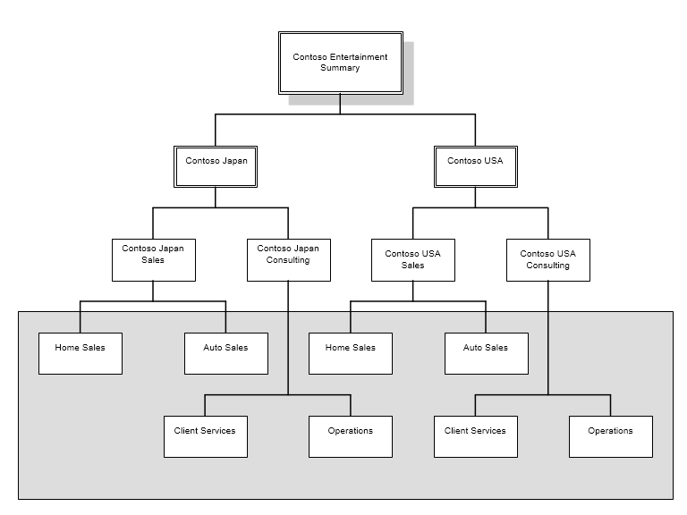
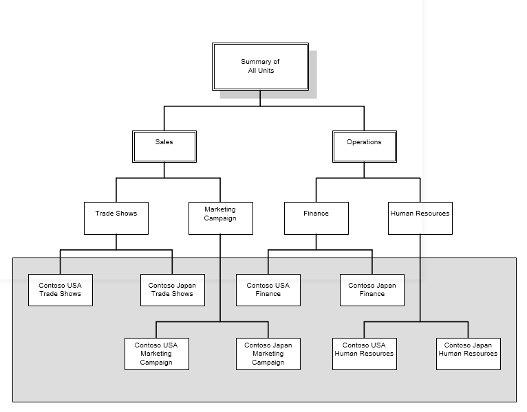
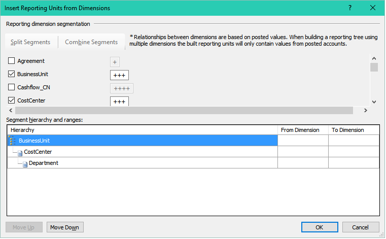
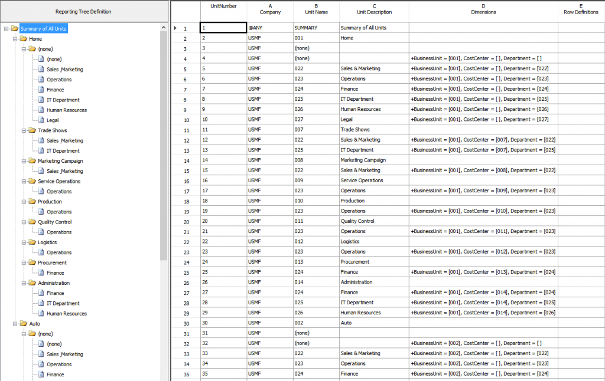

---
# required metadata

title: Reporting tree definitions in financial reports
description: This article provides information about reporting tree definitions. A reporting tree definition is a report component, or building block, that helps define the structure and hierarchy of your organization.
author: twheeloc
manager: AnnBe
ms.date: 01/11/2018
ms.topic: article
ms.prod: 
ms.service: dynamics-ax-platform
ms.technology: 

# optional metadata

ms.search.form: FinancialReports
# ROBOTS: 
audience: Application User
# ms.devlang: 
ms.reviewer: twheeloc
ms.search.scope: Core, Operations
# ms.tgt_pltfrm: 
ms.custom: 57592
ms.assetid: 747faa47-9a23-4277-bc11-8d0a1267c3a4
ms.search.region: Global
# ms.search.industry: 
ms.author: aolson
ms.search.validFrom: 2016-05-31
ms.dyn365.ops.version: AX 7.0.1

---

# Reporting tree definitions in financial reports

[!INCLUDE [banner](../includes/banner.md)]

This article provides information about reporting tree definitions. A reporting tree definition is a report component, or building block, that helps define the structure and hierarchy of your organization.

Financial reporting supports flexible reporting, so that you can easily make changes as your business structure changes. Reports are built from various components, or building blocks. One of these building blocks is a reporting tree definition. A reporting tree definition helps define the structure and hierarchy of your organization. It's a cross-dimensional hierarchical structure that is based on the dimensional relationships in your financial data. It provides information at the reporting unit level and at a summary level for all units in the tree. Reporting tree definitions can be combined with column definitions and report definitions, to create a building block group that can be used by multiple companies. A reporting unit is used for each box in an organizational chart. A reporting unit can be an individual department from the financial data, or it can be a higher-level summary unit that combines information from other reporting units. For a report definition that includes a reporting tree, one report is generated for each reporting unit and for the summary level. All these reports use the row and column definitions that are specified in the report definition, unless the report definition specifies that the reporting tree from the row definition should be used. Row and column definitions are important components in the design and functionality of financial reports. Reporting trees increase the power of the components and support flexible reporting as the business structure changes. Financial reports that aren't based on a reporting tree use only some of the capabilities of financial reporting. You can use multiple reporting tree definitions together with the same row and column definitions to view your organization’s data in various ways.

## Reporting tree best practices
Before you create a reporting tree, consider the following best practices:

-   First determine which reporting dimensions your legal entity or company requires.
-   Consider how you've set up your structure, and then draw an organizational chart of your company. The organizational chart will help you visualize how to group the reporting units into one or more reporting trees.
-   Start with the lowest available level of detail, such as the departments and projects that are defined in the financial data. Add as many boxes to the level of detail as are require to show higher-level divisions or regions. Each box represents a potential reporting unit in any reporting tree that you create.
-   You must also consider the best way to build your trees. You can use an automated build process to generate a reporting tree, or you can manually create a reporting tree. It's important that you understand both methods before you design your trees.
-   You can use the reporting units that are defined in your financial data system to add reporting units to the reporting tree definition.

## Create multiple reporting trees
You can create an unlimited number of reporting trees to view your organization’s data in various ways. Each reporting tree can contain any combination of departments and summary units. A report definition can contain a link to only one reporting tree at a time. By rearranging the structure of the reporting units, you can create different reporting trees. You can then use the same row and column definitions for each reporting tree. In this manner, you can quickly create different financial report layouts. If you create multiple reporting trees, you can print a series of financial statements each month that analyze and present your company's operations in various ways. For more information, see the examples of reporting unit structures at the end of this article.

## Create a reporting tree definition
A reporting tree definition contains the columns that are described in the following table.

| Reporting tree column |                                                                                                                                                                                                                                                                                                                                                                                                                                                                                                                                                                                                                           Description                                                                                                                                                                                                                                                                                                                                                                                                                                                                                                                                                                                                                            |
|-----------------------|------------------------------------------------------------------------------------------------------------------------------------------------------------------------------------------------------------------------------------------------------------------------------------------------------------------------------------------------------------------------------------------------------------------------------------------------------------------------------------------------------------------------------------------------------------------------------------------------------------------------------------------------------------------------------------------------------------------------------------------------------------------------------------------------------------------------------------------------------------------------------------------------------------------------------------------------------------------------------------------------------------------------------------------------------------------------------------------------------------------------------------------------------------------------------------------------------------------------------------------------------------------|
|        Company        |                                                                                                                                                                                                                                                                                                                                                                                                                                                                                                          The company name for the reporting unit. The <strong>@ANY</strong> value, which is typically assigned only to the summary level, enables the reporting tree to be used for all companies. All child branches have a company assigned to them.                                                                                                                                                                                                                                                                                                                                                                                                                                                                                                           |
|       Unit Name       |                                                                                                                                                                                                                                                                                                                                                                                                                                                                                                                                   The code that identifies this reporting unit in the graphical reporting tree. Be sure to establish a unique coding system that is consistent, and that will be easy for users to understand.                                                                                                                                                                                                                                                                                                                                                                                                                                                                                                                                   |
|   Unit Description    |                                                                                                                                                                                                                                                                                                                                                                                                                                                        The reporting unit title appears in the report header or footer if you enter <strong>UnitDesc</strong> as a code on the <strong>Headers and Footers</strong> tab of the report definition. The title appears in the report row description if you enter <strong>UnitDesc</strong> in the <strong>Description</strong> cell of the row definition.                                                                                                                                                                                                                                                                                                                                                                                                                                                         |
|      Dimensions       |                                                                                                                                                                                                                                                                                                                                                                      A reporting unit that draws information directly from the financial data. It defines the logical positioning and lengths for the account and related segments. Every reporting unit row must have a dimension in this column. You can also put a dimension in a summary unit row (for example, for expenses that are directly related to that unit). If you enter a dimension in a summary unit row, accounts that are used in parent units should not be used in child units. Otherwise, amounts might be duplicated.                                                                                                                                                                                                                                                                                                                                                                      |
|    Row Definitions    |                                                                                                                                                                                                                                                                                                                                                                                        The name of the row definition for the reporting unit. The same row definition is used for each unit of the reporting tree. When you generate a report, this row definition is used for each reporting unit. The row definition can include multiple financial dimensions links. If a row definition is specified in the reporting tree, select the <strong>Use row definition from reporting tree</strong> check box on the <strong>Report</strong> tab of the report definition.                                                                                                                                                                                                                                                                                                                                                                                        |
|       Row link        |                                                                                                                                                                                                                                                                                                                                                                                                                                                                                                                                                            The row link to use for the reporting unit. Row links are defined for the row definition to identify the financial dimensions to link to.                                                                                                                                                                                                                                                                                                                                                                                                                                                                                                                                                             |
|     External link     |                                                                                                                                                                                                                                                                                                                                                                                                                                                                                                                                                                   The row link to use for this reporting unit. Row links are defined for the row definition to identify the report to link to.                                                                                                                                                                                                                                                                                                                                                                                                                                                                                                                                                                   |
|     External file     |                                                                                                                                                                                                                                                                                                                                                                                                                                                                                                                                                                                              The file path of the financial reporting worksheet to pull data from.                                                                                                                                                                                                                                                                                                                                                                                                                                                                                                                                                                                               |
|     Page Options      |                                                                                                                                                                                                                                                                                                                                                                                                                                                                                                                                                                       This column controls whether the details for the reporting unit are suppressed when the report is viewed or printed.                                                                                                                                                                                                                                                                                                                                                                                                                                                                                                                                                                       |
|       Rollup %        | The percentage of the reporting unit that should be allocated to the parent unit. The percentage that you enter in this column applies to each row of the row definition before the value in the row is added to the parent report. For example, if a child unit must be divided evenly between two departments, the amounts in each row are multiplied by 50 percent before the value is added to the department report. One reporting unit can't have two parent units. To allocate the amounts from a reporting unit to two parent units, create another reporting unit that has the same dimension to roll up the additional 50 percent. Enter whole percentages without a decimal point. For example, <strong>25</strong> represents 25-percent allocation to the parent. If you include a decimal point (<strong>.25</strong>), 0.25 percent is allocated to the parent. To use a percentage that is less than 1 percent, use the <strong>Allow Rollup &lt;1%</strong> option in the report definition. This option is on the <strong>Additional Options</strong> tab in the <strong>Report Settings</strong> dialog box. You access this dialog box from the <strong>Other</strong> button on the <strong>Settings</strong> tab of the report definition. |
|     Unit Security     |                                                                                                                                                                                                                                                                                                                                                                                                                                                                                                                                                                                   Restrictions on the users and groups that can access the information for the reporting unit.                                                                                                                                                                                                                                                                                                                                                                                                                                                                                                                                                                                   |
|    Additional Text    |                                                                                                                                                                                                                                                                                                                                                                                                                                                                                                                                                                                                               Text that is included on the report.                                                                                                                                                                                                                                                                                                                                                                                                                                                                                                                                                                                                               |

To create a reporting tree definition, follow these steps.

1.  Open Report Designer.
2.  Click **File** &gt; **New** &gt; **Reporting Tree Definition**.
3.  Click **Edit** &gt; **Insert Reporting Units from Dimensions**.
4.  In the **Insert Reporting Units from Dimensions** dialog box, select the check box for each dimension to include in the reporting tree. The **Insert Reporting Units from Dimensions** dialog box contains the following sections.

    | Section                          | Description                                                                                                                                                                                                                                                                                                                                                                                                                                                    |
    |----------------------------------|----------------------------------------------------------------------------------------------------------------------------------------------------------------------------------------------------------------------------------------------------------------------------------------------------------------------------------------------------------------------------------------------------------------------------------------------------------------|
    | Reporting dimension segmentation | Use the **Split Segments** and **Combine Segments** buttons to change the number and length of segments. **Note:** You can combine only segments that you've split. To combine multiple dimensions, use wildcard characters in your dimension values.                                                                                                                                                                                                          |
    | Include/Character position       | This section lists the dimensions that are defined in the financial data and shows the number of characters in the longest value that is defined for each dimension. Select the check box for a dimension to include that dimension in the reporting tree hierarchy.                                                                                                                                                                                           |
    | Segment hierarchy and ranges     | This section shows the dimension hierarchy. You can move the dimensions in the list to change their reporting order. In the **From Dimension** and **To Dimension** fields, you can specify a range of values in each dimension. If you don't specify a range, all dimension values are inserted into the reporting tree. **Note:** If you're using more than one dimension, only dimension combinations that have been posted to are returned in the results. |

    For a screen shot that shows an example of the **Insert Reporting Units from Dimensions** dialog box, see the "Example of the Insert Reporting Units from Dimensions dialog box" section later in this article.
5.  To create additional segments (for example, by split one segment into two shorter segments), click the correct location in a **Character position** field, and then click **Split Segments**.
6.  To merge two segments into one segment, click in either of the segment boxes to merge, and then click **Combine Segments**.
7.  The hierarchy defines how dimensions report to each other and the range for each dimension. To change the hierarchy of the dimensions, in the **Segment hierarchy and ranges** area, select the dimension to move, and then click **Move Up** or **Move Down**.
8.  To specify a range of dimension values to add to the new reporting tree, in the **Segment hierarchy and ranges** area, follow these steps:
    1.  In the **From Dimension** field for that dimension, enter the first value in the range.
    2.  In the **To Dimension** field, enter the last value in the range.

9.  Repeat steps 7 through 8 for each dimension in the **Segment hierarchy and ranges** area.
10. After you've finished defining how your reporting units should be brought into the new reporting tree, click **OK**.
11. Click **File** &gt; **Save** to save the reporting tree. Enter a unique name and description for the reporting tree, and then click **OK**.

### Open an existing reporting tree definition

1.  In Report Designer, click **Reporting Tree Definitions** in the navigation pane.
2.  Double-click a name in the reporting tree list to open it.
3.  To view any building blocks that are associated with the reporting tree, right-click the reporting tree definition, and then select **Associations**.

### Roll up data in a reporting tree

When you use a reporting tree, you can aggregate amounts from child reporting units at the level of the parent reporting unit. This aggregation is known as rolling up the data. The following rules are used to roll up amounts to parent units in a reporting tree:

-   In a reporting tree, child units must contain dimensions, unless the reporting tree is a single-level tree. Parent units usually don't contain dimensions in a reporting tree. **Note:** If you specify dimensions for both child units and parent units, you might cause duplication of data in the report.
-   Reporting units that contain dimensions in the reporting tree correspond to the dimensions that are used in the row and column definitions. The combination of dimensions determines the amounts that are returned for that unit. For example, in example 2 later in this article, lines 6 and 7 return values only for departments 00 and 01, respectively.
-   The amounts for parent reporting units that don't contain dimensions in the reporting tree are determined from the child unit report and roll up the amount to the specified parent unit. For example, if the parent unit (see Contoso USA in example 2 of data roll-up examples) has two child units (022 and 023) and doesn't contain dimensions, a report is generated for each child and the parent. The parent total is the sum of the two child amounts.

### Manage reporting units

Each reporting tree definition is displayed in unique views. There is a graphical view that shows the parent/child hierarchy and a worksheet view that shows the specific information for each reporting unit. The graphical view and the worksheet view are connected. When you select a reporting unit in one view, it's also selected in the other view. You can build cross-dimensional hierarchies that are based on the dimensional relationships in the financial data. When you create a reporting tree definition, you can use the same row definitions multiple times, regardless of whether you're generating a departmental income statement or a consolidated summary income statement. The dimensions that are defined in the row definition can be combined with dimensions in the reporting tree definition to provide various views of your organization's performance.

### Reporting unit structure

The following types of reporting units are used in financial reporting:

-   A detail unit draws information directly from the financial data, from an Excel worksheet, or from another financial reporting worksheet.
-   A summary unit summarizes data from lower-level units.

A parent reporting unit is a summary unit that aggregates summarized information from a detail unit. A summary unit can be both a detail unit and a summary unit. Therefore, a summary unit can draw information from a lower-level unit, the financial data, or an Excel worksheet. A parent unit can be the child unit of a higher-level parent unit. A child reporting unit can be a detail unit that pulls information directly from the financial data or an Excel worksheet. A child reporting unit can also be an intermediate summary unit. In other words, it can be the parent unit of a lower-level unit and also the child unit of a higher-level summary unit. In the most common scenario for reporting units, parent units have a blank cell in the **Dimensions** column, and child units have links to specific or wildcard dimension combinations.

### Organize reporting units

You can rearrange the organizational structure of a reporting tree definition by moving reporting units in the graphical view. You can also promote reporting units to a higher level in the reporting tree or demote them to a lower level.

1.  In Report Designer, open the reporting tree definition to modify.
2.  In the graphical view of the reporting tree definition, select a reporting unit.
3.  Drag the unit to a new position. Alternatively, right-click the unit, and then select **Promote Reporting Unit** or **Demote Reporting Unit**.
4.  Click **File** &gt; **Save** to save your changes.

### Add text about a reporting unit

An additional text entry is a static text string of up to 255 characters that adds information to the reporting tree definition. For example, the additional text can be a short company description. You can create up to ten additional text entries for each reporting unit in a reporting tree definition. The additional text appears on the report for the reporting unit that the text is assigned to. You can add text entries from the **Description** column of the row definition, and from the **Headers and Footers** tab in the report definition.

1.  In Report Designer, open the reporting tree definition to modify.
2.  Double-click the **Additional Text** cell for the reporting unit row.
3.  In the **Additional Text** dialog box, in the first empty row, enter the text. The first row that contains text is referenced as UnitText1, regardless of its position in the **Additional Text** dialog box.
4.  To add more text entries for this reporting unit, enter the text in an empty row.
5.  Click **OK**.

### Remove additional text from a reporting unit

1.  In Report Designer, open the reporting tree definition to modify.
2.  Double-click the **Additional Text** cell for the reporting unit row.
3.  In the **Additional Text** dialog box, select the entry to remove, and then click **Clear**. Alternatively, right-click the entry, and then select **Cut**.
4.  Click **OK**.

### Restrict access to a reporting unit

You can prevent certain users and groups from accessing a reporting unit. You can also define restrictions so that they apply to child reporting units of the reporting unit.

1.  In Report Designer, open the reporting tree definition to modify.
2.  Double-click the **Unit Security** cell for the reporting unit row to restrict access to.
3.  In the **Unit Security** dialog box, click **Users and Groups**.
4.  Select the users or groups that should have access to the reporting unit, and then click **OK**.
5.  To restrict access to child reporting units, select the **Add security to children reporting units** check box.
6.  Click **OK**.

### Remove access to a reporting unit

1.  In Report Designer, open the reporting tree definition to modify.
2.  Double-click the **Unit Security** cell for the reporting unit row to remove access to.
3.  In the **Unit Security** dialog box, select a name, and then click **Remove**.
4.  Click **OK**.

### Link to reports

After you've created a **report** column in the row definition and specified the report to include on the report, you must update the reporting tree with the linked column and the information about the report. A report can be imported into any unit in the reporting tree.

### Identify the report in a reporting tree

1.  In Report Designer, open the reporting tree definition to modify.
2.  In the **Row Definitions** column, the information in the cells is based on the information for the selected row, because the same row definition must be used in all units of the reporting tree. Double-click the **Row Definitions** cell, and then select the row definition that contains information about the report.
3.  In the **Worksheet Link** cell for a reporting unit, select the link name that corresponds to the report.
4.  In the **Workbook or Report Path** cell for a reporting unit, enter the name of the report, or browse to select the report.
5.  To specify a worksheet in a report, enter the name of the worksheet in the **Worksheet name** cell.
6.  Repeat steps 3 through 5 for each reporting unit that should receive data from a report. To prevent incorrect data from appearing in your report, make sure that the correct report names appear in the corresponding unit of the reporting tree.

## Examples
### Reporting unit structure – Example 1

Here is the structure of the reporting units in the following reporting tree:

-   The Contoso Japan reporting unit is a parent unit of the Contoso Japan Sales and Contoso Japan Consulting child units.
-   The Contoso Japan Sales division unit is both a child unit of the Contoso Japan unit, and a parent unit of the Home Sales and Auto Sales units.
-   The lowest-level detail reporting units (Home Sales, Auto Sales, Client Services, and Operations) represent departments in the financial data. These reporting units are in the shaded area of the diagram.
-   The higher-level summary units summarize information from the detail units.

### Reporting unit structure – Example 2

In the following diagram, the reporting tree has an organizational structure that is divided by business function. 

### Example of the Insert Reporting Units from Dimensions dialog box

The following illustration shows an example of the **Insert Reporting Units from Dimensions** dialog box. For this example, the results will return the combination of business units, cost centers, and departments.  The resulting reporting tree definition is sorted by business unit, then by cost center, and then by department. The dimension for the fifth reporting unit is **Business Unit = \[001\], Cost Center =\[\], Department = \[022\]**, and identifies a reporting unit for accounts that are specific to business unit 001 and department 022. 

### Examples of data roll-up

The following examples show possible information that is used in a reporting tree definition for data that is rolled up.

#### Example 1

#### Example 2

# See also

[Financial reporting](financial-reporting-intro.md)

