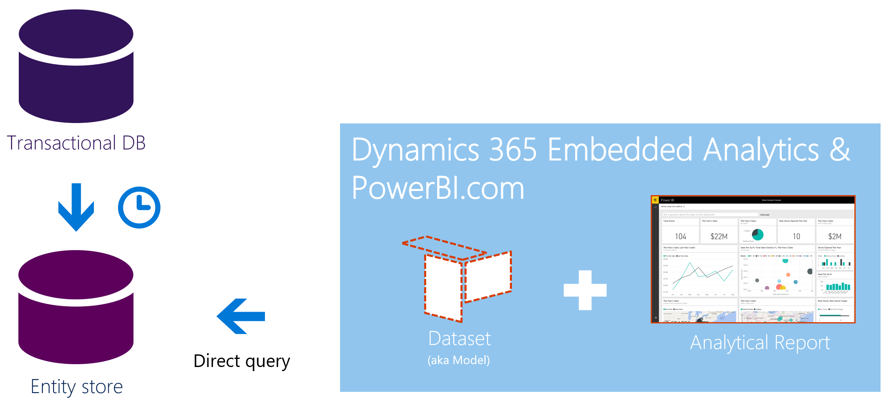
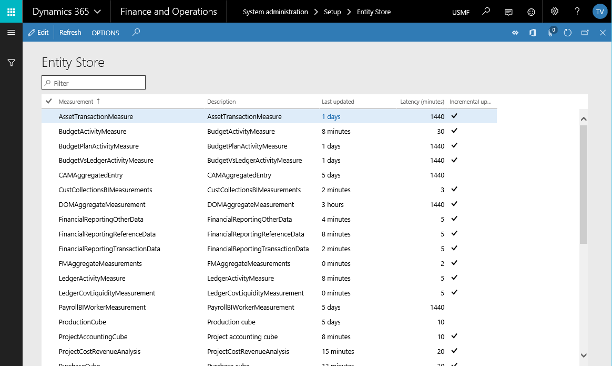

---
# required metadata

title: Incremental refresh option for Entity Store models
description: TBD
author: tjvass
manager: AnnBe
ms.date: 03/09/2018
ms.topic: article
ms.prod: 
ms.service: dynamics-ax-applications
ms.technology: 

# optional metadata

# ms.search.form:
# ROBOTS:
audience: IT Pro
# ms.devlang: 
ms.reviewer: sericks
ms.search.scope: Operations
# ms.tgt_pltfrm: 
# ms.custom:
ms.search.region: Global
# ms.search.industry:
ms.author: tjvass
ms.search.validFrom: 2018-3-31 
ms.dyn365.ops.version: Platform update 16
---

# Incremental refresh option for Entity Store models

[!include[banner](../includes/banner.md)]

TARGET: **Platform Update 16 or later**

## What are Entity Store models?
Entity Store models are used in Dynamics 365 for Finance & Operations to provide customers with accessible views of business data for Reporting & Analytical tools.  Delivered as part of the application metadata, Entity Store models can be described as collections of data sets and relationships associated with a particular business process.  Models often contain a root data source and a series of related views that are useful in analyzing business activities and performance.  

For instance, Customer Collections and Leger Activity are examples of business processes that require an Entity Store model for reporting and analytics.  Defined in the application metadata using Aggregate Measurements, these views are specifically designed to be the source of data for high volume consumers like visualizations embedded in dashboards and electronic reports.

The Entity Store functions as an intermediary cache between the Dynamics 365 for Finance & Operations transactional database and the published end-points consumed by external reporting and analytical tooling like Excel or Power BI.com.  Entity Store ensures the memory consumed by reporting and monitoring solutions do not interfere with resources supporting active user sessions in the web application.  The Cloud hosted service automatically updates Entity Store models based on a refresh schedule managed by the System Administrator.  

The following diagram illustrates the management of business data for Reporting & Analytics tooling.
 

Within the Customer Collections model you'll find a group of data sets which provide views relevant to a person within a business responsible for tracking outstanding customer debts.  These views provide advanced calculations and aggregations known  as **Measures** that you can pivot on category fields referred to as **Dimensions**.  For instance, the Application Suite provides an Entity Store model for Customer Collections agents that can be used to conveniently visualize the Aging buckets of customers.  Because the data is sourced from the Entity Store, reports bound to this model are able to visualize the data in milli-seconds instead of waiting minutes for the data to be processed in the transactional database. [Click here](https://docs.microsoft.com/en-us/dynamics365/unified-operations/dev-itpro/analytics/power-bi-integration-entity-store) for more information on the Entity Store.

## Managing Entity Store models
By channeling reporting and analytical queries to the Entity Store, system administrators have the opportunity to control the time accuracy of the data.  For some data analytics scenarios, data that is delayed by 5-10 minutes will be acceptable by users.  However, for other types of reporting experiences the information customers require near real-time results.  It's important to understand time requirements associated with the data before rolling out an Entity Store model refresh strategy.

System administrators use built-in tooling to manage the frequency at which Entity Store models are refreshed with the latest updates available in the transactional database.  Dynamics 365 for Finance & Operations supports both a Full and Incremental synchronization strategy that may be used in concert to keep models up-to-date.

- **Full-Synchronization** - existing data in the Entity Store is deleted and the entire model is calculated and materialized during the background process
- **Incremental refresh** - updates to transactional database including object deletes are synchronized with the Entity Store models

### Full-Synchronization
While full-synchronization ensures that all aspects of an Entity Store model are refreshed the process could take several minutes for large data sets.  For this reason, it's recommended that full-refresh operations are only performed during non-business hours where possible.

### Incremental refresh
Incremental refresh is now available as an option for updating Entity Store models in response to changes in objects referenced by the model.  Changes to root attributes within a model that are detected by the delta processing engine an Entity Store refresh.  This includes Entity store model collections that can be uniquely identified using a field reference.  System Admins can use the Entity Store management tooling provided with Dynamics 365 for Finance & Operations to identify Entity Store models supported by the incremental delta detection logic.

**Note:** We recommend that you occasionally perform a Full synchronization for all models including those that take advantage of the incremental refresh option to ensure all details of the model are up-to-date.

**Can have an Entity Store model that uses both incremental and full-refresh?**  
Not at this time. We appreciate your patience as we work to expand the collection of aggregate data modelling patterns supported by the Incremental Refresh process.  Enhancements will be delivered routinely as part of future Platform Updates.

Here's a screenshot of the Entity Store model administration experience using Incremental refresh options…
 

System Administrators use the Entity Store model management form to define the schedule for synchronizing data with the Dynamics 365 for Finance & Operations transactional database.  For more information on using the Entity Store admin tools, review the related article [Scheduling Entity Store model refreshes](scheduling-entity-store-model-refreshes.md).
