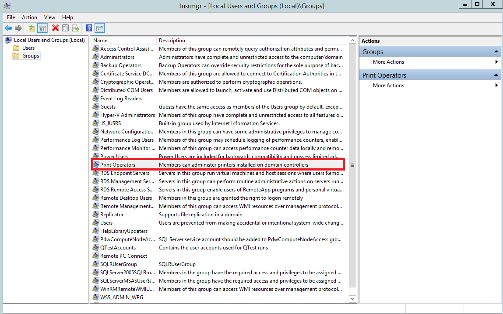

---
# required metadata

title: Install network printer devices in on-premises environments
description: [Full description that appears in the search results. Often the first paragraph of your topic.]
author: TJVass
manager: AnnBe
ms.date: 11/07/2017
ms.topic: article
ms.prod: 
ms.service: dynamics-ax-platform
ms.technology: 

# optional metadata

# ms.search.form: 
# ROBOTS: 
audience: IT Pro
# ms.devlang: 
ms.reviewer: sericks
ms.search.scope: Operations
# ms.tgt_pltfrm: 
ms.custom: 
ms.search.region: Global
# ms.search.industry: 
ms.author: tjvass
ms.search.validFrom: 2017-12-31
ms.dyn365.ops.version: AX 7.3.0

---

# Install network printer devices in on-premises environments

[!include[banner](../includes/banner.md)]

<h2>INTRODUCTION</h2>

This articles describes the process for connecting a Dynamics 365 for Operations and Finance On-Premise deployment to existing network printer devices. Network printing in the on-premise application is supported by the [Print and Document Services](https://technet.microsoft.com/en-us/library/hh831468(v=ws.11).aspx) in Windows Server 2016 which allows you to centralize printer management tasks.  Installing and Configuring the Print and Document Services requires administrative access to server hosting the primary AOS instance.

There are two roles associated with configuring the network printing services:
-  <b>Service Administrator</b> - this person is responsible for installing and configuring the platform infrastructure components.  Traditionally, an AD account with elevated domain privileges, this role has sufficient privileges to install Windows Server components.

-  <b>Organization Administrator</b> - this person manages application security privileges.  This AD account belongs to the System
     Administrator Role in Dynamics 365 for Operations & Finance.

Before the Organization Administrator can begin adding Network Printers to Dynamics 365 for Operations & Finance, the Service Administrator must install and configure Print and Document Services on the server hosting the primary AOS instance.  Once that is complete, the Organization Administrator can begin using built-in tools to configure network printer devices.

<h3>Installing and Configuring Print and Document Services</h3>
The following section is used by the Environment Administrator to enable network printing services.

1.  Use the [instructions here](https://technet.microsoft.com/en-us/library/jj134159(v=ws.11).aspx) to install Print and Document Services
2.  Now, use the [instructions here](https://technet.microsoft.com/en-us/library/jj134163(v=ws.11).aspx) to Configure Print and Document Services

Now, perform the following actions for each server used to host the application "AXService"
1.  Start the <b>Local Users and Groups</b> manager on the local server
2.  Select the <b>Groups</b> node
3.  Select <b>Print Operators</b>, then <b>right + click</b> and select <b>Add to Group</b>
        
4.  Now add the network AD account used to run the AXService to the group
5.  Install network printers by using AXService user account. This step ensures the printer driver is available to AXService user account.
6.  Print a test page with installed printers to make sure all the connections are configured correctly.
7.  Restart AXService application to ensure the user’s profile is loaded correctly to look up printer driver.

<h3>Managing Network Printers for the Dynamics 365 for Operations Applications</h3>
The following section is used by the System Administrator to define network printers for the application

1.  Open the Manage network printers page (<b>Organization administration > Setup> Network printers</b>).
2.  Add new printers by providing printer <b>Name, Description, Path and Status</b>. Make sure the printer path matches the network path of the installed printer.

Items marked <b>Active</b> will immediately become available for application users to begin printing Document style reports on network printer devices.
