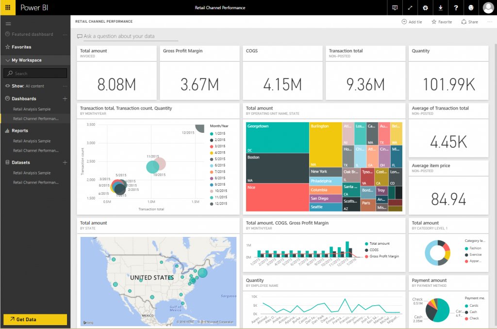
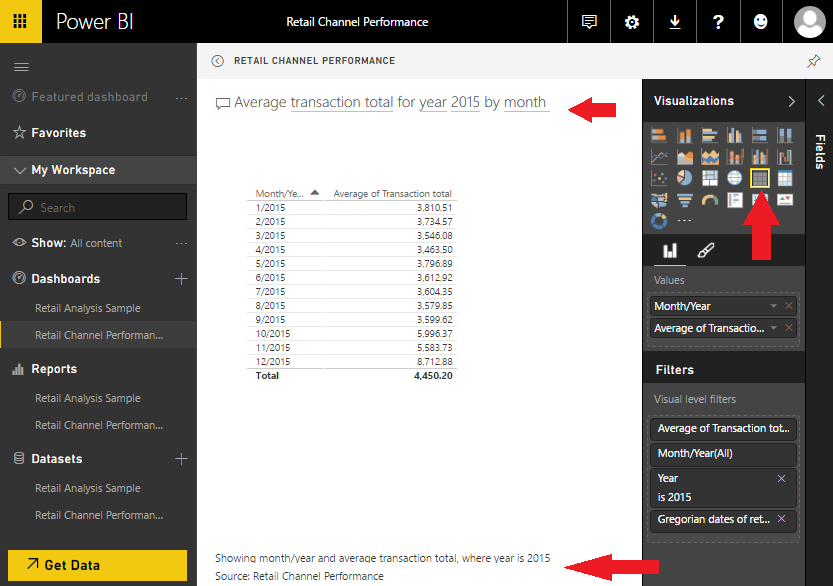
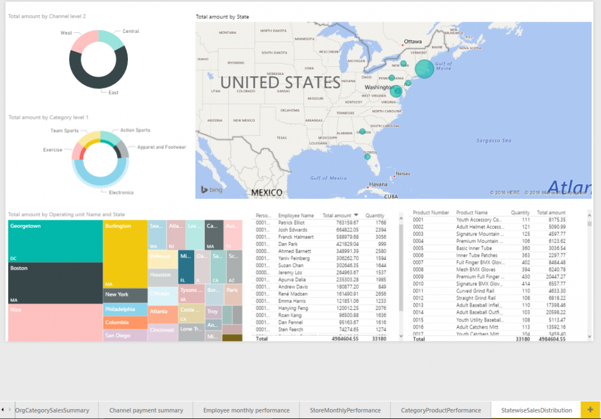
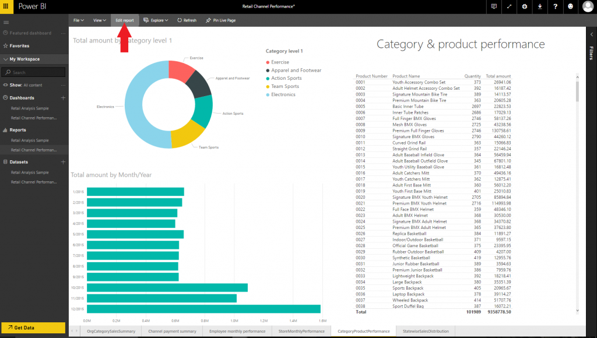
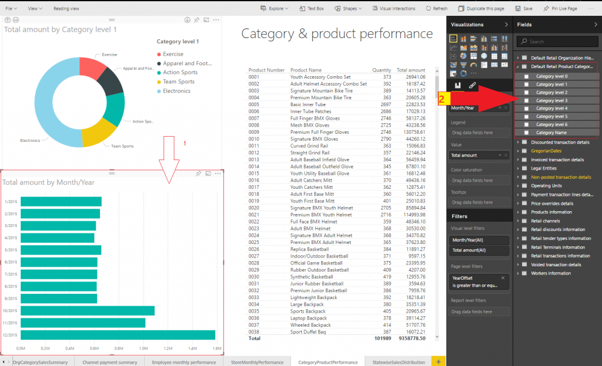
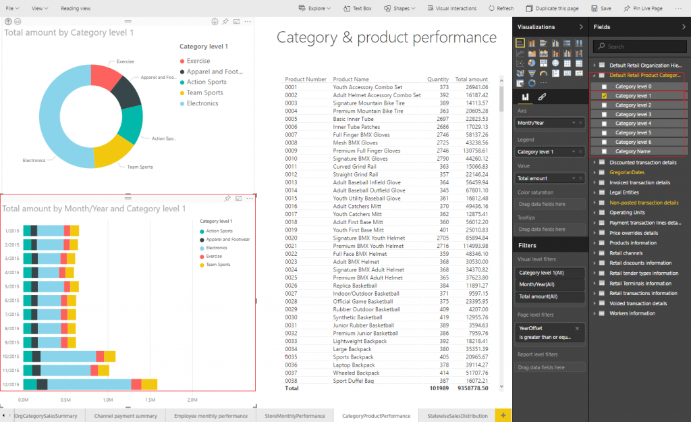
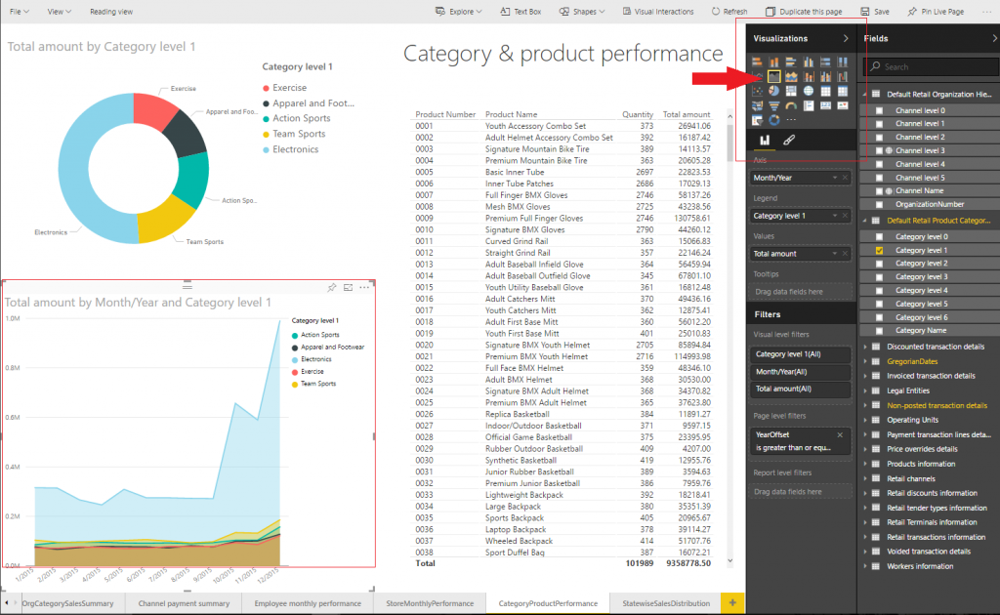
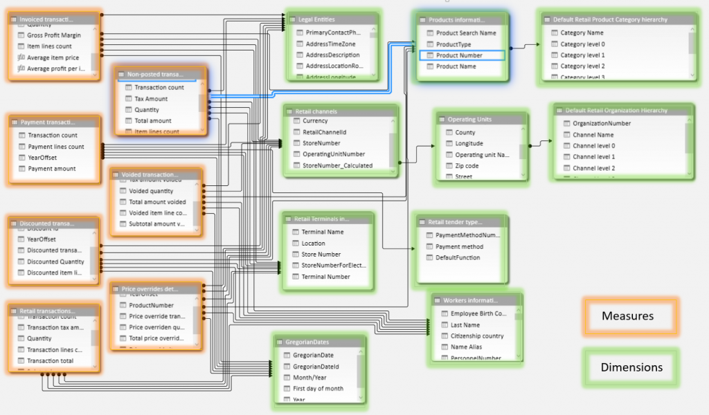

---
# required metadata

title: Retail channel performance Power BI content
description: This topic provides information about the Retail channel performance Power BI content for Dynamics AX 7.0 releases. This content pack lets channel managers quickly build channel performance analytics to predict trends and uncover insights, based on sales performance.
author: ashishmsft
manager: AnnBe
ms.date: 05/09/2018
ms.topic: article
ms.prod: 
ms.service: dynamics-ax-platform
ms.technology: 

# optional metadata

# ms.search.form: 
# ROBOTS: 
audience: IT Pro
# ms.devlang: 
ms.reviewer: sericks
ms.search.scope: Operations
# ms.tgt_pltfrm: 
ms.custom: 105483
ms.assetid: cb5aff3b-5b29-44f7-9c6f-6b055c043996
ms.search.region: Global
# ms.search.industry: 
ms.author: asharchw
ms.search.validFrom: 2016-02-28
ms.dyn365.ops.version: AX 7.0.0

---

# Retail channel performance Power BI content

[!include [banner](../includes/banner.md)]

> [!Note]
> This content pack has been deprecated as documented in [Power BI content packs available on AppSource](../migration-upgrade/deprecated-features.md#power-bi-content-packs-available-on-appsource).

This topic provides information about the Retail channel performance Power BI content for Dynamics AX. This content pack lets channel managers quickly build channel performance analytics to predict trends and uncover insights, based on sales performance.

The Retail channel performance content pack lets you quickly build your channel performance analytics. The content pack is designed specifically for channel managers who focus on sales performance to predict trends and uncover insights. Its components draw directly from Retail and commerce data in the Dynamics AX database, and provide drill-down reports about organization-wide sales performance across global geography by employee, category, product, terminal, channel, and more. Power BI automatically creates reports and dashboards that give you a great starting point for exploring and analyzing your Retail and commerce data. This article includes the following information:

-   Learn how to connect the Retail channel performance content pack in Power BI to a Dynamics AX data source.
-   View a list of reports that provide insights into retail channel performance.
-   Learn how to modify an existing report in the content pack to make it self-authored.
-   Get a glimpse of an actual data model that enables the whole experience in Power BI.

## Connect the Retail channel performance content pack in Power BI to a Dynamics AX data source
1.  Go to https://www.powerbi.com, and click **Sign in**. If you don't have an account, you can sign up to try the new Power BI Preview for free.
2.  To sign in, enter a Microsoft Office 365 account that has a Power BI account.
3.  If your workspace appears, click **Get Data** at the bottom of the left navigation pane.
4.  In **Services** section, click **Get**.
5.  Scroll or search to find **Microsoft Dynamics AX Retail channel performance**, and then click **Get it now**.
6.  Enter your Dynamics AX URL in the following format: `https://<tenant>.cloudax.dynamics.com` (for example, `https://YourAOSTenant.cloudax.dynamics.com`). Then click **Next** to pull data from Dynamics AX data storage into this Power BI dashboard.
7.  Select **oAuth2** as the authentication method, and then click **Sign in**.
8.  To sign in, enter an Office 365 account that has permission to access your Dynamics AX environment.
9.  After data is successfully pulled from Dynamics AX into Power BI, you can view your personal **Retail channel performance** dashboard in Power BI by clicking **Retail channel performance dashboard** in the left navigation pane. 
10. You can then take advantage of the Q&A feature in Power BI to query your Dynamics AX sales data by using natural language. 

## View a list of reports
By clicking through any of the pinned tiles on the dashboard, you can navigate the following list of reports that provide insights into retail channel performance:

-   Geographical sales distribution
-   Category sales performance
-   Sales summary by Tender type or payment method
-   Employee monthly performance
-   Store monthly performance
-   Product sales performance for the given category in the given store

For example, you might want to do a deeper analysis of geographical sales distribution. 

## Modify an existing report in the content pack to make it self-authored
Here's an example that shows how easy it is to modify an existing report in the content pack to make it self-authored. In this example, we will modify an existing report that is named **Category & product performance** by adding **Category level 1** to the **Total amount by Month/Year** chart on that report.

1.  Click the **CategoryProductPerformance** tab at the bottom of the window to open the **Category & product performance** report, and then click **Edit report**. 
2.  Select the chart that is named **Total amount by Month/Year**. Then, on the right side of the window, in the **Fields** pane, expand the **Default Retail Product Category Hierarchy** node. 
3.  In the list of category levels for this hierarchy, select **Category Level 1**. The name of the chart that you selected this attribute for changes to **Total amount by Month/Year and Category level 1**, and the chart now shows the share of sales in each category for each month. 
4.  Finally, try to change the visualization itself. Select the **Total amount by Month/Year and Category level 1** chart, and then, in the **Visualizations** pane, click **Area chart** or **Stacked area chart**, and see the effect. 

## Get a glimpse of the actual data model
The data model that is included in the content pack for the Dynamics AX data entities and aggregated data entities lets you slice and dice across various measures by using different dimensions. 

Additional resources
--------

[Power BI integration](power-bi-integration.md)

[Configuring Power BI integration for workspaces](configure-power-bi-integration.md)

