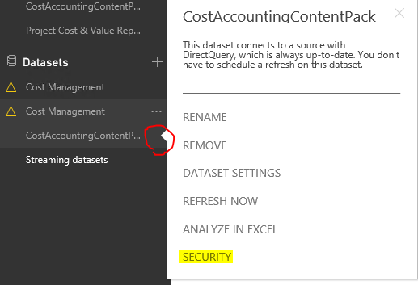
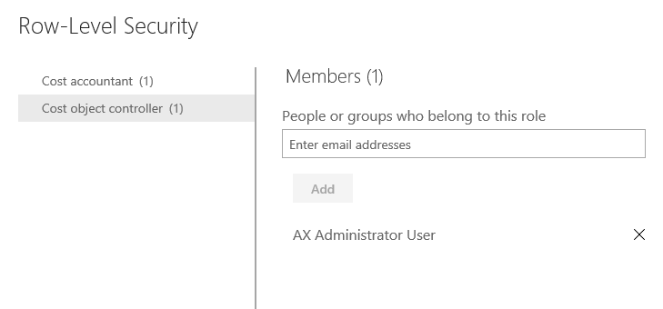

---
# required metadata

title: Set up security for the Cost accounting analysis Power BI content
description: This topic explains how you can propagate the access-level security in Cost accounting to row-level security in Microsoft Power BI. This functionality helps guarantee that users see only Power BI data that they are granted access to.
author: YuyuScheller
manager: AnnBe
ms.date: 06/20/2017
ms.topic: article
ms.prod: 
ms.service: dynamics-ax-platform
ms.technology: 

# optional metadata

# ms.search.form: 
# ROBOTS: 
audience: Application User, IT Pro
# ms.devlang: 
ms.reviewer: sericks
ms.search.scope: Operations
# ms.tgt_pltfrm: 
ms.custom: 270294
ms.assetid: 3a7ba8b0-ac57-4159-9cd8-4308f6021f36
ms.search.region: Global
# ms.search.industry: 
ms.author: yuyus
ms.search.validFrom: 2016-11-30
ms.dyn365.ops.version: Version 1611

---

# Set up security for the Cost accounting analysis Power BI content

[!INCLUDE [banner](../includes/banner.md)]

This topic explains how you can propagate the access-level security in Cost accounting to row-level security in Microsoft Power BI. This functionality helps guarantee that users see only Power BI data that they are granted access to.

Overview
--------

The **Cost accounting analysis** Microsoft Power BI content uses Power BI row-level security to limit a user's access. Security is based on the access-level organizational hierarchy that is set up in the Cost accounting parameters. For more information about the **Cost accounting analysis** Power BI content, see [Cost accounting analysis Power BI content](cost-accounting-analysis-content-pack.md).

## Setup
To propagate access-level security to Power BI, the owner of the Power BI content must follow these steps. **Note:** The user who publishes the **Cost accounting analysis** Power BI content automatically becomes the owner. Only an owner can set up security in Power BI. Additionally, until an owner adds other users on PowerBI.com, no one except the owner can see any data in the **Cost accounting analysis** Power BI content.

1.  Publish the definition file to Power BI.
2.  Sign in to PowerBI.com.
3.  Find the dataset for the **Cost accounting analysis** Power BI content.
4.  Open the security page. 

    

5.  The **Cost object controller** role is already created. Add other members who are part of the Cost accounting access-level organizational hierarchy. 

    

Users who are added to the **Cost object controller** role will see only the data that they are allowed to see, according to the definition in the Cost accounting access-level organizational hierarchy. **Note:** Row-level security applies to tiles and reports in Microsoft Dynamics 365 for Finance and Operations that are embedded from Power BI.

## Updating security
If updates are made to access-level security in Cost accounting, and you want Power BI to reflect those updates, you must update the entity store for the **Cost accounting analysis** Power BI content. After you complete the entity store update from Finance and Operations, you must update the artifacts on PowerBI.com. For more information about how to do an entity store update, see [Update entity store](power-bi-integration-entity-store.md#update-entity-store). The owner of the **Cost accounting analysis** Power BI content must also do an entity store update if new users are granted access to the organizational hierarchy. Additionally, the owner must add the new users to the **Cost object controller** role on PowerBI.com, so that row-level security is applied for them.

## Disabling security
We assume that your organization wants to restrict data access. If, for some reason, the security parameters are disabled when you run Cost accounting, the owner must add users to the **Cost accountant** role in Power BI instead. If you change security from an enabled state to a disabled state, it’s a good idea to remove users from the **Cost object controller** role. And vice versa if you re-enable security. Users can belong to both roles. Joint access is the union of both roles. In the case of the **Cost accounting analysis** Power BI content, users who have joint access have unrestricted data access. If your goal is to apply restricted access, users must be assigned only to the **Cost object controller** role. These row-level security updates take effect immediately. Affected users should refresh their browsers.

## Additional resources
To learn more about Power BI row-level security, see [Manage security on your model in Power BI](https://powerbi.microsoft.com/en-us/documentation/powerbi-admin-rls/#manage-security-on-your-model).

