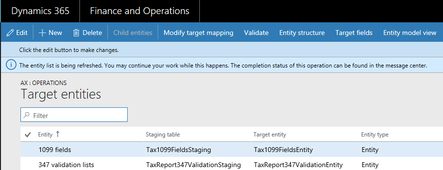
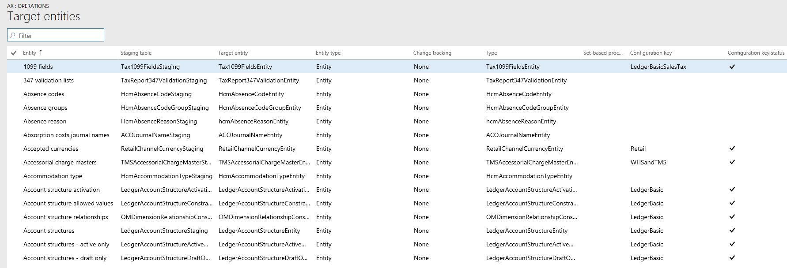
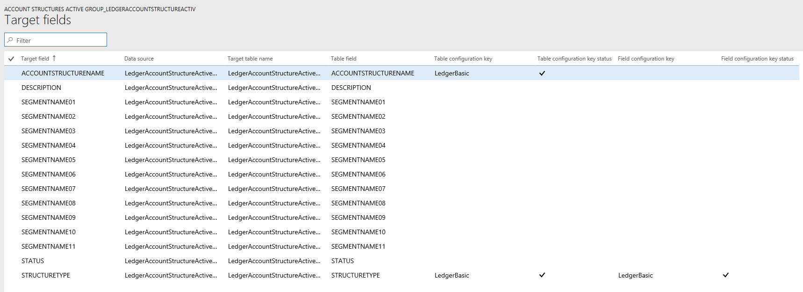

---
# required metadata

title: Configuration keys and data entities
description: This topic describes the relationship between configuration keys and data entities in Microsoft Dynamics 365 for Finance and Operations, Enterprise edition. 
author: Sunil-Garg
manager: AnnBe
ms.date: 01/01/2018
ms.topic: article
ms.prod: 
ms.service: dynamics-ax-platform
ms.technology: 

# optional metadata

# ms.search.form: 
# ROBOTS: 
audience: Application user
# ms.devlang: 
ms.reviewer: margoc
ms.search.scope: Operations
# ms.tgt_pltfrm: 
ms.custom: 25341
ms.assetid: 8e214c95-616b-4ee1-b5a4-fa5ce5147f2c
ms.search.region: Global
# ms.search.industry: 
ms.author: sunilg
ms.search.validFrom: 2018-01-01
ms.dyn365.ops.version: Platform update 13

---

# Configuration keys and data entities
Before you use data entities to import or export data, we recommended that you first determine the impact of configuration (config) keys on the data entities that you are planning to use. 

To learn more about configuration keys in Finance and Operations, see .

### Configuration key assignments
Configuration keys can be assigned to one or all of the following artifacts.
-   Data entities
-   Tables used as data sources
-   Table fields
-   Data entity fields

The following table summarizes how config key settings for an object change the expected behavior of the object.

| Config key setting on data entity | Config key setting on table | Config key setting on table field | Config key on data entity field |                                                                                                                                                                                                                                                             Expected behavior                                                                                                                                                                                                                                                             |
|:---------------------------------:|:---------------------------:|:---------------------------------:|:-------------------------------:|:-----------------------------------------------------------------------------------------------------------------------------------------------------------------------------------------------------------------------------------------------------------------------------------------------------------------------------------------------------------------------------------------------------------------------------------------------------------------------------------------------------------------------------------------:|
| Disabled                          | Doesn’t matter              | Doesn’t matter                    | Doesn’t matter                  | If the configuration key on the data entity is disabled, the data entity will not be functional. It will not matter in this case if the configuration keys in the underlying table(s) and field(s) were enabled or disabled.                                                                                                                                                                                                                                                                                                              |
| Enabled                           | Disabled                    | Doesn’t matter                    | Doesn’t matter                  | If the configuration key on the data entity is enabled, data management will then check the configuration key on each of the underlying tables. If the configuration key of a table is disabled, that table will not be available in the data entity for functional use. The field level configuration key nor the entity field from that table will not matter in this case. Note that, if the primary table in the entity has its configuration key disabled, then this will behave as if the entity’s configuration key were disabled. |
| Enabled                           | Enabled                     | Disabled                          | Doesn’t matter                  | If the configuration key on the data entity and the underlying table(s) are enabled, data management will check the configuration key on each one of the fields in the table(s). If the configuration key of a field is disabled, that field will not be available in the data entity for functional use even if the corresponding entity field had the configuration key enabled.                                                                                                                                                        |
| Enabled                           | Enabled                     | Enabled                           | Disabled                        | If the configuration key is enabled at all levels but the entity field, then the field will not be available for use in the data entity.                                                                                                                                                                                                                                                                                                                                                                                                  |

Note, if an entity has another entity as a data source then, the above semantics are applied in a recursive manner.

### Entity list refresh
When the entity list is refreshed, data management builds the configuration key metadata for runtime use. This metadata is built using the above semantics. It is always recommended to wait for the entity refresh to complete before using jobs and entities in data management as the configuration key meta data may not be up to date and could result in an unexpected outcome. When the entity list is being refreshed, the following message is shown in the entity list page.

### Data entity list page
The data entity list page in data management shows the configuration key settings for the entities. You must start from this page for each of the entities you plan to use to first understand the impact from configuration keys on the data entity.
This information is shown using the metadata that is built during entity refresh. The configuration key column shows the name of the configuration key that is associated with the data entity. If this is blank, it means, there is no configuration key associated. The configuration key status column shows the state of the configuration key. If it has a tick mark, it means the key is enabled. If it is blank, it means either the key is disabled or there is no key associated.

### Target fields
The next step is to drill into the internals of the data entity to view the impact of configuration keys on tables and fields. The target fields form for a data entity shows configuration key and the key status information for the related tables and the fields in the data entity. If the key column is blank, it means there is no key associated. If the key status column is blank, it means either there is no key is associated or the key is disabled. If the data entity itself has its configuration key disabled, a warning message is shown informing that the tables and fields in the target fields form for this entity will not be available at all regardless of their configuration key status.

### Child entities
Certain entities have another entity(s) as data sources. The child entities form in such cases or in the case of composite entities, shows the configuration key information. Use this form in the similar way to the entities list page described above. The target fields form for the child entity also behaves like what is described above.

### Using data entities
After understanding the full impact, if any, of configuration keys on the data entities that you would like to use, you can now proceed to using the entities by adding to the data projects. You will now know which fields are going to be available for use and hence can create the mappings accordingly.

### Run time validations for configuration keys
Using the configuration key metadata built during entity refresh list, run time validations are performed in the following use cases.

-   When a data entity is added to a job

-   When user clicks ‘validate’ on the entity list

-   When the user loads a data package into a data project

-   When the user loads a template into a data project

-   When an existing data project is loaded

-   When a template is loaded into a data project

-   Before the export/import job is executed (batch, non-batch, recurring,
    Odata)

-   When the user generates mapping

-   When the user maps fields in the mapping UI

-   When the user adds only 'importable fields'

### Guidance on managing configuration key changes in data management
Any time configuration keys are updated at the entity, table or field level, the entity list in data management must be refreshed. This process will ensure that, data management picks up the latest configuration key settings. Until the entity list is refreshed, the following warning will be shown in the entity list page. The updated configuration key changes will take effect immediately after the entity list is refreshed. It is recommended to validate existing data projects and jobs to make sure they will function as expected after the configuration keys changes were put in effect.

