---
# required metadata

title: Data management
description: This topic provides information about data management in Microsoft Dynamics 365 for Finance and Operations. 
author: Sunil-Garg

manager: AnnBe
ms.date: 06/20/2017
ms.topic: article
ms.prod: 
ms.service: dynamics-ax-platform
ms.technology: 

# optional metadata

# ms.search.form: 
# ROBOTS: 
audience: Developer, IT Pro
# ms.devlang: 
ms.reviewer: margoc
ms.search.scope: Operations

# ms.tgt_pltfrm: 
ms.custom: 96283
ms.assetid: e67f5edc-1087-4867-8955-b2a40d94217f
ms.search.region: Global
# ms.search.industry: 
ms.author: sunilg
ms.search.validFrom: 2016-02-28
ms.dyn365.ops.version: AX 7.0.0

---

# Data management

[!INCLUDE [banner](../includes/banner.md)]

This topic describes how you can use the data management framework to manage data entities and data entity packages in Microsoft Dynamics 365 for Finance and Operations. 

The data management framework consists of the following concepts: 

- **Data entities**: A data entity is a conceptual abstraction and encapsulation of one of more underlying tables. A data entity represents a common data concept or functionality, for example, Customers or Vendors. Data entities are intended to be easily understand by users familiar with business concepts. After data entities are created, you can reuse them through the Excel Add-in, use them to define import/export packages, or use them for integrations. 
- **Data project**: A project that contains configured data entities, which include mapping and default processing options.
- **Data job**: A job that contains an execution instance of the data project, uploaded files, schedule (recurrence), and processing options.
- **Job history**: Histories of source to staging and staging to target jobs.
- **Data package**:  A single compressed file that contains a data project manifest and data files. This is generated from a data job and used for import or export of multiple files with the manifest. 

The data management framework supports using data entities in the following core data management scenarios:

- Data migration
- Set up and copy configurations
- Integration

## Data entities

Data entities provide conceptual abstraction and encapsulation of underlying table schema that represent data concepts and functionalities. In Microsoft Dynamics AX 2012, most tables, like the Customer and Vendor tables, were de-normalized and split into multiple tables. This was beneficial from a database design point of view, but made it difficult for implementers and ISV’s to use without a thorough understanding of the physical schema. Data entities were introduced as part of data management to be used as a layer of abstraction to easily understand by using business concepts. In previous versions of Microsoft Dynamics 365 for Finance and Operations, there were multiple ways to manage data, such as Microsoft Excel Add-ins, AIF, and DIXF. The concept of data entities combines those different concepts into one. After data entities are created, you should be able to reuse them for an Excel Add-ins, import/export, or integration. The following table shows core data management scenarios.

<table>
<colgroup>
<col width="50%" />
<col width="50%" />
</colgroup>
<tbody>
<tr class="odd">
<td><strong>Data Migration</strong></td>
<td><ul>
<li>Migrate reference, master, and document data from legacy or external systems.</li>
</ul></td>
</tr>
<tr class="even">
<td><strong>Setup and copy configuration</strong></td>
<td><ul>
<li>Copy configuration between company/environments.</li>
<li>Configure processes or modules using the Lifecycle Services (LCS) environment.</li>
</ul></td>
</tr>
<tr class="odd">
<td><strong>Integration</strong></td>
<td><ul>
<li>Real-time service based integration.</li>
<li>Asynchronous integration.</li>
</ul></td>
</tr>
</tbody>
</table>

## Data migration
Using the data management framework, you can quickly migrate reference, master, and document data from legacy or external systems. The framework is intended to help you quickly migrate data by using the following features: 

-   You can select only the entities you need to migrate. 
-   If an import error occurs, you can skip selected records and choose to proceed with the import using only the good data, opting to then fix and import the bad data later. You will be able to partially continue and use errors to quickly find bad data. 
-   You can move data entities straight from one Finance and Operations system to another, without having to go through Excel, or XML. 
-   Data imports can be easily scheduled using a batch, which offers flexibility when it is required to run. For example, you can migrate customer groups, customers, vendors, and other data entities in the system at any time.

## Set up and copy configuration
You can use the data management framework to copy configurations between companies or environments, and configure processes or modules using Microsoft Dynamics Lifecycle Services (LCS). 

Copying configurations is intended to make it easier to start a new implementation, even if your team doesn't deeply understand the structure of data that needs to be entered, or data dependencies, or which sequence to add data to an implementation. 

The data management framework allows you to:

-   Move data between two similar systems
-   Discover entities and dependencies between entities for a given business process or module
-   Maintain a reusable library of data templates and datasets
-   Use data packages to create incremental data entities. Data entities can be sequenced inside the packages. You can name data packages, which can be easily identifiable during import or export. When building data packages, data entities can be mapped to staging tables in grids or by using a visual mapping tool. You can also drag-and-drop columns manually. 
-   View data during imports, so you can compare data, and ensure that it is valid.

## Working with data entities
The following sections provide quick snapshots of the different functionalities of data management using data entities. The goal is to help to you strategize and make effective decisions on how to best utilize the available tools during data migration. You will also find tips and tricks on how to effectively use each area during data migration. A list of available data entities for each area can also be found with the suggested data sequences, showing data dependencies. Microsoft provides data packages that can be found on Lifecycle Services (LCS) as an initial guide. The information in this document can be used as a guide for creating your own packages. The description of each data entity shows what the object contains and if it is needed during data migration.

### Sequencing
There are two types of sequencing that should be considered when working with data entities.

-   Sequencing data entities within a data package
-   Sequencing the order of data package imports

#### Sequence data entities within a data packages**

1.  When a user adds data entities to a data project, by default, a sequence is set for the order in which the entities will load. The first entity added to the project will be set as the first entity to load, the next entity added will be second, the next entity will be third, and so on. 
    For example, if a user added two entities in this order, **Sales tax codes** and **Sales Tax groups**, then **Sales tax codes** is assigned an entity sequence of **1.1.1**, and **Sales tax groups** is assigned an entity sequence of **1.1.2**. The sequence level indicates that the second entity will not start the import process until the first level is finished.
2.  To view or edit a sequence, click the **Entity sequence** button on the Action Pane of the data project. 

    

4.  In the Definition group entity sequence, you can see the execution units and the sequence. You can change sequence by selecting the data entity in the list, setting a different Execution unit or Sequence in level, and then clicking **Update selected**. After clicking **Update selected**, the entity will move up or down in the entity list.

**Example**
The following screenshot shows the entity sequence that is set for the Sales Tax CodeGroups data package. 

    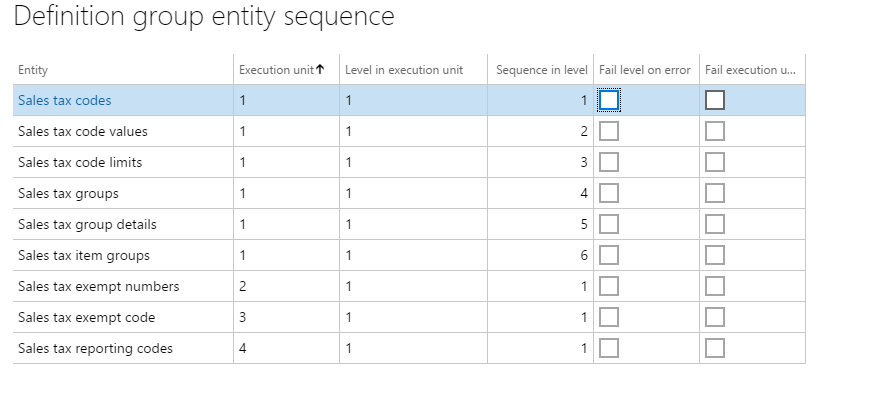

In order to successfully import sales tax codes and groups, the sales tax codes and details have to be loaded first, before sales tax groups can be imported. Sales tax codes and groups are all in Execution unit = 1, but the sequences are in the order that they will be imported. Other related sales tax entities that are not dependent upon other data entities being loaded are included in the package. For example, sales tax exempt numbers is set in its own Execution unit = 2. This data entity will start loading immediately because there are no dependencies on other entities loading before it. 

#### Sequence data package imports
In order to successfully load data, it's important to set the correct order for importing data packages, because of dependencies that exist within and across modules. The numbering format that has been created for the data packages within LCS are as follows:

-   First segment: Module
-   Second segment: Data type (setup, master, transaction)
-   Third segment: Sequence number

The following tables provide more information about the default numbering format. 

**Module numbers**

[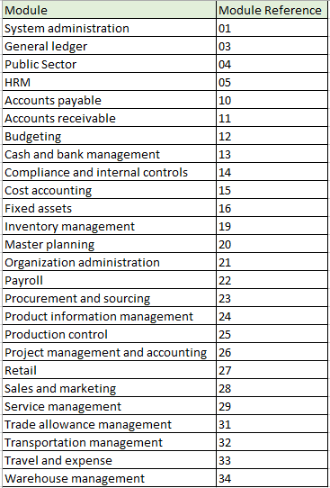](./media/dataentitiesdatapackages03.png)

**Data type numbers** 

**Sequence number**

[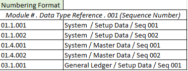](./media/dataentitiesdatapackages05.png)

Data packages follow the sequence number, followed by the module abbreviation, and then a description. The following example shows General ledger data packages. 

## Mapping
When working with data entities, mapping an entity to a source is automatic. The automatic mapping of fields can be overridden if needed. 

### View mapping
To view how an entity is mapped, locate the tile for the entity in the project, and then click **View map**. 

We provide mapping visualization view (default) and mapping details view. A red asterisk (\*) identifies any required fields in an entity. These fields must be mapped in order to work with the entity. Other fields can be unmapped as required when working with the entity. 

- To unmap a field, highlight the field in either column (**Entity** or **Source**), click **Delete selection**, and then click **Save**.   After saving, close the form to return to the project. 

The field mapping from source to staging can also be edited after import using the same process. 
[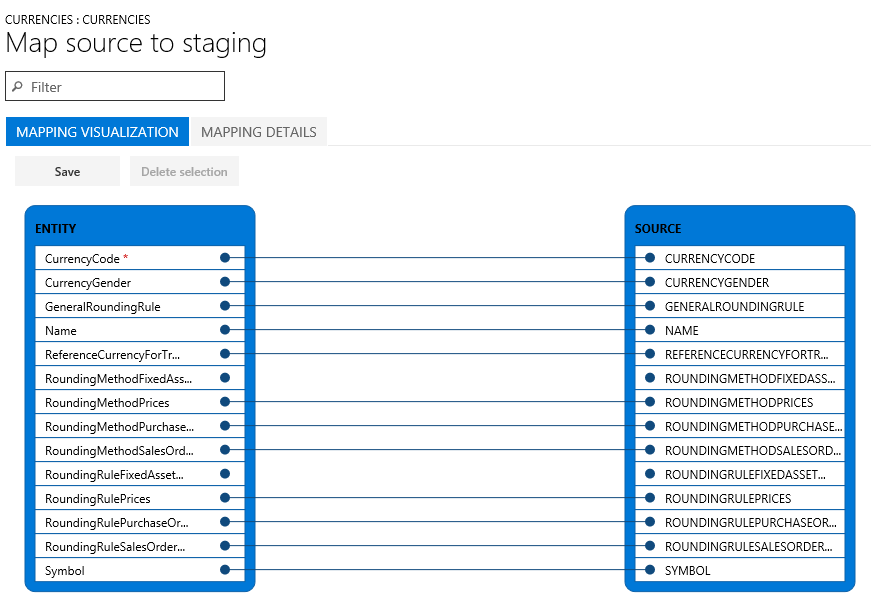](./media/dataentitiesdatapackages07.png) 

### Regenerate a map
If you have extended an entity (added fields) or if the automatic mapping appears to be incorrect, the mapping of the entity can be regenerated in the **Mapping** form. 

1. To do this, click **Generate source mapping**. 
    A message will display asking, “Do you want to generate the mapping from scratch ?” 
2. Click **Yes** to regenerate the mapping.

### Generate data
If you have fields in entities that you want the system to generate data for on import, instead of providing the data in the source file, you can use the auto-generated functionality in the mapping details for the entity. For example, if you want to import customers and customer address information, but the address information was not previously imported with the Global Address Book entities, you can have the entity auto-generate the party number upon import and the GAB information will be created. To access this functionality, view the map of the entity and click the **Mapping details** tab. Select the fields that you want to auto-generate. This will change the source field to **Auto**. 

[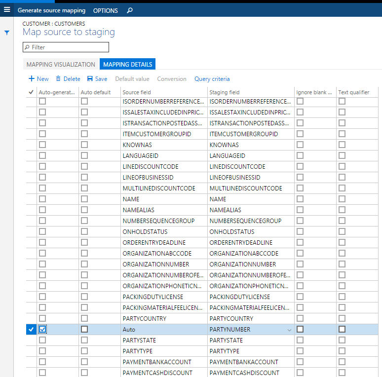](./media/dataentitiesdatapackages18.png)

### Turn off automatically generated number sequences
Many entities support automatic generation of identifiers based on number sequence setup. For example, when creating a product, the product number is automatically generated and the form does not allow you to edit values manually. 

[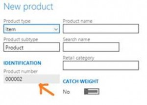](./media/dataentitiesdatapackages15.png.jpg) 

It is possible to enable manual assignment of number sequences for a specific entity.

[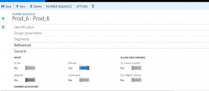](./media/dataentitiesdatapackages16.png) 

After you have enable manual assignment, you can provide manually assigned numbers instead.

[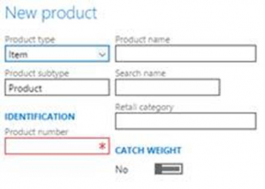](./media/dataentitiesdatapackages17.png)

## Export
Export is the process of retrieving data from a system using data entities. The export process is done through a project. When exporting,  you have a lot of flexibility as to how the export project is defined. You can choose which data entities to export, but also the number of entities, the file format used (there are 14 different formats to choose for export), and apply a filter to each entity to limit what is exported. After the data entities have been pulled into the project, the sequencing and mapping described earlier can be performed for each export project.

[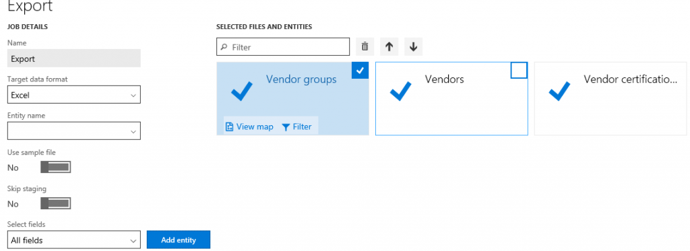](./media/dataentitiesdatapackages08.png)

After the project is created and saved you can export the project to create a job. During the export process, you can see a graphical view of the status of the job and the record count. This view shows multiple records so you can review the status of each record prior to downloading the actual files. 

-   While importing the system users entity, you may receive an integrity violation error if there is a guest user in the exported package. The guest user must be deleted from the package in order for the entity to work.
-   If a record already exists in the **UserInfo** table (the Admin record would most likely always exist), the import will fail for those records but work for other records.

 

[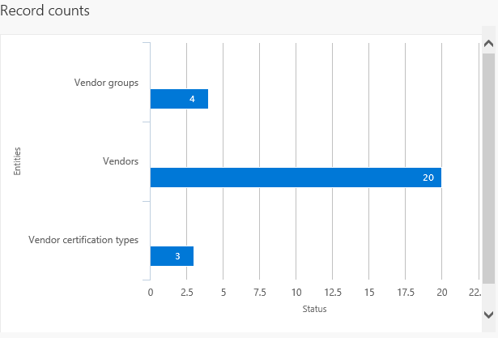](./media/dataentitiesdatapackages11.png) 

After the job is completed you can choose how to download the files: each data entity can be a separate file, or by combining the files into a package. If there are multiple data entities in the job, choosing the package option will speed up the upload process. The package is a zip file, containing a data file for each entity as well as a package header and manifest. These additional documents are used when importing in order to add the data files to the correct data entities and sequence the import process.

## Import
Import is the process of pulling data into a system using data entities. The import process is done through the **Import** tile in the **Data Management** workspace. Data can be imported either for individual entities or for a group of logically related entities that are sequenced in the correct order. The file formats vary depending on the type of import. For an entity, it can be an Excel file that is comma-separated, tab-separated, or text. For a data package, it is a .zip file. In both cases, the files are exported using the above mentioned export process. 

### Import a data package: 
1.  Log into the environment using a login with sufficient privileges (typically this is the Administrator role).
2.  On the dashboard, click the **Data Management** workspace.
3.  Click the **Import** tile.
4.  On the next page, do the following:
    1.  Provide a name.
    2.  In the **Source Data Format** field, select **Package** .
    3.  Click the **Upload** button and choose the appropriate package file from the location for the data being imported. This will import all the files from the package. 
    [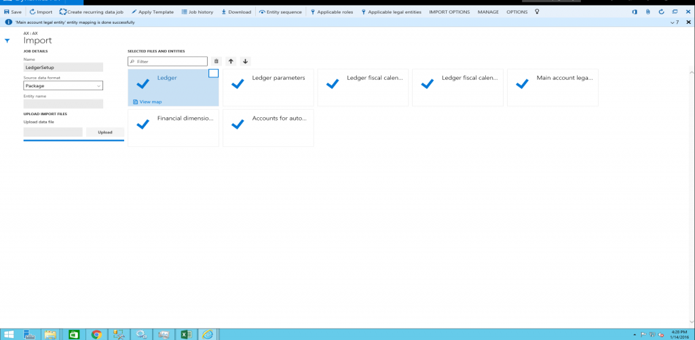](./media/dataentitiesdatapackages12.png)
    4.  Click **Save**, and then click **Import**.

### Import multiple data packages:
Use one of the following methods to import multiple data packages.
-   Create a new job for each package, and then repeat steps 4(a) through 4(d) above, for each package. 
-   Create one job to import multiple packages in a sequence. Repeat steps 4(a) through 4(c) above, and then repeat step 4(c) for all packages that need to be imported. After you select the packages, execute step 4(d) to import the data from the selected data packages through a single job. 
        [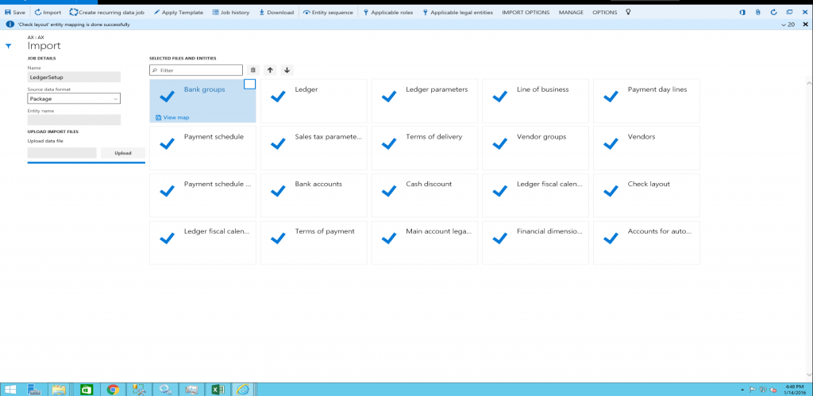](./media/dataentitiesdatapackages13.png)

After you click **Import**, the data will be imported through staging tables. The progress of the import can be tracked using the **Refresh** button in the upper-right corner of the screen. 

## Troubleshoot data package processing
This section provides troubleshooting information for the different stages of data package processing.

-   Status and error details of a scheduled job can be found under the **Job history** section in the **Data management** form.
-   Status and error details of previous runs for data entities can be displayed by selecting a data project and clicking **Job history**. In **the Execution history** form, select a job, and click **View staging data** and **View execution log**. The previous runs include data project runs that were executed as batch jobs or manually.

### Export process troubleshooting
-   If you get an error during the export process, click **View execution log** and review the log text, staging log details, and Infolog for more information.
-   If you get an error during the export process with a note directing you to not skip staging, turn off the **Skip staging** option, and then add the entity. If you are exporting multiple data entities, you can use the **Skip staging** button for individual data entities.

### Import process troubleshooting
When uploading data entity files:
- If data entities do not display in **Selected files and entities** after you click **Upload** during the import process, wait a few minutes, and then check whether the OLEDB driver is still installed. If not, then reinstall the OLEDB driver. The driver is Microsoft Access Database Engine 2010 Redistributable – AccessDatabaseEngine\_x64.exe.
- If data entities display in **Selected Files and Entities** with a warning after you click **Upload** during the import process, verify and fix the mapping of individual data entities by clicking **View map**. Update the mapping and click **Save** for each data entity.
  During data entity import:
- If data entities fail (shown with a red X or yellow triangle icon on the data entity tile) after you click **Import**, click **View staging data** on each tile under the **Execution summary** page to review the errors. Sort and scroll through the records with Transfer status = Error to display the errors in the Message section. Download the staging table. Fix a record (or all records) directly in staging by clicking **Edit, Validate all, and Copy data to target**,  or fix the import file (not staging file) and reimport the data.
  -   If data entities fail (shown with a red x or yellow triangle icon on the data entity tile) after you click **Import**, and **View staging data** shows no data, go back to the **Execution summary** page. Go to **View execution log**, select the data entity, and review the **Log text, Staging log details, and Infolog** for more information. **Staging log details** will display **Error column** (field) details and **Log description** will describe errors in detail.
- If data entities fail, you can check the import file to see if there’s an extra line in the file with text which displays, “This is a string that is inserted into Excel as a dummy cell to make the column to support more than 255 characters. By default, an Excel destination component will not support more than 255 characters. The default type of Excel will be set based on the first few rows”. This line is added during data export. If this line exists, delete this line, re-package the data entity, and try to import.

### Troubleshooting the System users entity
-   When you import the system users entity, you may receive a integrity violation error if there is a guest user in the exported package. The guest user must be deleted from the package in order for the entity to work.
-   If a record already exists in the **UserInfo** table (the Admin record will likely exist), the import will fail for those records but work for other records.

## See also
[Data entities](data-entities.md)

