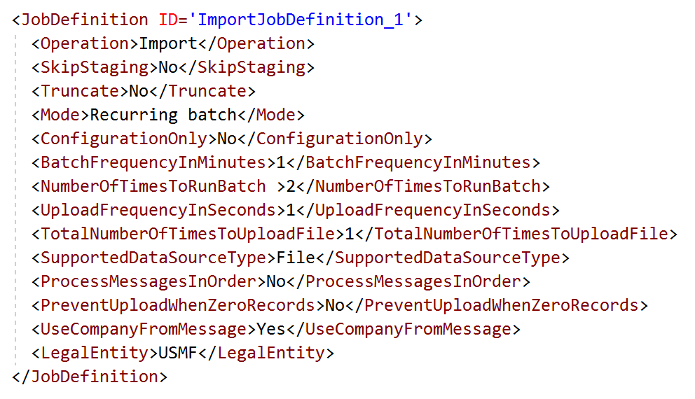
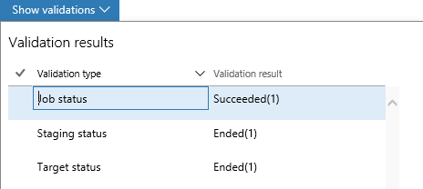
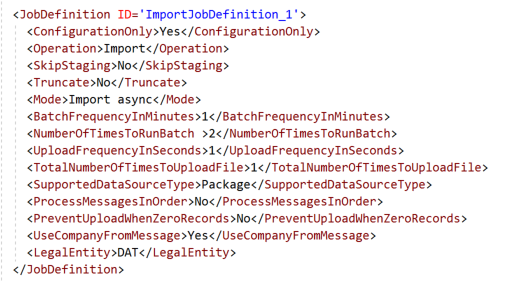
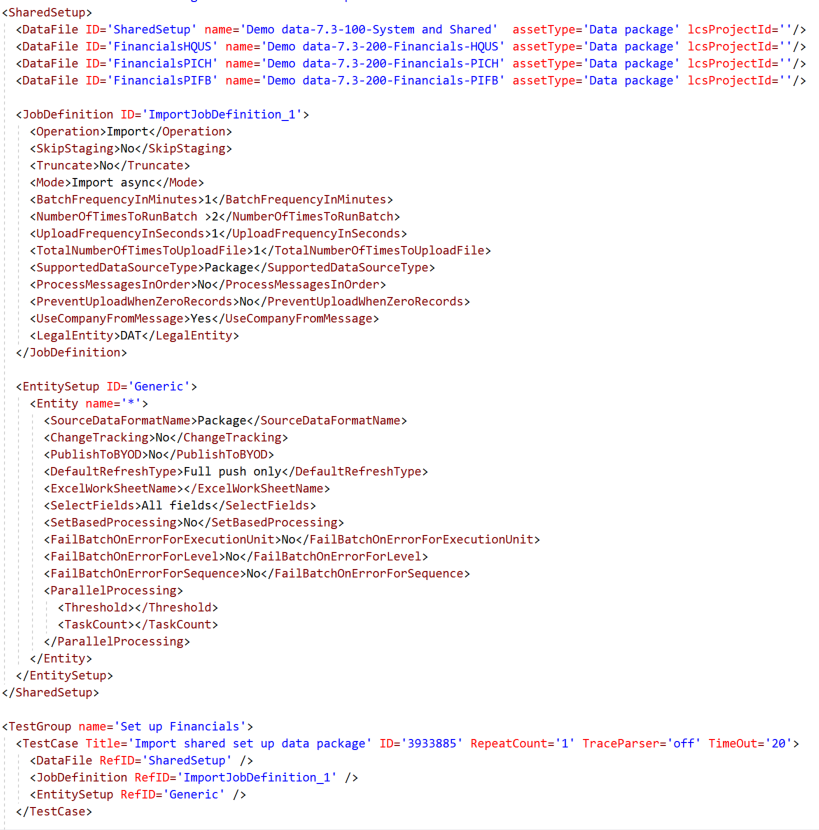

---
# required metadata

title: Testing with the data management framework
description: 
author: Sunil-Garg
manager: AnnBe
ms.date: 01/10/2018
ms.topic: article
ms.prod: 
ms.service: dynamics-ax-platform
ms.technology: 

# optional metadata

# ms.search.form: 
# ROBOTS: 
audience: Developer
# ms.devlang: 
ms.reviewer: margoc
ms.search.scope: Operations
# ms.tgt_pltfrm: 
# ms.custom: 25341
# ms.assetid: 
ms.search.region: Global
# ms.search.industry: 
ms.author: sunilg
ms.search.validFrom: 2016-02-28
ms.dyn365.ops.version: Platform update 14

---

# Task automation in data management framework

The task automation manager in data management enables automation of certain types of data tasks for specific scenarios. Implementation projects can use this capability to manage automation of data project creation, data project configuration, or recurring schedules. You can also configure and trigger the execution of import/export operations, such as the setup of demo data, golden configuration data, or data migration related tasks. This feature will also provide a way to validate a task’s outcome, which makes it conducive for automated testing of data entities. The basic approach to task automation is as follows.
1.	Identify the data related tasks that will benefit from task automation. A task would usually be a configuration task or a task to import/export some data. Implementation teams must look at their configuration management and data migration plan to identify potential tasks that can benefit from task automation. Implementation teams can also identify test cases for automated testing of data entities. Each test case can then be defined as a task.
2.	The task automation manager expects the data packages to be available in the asset library of an LCS project. It is up to the implementation teams to identify the LCS project based on other decision-making factors. With data packages available in LCS project, task automation manager can consume the packages from any environment (sandbox and/or production) making the consumption of data packages easy across environments.
3.	The task automation manager drives off an XML manifest which must define each task that is automated. If task automation is used only to configure data projects but not to import/export actual data, the manifest enables such option. In this context, the manifest can be source controlled for effective configuration management as part of the overall ALM.
4.	The task automation manager provides success or failure outcome for a task. It also provides insights into why a task failed. The level of information provided in the task automation manager is optimized to facilitate initial discovery. Detailed investigation must be done using data project and execution details in data management.

Note: Although the task automation can be run on any environments in the cloud, it is not recommended to run any import/export tasks using integration API’s in a production environment. The intent for using integration API’s in task automation should only be for test automation for testing purposes.

The following sections goes into the details for each of these aspects.

### Task manifest
Once the task has been identified, it must be defined in an XML manifest. This section describes the manifest. Refer to the best practice section for guidance on how to name and design the manifest.

### Manifest root
The <TestManifest>  is the root of the manifest. All the elements are children of this element.

### Shared set up
The shared set up section provides for defining the generic task parameters and task behavior for all tasks in the manifest. This enables maintainability of the manifest.

### Data files
The <DataFile> element allows to define the data packages and/or data files that must be used by the tasks in the manifest. The data files must be in the LCS asset library of an LCS project or it can be in the shared asset library.
Note: The user account running the task automation manager in Dynamics 365 for Operations and Finance must have access to LCS and the LCS project that is referenced in the manifest for data packages.

### Data project definition
The data project definition is defined using the <JobDefinition> element. There can be more than one job definitions in a manifest.

### Entity set up:
The entity set up provides for defining the characteristics of an entity that is being used by a task. There can be more than one such definition one for each entity being used by tasks in the manifest.

### Test groups:
Groups can be used to organize related tasks together in a manifest. There can be more than one group in a manifest.

### Best practice for manifest design
There are different ways in which a manifest can be defined. Below are a few pointers to consider when designing the manifest.

-   **Granularity** – the granularity of the manifest must be a functional
    decision more than anything else. There is going be a fine balance between
    the number of manifests an implementation team must manage versus showing
    discipline and being judicious to manage all tasks in a single manifest. One
    rule of thumb teams can use is to find out if they are constantly having an
    urge to merge tasks from multiple manifests as they start using them. This
    would indicate that the manifests are too granular and are functionally not
    composed as needed. The other aspect to consider would we separation of
    duties on who should perform what tasks. For example, there could be a one
    manifest to set up the demo data and a different manifest to set up the
    golden configuration on environments. This way, team members can be guided
    to only use manifests which they are supposed to use. A third aspect would
    be the implementation team’s access to LCS as the tasks would expect the
    data packages to be in LCS. This could become a point to consider for larger
    and globally distributed implementation teams/end user base that either has
    multiple instances of Dynamics 365 for Finance and Operations or have
    multiple LCS projects.

-   **Inheritance** – the manifest schema supports inheritance of common
    elements that are going to be applicable to all tasks in the manifest. The
    task can override an element to create a unique behavior for itself. This
    helps to keep the manifest concise and clean which improves readability and
    maintenance. Emphasis must be given to minimize repeating of configuration
    elements and instead re-use as much as it is possible.

**Source control** – manifests that must be used by all the members of an
implementation team should be source controlled in the application object tree
(AOT). This not only provides for the benefits of source control but also
enables a process to distribute or make the manifest(s) available to all users
in a consistent manner. This also enables configuration management for data
management related data projects if manifests are being used to configure.

### Validations
The task automation manager performs validations based on the set up of a task. The validations can be viewed after the task has completed to know the reasons of a failure in case the task had failed.

### Configuration management for data projects
The ‘ConfigurationOnly’ element can be used to create configuration tasks for data projects and recurring schedules. Below is a sample for such a task. The fist one is an example to configure a data project without any recurring schedule. The second one is an example where a recurring schedule must also be configured. The difference is the value provided to the <Operation> element.
The manifest for the configuration tasks can be source controlled to enable ALM on configuration management of data projects

### Automating demo data set up for environments
Manifests can be created with tasks to import demo data packages directly from LCS. You can schedule all the tasks to be executed thereby not having to monitor individual package import for completion. The <LegalEntity> element comes in very handy in this scenario because, the data project import happens in the specified legal entity thereby eliminating for the user to switch companies to import a data package. Below is an example task for demo data import where the demo data packages are in the shared asset library.

### Automating data migration tasks
A similar approach to demo data tasks can be also taken to perform data imports of data packages in a data migration process. Typically, once the environment for data migration has been deployed, the implementation team proceeds with configuring the environment with the base configuration (also called as the golden configuration data packages) data packages. After the base configuration is complete, the migrated data is imported via data management. These import tasks can be configured as tasks in a manifest and can be executed using the task automation manager to simplify and streamline this part of the data migration process.

### Data entity test automation
The task automation concepts can be also used to perform automated testing of data entities including integration scenarios. The ability to configure a data project and entities using the manifest provides the flexibility to test various combinations of scenarios for data entities.

The automation manager has inbuilt validations to aid with confirmation of why a task failed or passed. The data validations currently supported are the following.

•	-   Job status – checks if the status of the job is successful or not

-   Batch status – checks if the status of the batch was successful or not

-   Message status – if the test is about integrations then, the message status
    is also validated

-   Truncation – if truncation was enabled, then validation is done to check if
    truncation happened

Skip staging – if skip staging was enabled on a test then, validation is done to
check if staging was skipped

If a task has failed, looking at the validations is a quick way to know why the task failed. The corresponding data project and its execution details must be looed into for detailed investigation.
[!include[banner](../includes/banner.md)]

Intro sentence
