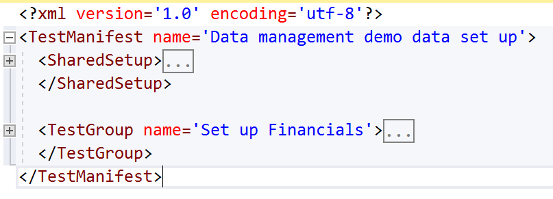
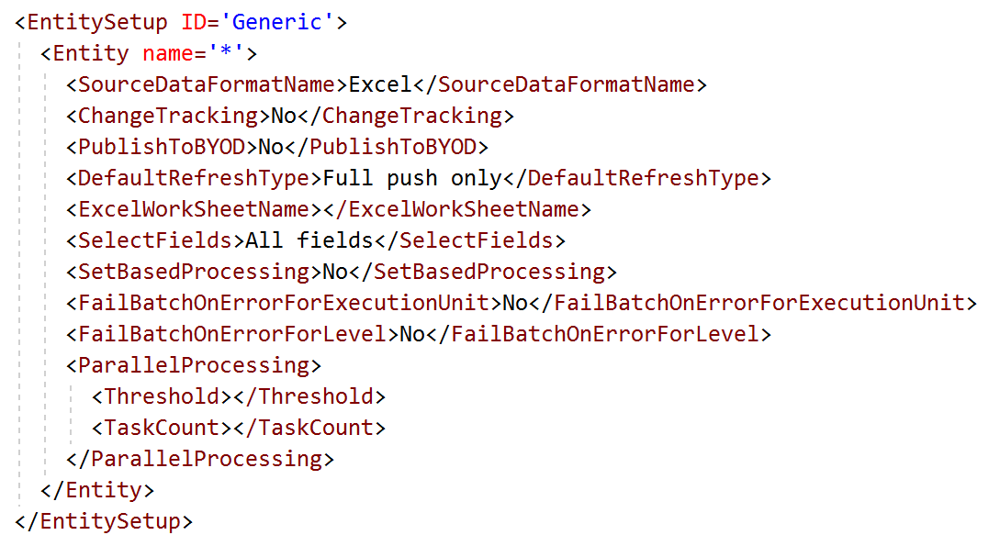
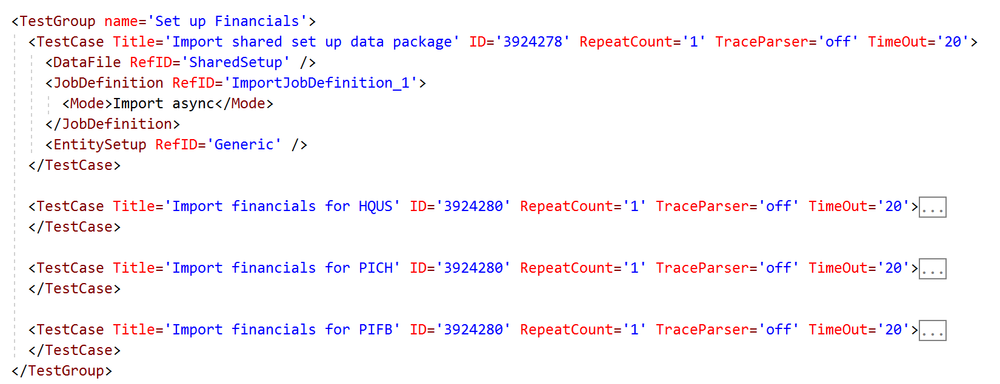
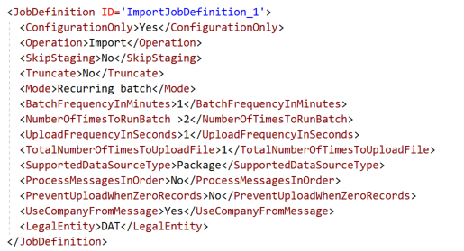

---
# required metadata

title: Data task automation
description: Data task automation in Dynamics 365 for Finance and Operations lets you easily repeat many types of data tasks, and validate the outcome of each task. 
author: Sunil-Garg
manager: AnnBe
ms.date: 03/28/2018
ms.topic: article
ms.prod: 
ms.service: dynamics-ax-platform
ms.technology: 

# optional metadata

# ms.search.form: 
# ROBOTS: 
audience: Developer
ms.reviewer: margoc
ms.search.scope: Operations
ms.search.region: Global
# ms.search.industry: 
ms.author: sunilg
ms.search.validFrom: 2016-02-28
ms.dyn365.ops.version: Platform update 14

---

# Data task automation

Data task automation in Microsoft Dynamics 365 for Finance and Operations lets you easily repeat many types of data tasks, and validate the outcome of each task. Data task automation is very useful for projects in the implementation phase. For example, you can automate data project creation and data project configuration. You can also configure and trigger the execution of import/export operations, such as setting up demo data, golden configuration data, and performing other data migration related tasks. You can also use data task automation to create automated testing of data entities, using task outcome validation. 

> [!IMPORTANT]
> Data task automation is currently not supported for on-premises environments.

We recommend the following approach to data task automation:

1.	Identify the data related tasks that will benefit from automation. 

    We recommend that implementation teams review their configuration management and data migration plans to identify potential data tasks for automation, and data entity test cases. 

2.	Define tasks.

    Tasks are defined in an XML manifest. You can keep your manifest under source control as part of configuration management in your application lifecycle management (ALM) strategy.

3.	Put the data packages related to the automation manager in the asset library of the appropriate LCS project. 

    The Data task automation manager can consume packages from any environment (sandbox and/or production) related to the LCS project.

    > [!IMPORTANT]
    > The user account running the task automation manager in Finance and Operations must have access to LCS and the LCS project that is referenced in the manifest for data packages.
    > Although data task automation can be run on any environment in the cloud, we strongly recommend that you not run any import/export tasks that use integration API’s in a production environment. Data task automation with integration API’s should be used for automated testing only.

4.	Run the data tasks, and then review the outcomes. 

    Data task automation manager provides success or failure outcome for each task. It also provides insights into why a task failed.
    
    > [!NOTE]
    > Although the task automation can be run on any environments in the cloud, it is not recommended to run any import/export tasks using integration API’s in a production environment. The intent for using integration API’s in task automation should only be for automated testing purposes.
    

## Task manifest
A task must be defined in an XML manifest. This section describes the manifest. See the Best practice section for guidance on how to name and design the manifest.

### Manifest root
The <TestManifest>  is the root of the manifest. All other elements are children of this element.

### Shared set up
The Shared set up section defines general task parameters and behaviors for all tasks in the manifest. 

### Data files
The <DataFile> element defines the data packages and data files that will be used by the tasks in the manifest. The data files must be in the LCS asset library of your LCS project or in the Shared asset library.

### Data project definition
The data project definition is defined using the <JobDefinition> element. There can be more than one job definitions in a manifest.

### Entity set up
The entity set up defines the characteristics of an entity to be used by a task. There can be more than one such definition one for each entity being used by tasks in the manifest.

### Test groups
Groups can be used to organize related tasks together in a manifest. There can be more than one group in a manifest.

## Best practice for manifest design
You can define a manifest in many different ways. Below are a few pointers to consider when designing the manifest.

### Granularity
We recommend that you determine the granularity of your manifest as a functional decision. Your team will need to decide whether they want to manage many manifests, or manage changes in a single manifest. 
-	Start with as many manifests as your team thinks you need logically, and then merge them if the team finds themselves using and wanting to merge manifests when they start running them. 
-	Consider separation of duties. For example, you might have one manifest to set up the demo data and a different manifest to set up the golden configuration for your environment. This way, you can make sure that team members use only the manifests that they are supposed to use. 
-	Consider user access to LCS. For larger and globally distributed implementation teams, that have multiple instances of Finance and Operations or multiple LCS projects.

### Inheritance
The manifest schema supports inheritance of common elements that are going to be applicable to all tasks in the manifest. A task can override a common element to define a unique behavior. The goal of the Shared setup section is to minimize repeating configuration elements to re-use as much as possible. The goal is to keep the manifest concise and clean to improve maintenance and readability. 

### Source control
Manifests that must be used by all the members of an implementation team should be stored in source control in the application object tree (AOT). This not only provides for the benefits of source control but also enables a process to distribute or make the manifest(s) available to all users in a consistent manner. This also enables configuration management for data management related data projects if manifests are being used to configure.

## Validations
The task automation manager performs validations based on how a task has been set up. Validations can be viewed after the task has completed to know the reasons of a failure in case the task had failed. The level of information provided in the task automation manager is optimized to facilitate initial discovery. 

The data validations currently supported are the following.

-   Job status – checks whether the status of the job is successful or not

-   Batch status – checks whether the status of the batch was successful or not

-   Message status – if the test is about integrations then message status is also validated

-   Truncation – if truncation is enabled, then validation is done to check whether truncation happened

-   Skip staging – if Skip staging is enabled on a test, then validation is done to checkw whether staging was skipped

If a task has failed, looking at the validations is a quick way to know why the task failed. The corresponding data project and its execution details must be looed into for detailed investigation.

## Configuration management for data projects
The ‘ConfigurationOnly’ element can be used to create configuration tasks for data projects and recurring schedules. 

The first example below configures a data project without a recurring schedule. The second example includes a recurring schedule. The difference is the value provided to the <Operation> element. Manifests for configuration tasks should also be kept under source control.

## Example: Automated demo data set up
Manifests can be created with tasks to import demo data packages directly from LCS. You can schedule all the tasks to be executed so that you do not have to monitor individual package import for completion. The <LegalEntity> element comes in very handy in this scenario because the data project import happens in the specified legal entity, so that the user does not need to switch companies to import a data package. The folloiwng is an example task for demo data import where the demo data packages are in the shared asset library.

## Example: Automate data migration tasks
Typically, once an environment for data migration has been deployed, the implementation team proceeds with configuring the environment with the base configuration data packages (*golden configuration data packages*). After the base configuration is complete, the migrated data is imported using data management. Import tasks can be configured as tasks in a manifest and can then be executed using the data task automation manager to simplify and streamline data migration.

## Example: Data entity test automation
The ability to configure a data project and entities using the manifest provides the flexibility to test various combinations of scenarios for data entities.
