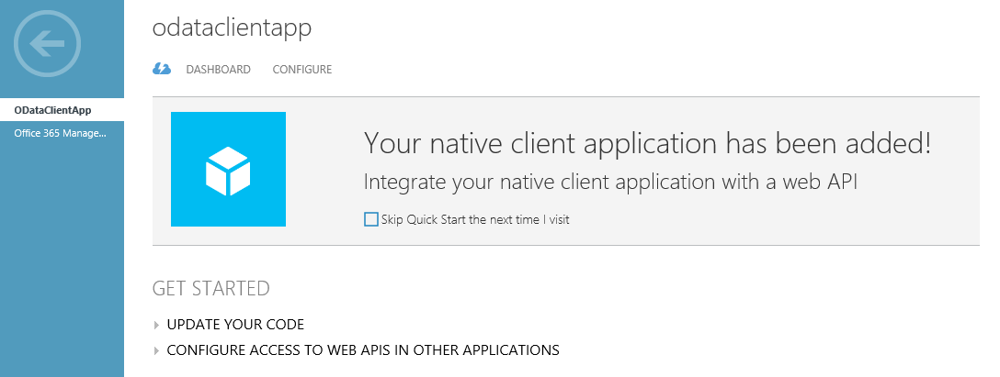
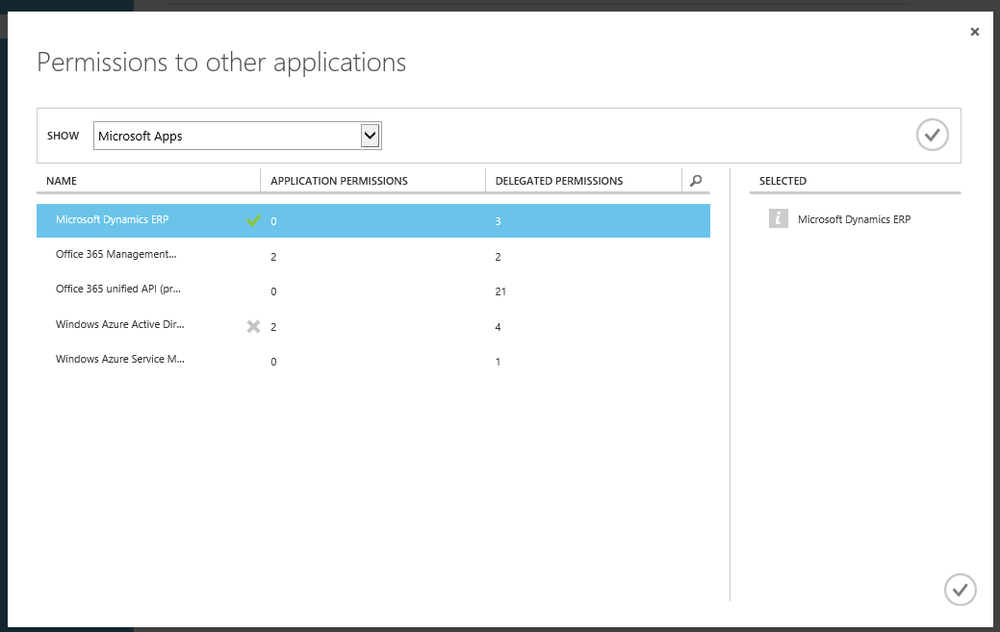

---
# required metadata

title: Service endpoints
description: This topic describes the service endpoints that are available.
author: Sunil-Garg
manager: AnnBe
ms.date: 06/20/2017
ms.topic: article
ms.prod: 
ms.service: dynamics-ax-platform
ms.technology: 

# optional metadata

# ms.search.form: 
# ROBOTS: 
audience: Developer
# ms.devlang: 
ms.reviewer: robinr
ms.search.scope: AX 7.0.0, Operations, UnifiedOperations
# ms.tgt_pltfrm: 
ms.custom: 21311
ms.assetid: 5ff7fd93-1bb8-4883-9cca-c8c42ddc1746
ms.search.region: Global
# ms.search.industry: 
ms.author: sunilg
ms.search.validFrom: 2016-02-28
ms.dyn365.ops.version: AX 7.0.0

---

# Service endpoints

[!include[banner](../includes/banner.md)]

This article describes the service endpoints that are available in Microsoft Dynamics 365 for Finance and Operations, Enterprise edition. It also provides a comparison to the endpoints that are available in Microsoft Dynamics AX 2012. 

## List of services
The following table lists all the service endpoints.

| Service endpoint            | AX 2012 | Finance and Operations     |
|-----------------------------|------------------|--------------------------------|
| Document services (AXDs)    | Yes              | No – Replaced by data entities |
| SOAP-based metadata service | Yes              | No – Replaced by REST metadata |
| SOAP-based query service    | Yes              | No – Replaced by OData         |
| OData query service         | Yes              | No – Replaced by OData         |
| SOAP-based custom service   | Yes              | Yes                            |
| JSON-based custom service   | No               | Yes                   |
| OData Service               | No               | Yes                   |
| REST Metadata Service       | No               | Yes                   |


## Custom services
When a developer writes a custom service under a service group, the service group is always deployed on two endpoints:
-   SOAP endpoint 
-   JSON endpoint

### SOAP-based custom service

SOAP-based services remain the same as they were in AX 2012.

Code examples for consuming custom services using SOAP are available in the [Microsoft Dynamics AX Integration GitHub repository](https://github.com/Microsoft/Dynamics-AX-Integration/tree/master/ServiceSamples/SoapConsoleApplication).

#### Key changes

-   All the service groups under the **AOTService group** node are automatically deployed.
-   All services that must be deployed must be part of a service group.

The SOAP endpoint is at https:\/\/&lt;host\_uri&gt;/soap/Services/&lt;service\_group\_name&gt;. 

**Example:** 
```https:\/\/usnconeboxax1aos.cloud.onebox.dynamics.com/soap/services/UserSessionService?wsdl 
```

For more information, see:
-   [Using Custom Services \[AX 2012\] (TechNet)](http://technet.microsoft.com/en-us/library/hh509052.aspx)
-   [Walkthrough: Exposing an X++ Class as a Data Contract (TechNet)](http://technet.microsoft.com/en-us/library/gg844225.aspx)
-   [Custom services Office Mix presentation](https://mix.office.com/watch/12e4fejbgj429). 


### JSON-based Custom Service

This feature enables X++ classes to be consumed as JSON services. In other words, the return data set is in JSON format. JSON, which stands for JavaScript Object Notation, is a compact, lightweight format that is commonly used communicate data between the client and the server. 

The JSON Endpoint is at 
```
https://&lt;host\_uri&gt;/api/Services/&lt;service\_group\_name&gt;/&lt;service\_group\_service\_name&gt;/&lt;operation\_name&gt;. 
```
Code examples for consuming JSON services are available in the [Microsoft Dynamics AX Integration GitHub repository](https://github.com/Microsoft/Dynamics-AX-Integration/tree/master/ServiceSamples/JsonConsoleApplication).

**Example:** 
```
https://usnconeboxax1aos.cloud.onebox.dynamics.com/en/api/services/UserSessionService/AifUserSessionService/GetUserSessionInfo
```

## OData services
We provide an OData REST endpoint. This endpoint exposes all the data entities that are marked as **IsPublic** in the Application Object Tree (AOT). It supports complete CRUD (create, retrieve, update, and delete) functionality that users can use to insert and retrieve data from the system. Detailed labs for this feature are on the LCS methodology. 

For more information, see the [Office Mix presentation about OData Services](https://mix.office.com/watch/1aym08mqyjghi).

Code examples for consuming Odata services are available in the [Microsoft Dynamics AX Integration GitHub repository](https://github.com/Microsoft/Dynamics-AX-Integration/tree/master/ServiceSamples/ODataConsoleApplication).

### Supported features from the OData specification

The following are the high-level features that are enabled for the OData service, per the [OData specification](http://docs.oasis-open.org/odata/odata/v4.0/odata-v4.0-part1-protocol.html).

- CRUD support is handled through HTTP verb support for POST, PATCH, PUT, and DELETE. 
- Available query options are
 -   $filter
 -   $count
 -   $orderby
 -   $skip
 -   $top
 -   $expand
 -   $select
- The OData service supports serving driven paging with a maximum page size of 1,000.

For more information, see: [OData actions that are bound to entities](http://docs.oasis-open.org/odata/odata/v4.0/errata02/os/complete/part1-protocol/odata-v4.0-errata02-os-part1-protocol-complete.html#_Toc406398355).

#### Filter details

There are built-in operators for $filter
-   Equals
-   Not equals
-   Greater than
-   Greater than or equal
-   Less than
-   Less than or equal
-   And
-   Or
-   Not
-   Addition
-   Subtraction
-   Multiplication
-   Division

You can also use the **Contains** option with $filter requests. It has been implemented as a wildcard character. For example:

```
http://host/service/EntitySet?$filter=StringField eq '\*retail\*'
```

For more information, see [OData operators](http://docs.oasis-open.org/odata/odata/v4.0/errata02/os/complete/part2-url-conventions/odata-v4.0-errata02-os-part2-url-conventions-complete.html#_Toc406398096).

#### Batch requests
Batch requests are supported in the OData service. For more information, see [OData batch requests](http://docs.oasis-open.org/odata/odata/v4.0/errata02/os/complete/part1-protocol/odata-v4.0-errata02-os-part1-protocol-complete.html#_Toc406398359).

#### Metadata annotations

/data/$metadata provides annotations. EnumType is support in $metadata.


### Cross-company behavior

By default, OData returns only data that belongs to the user's default company. To see data from outside the user's default company, specify the **?cross-company=true** query option. This option will return data from all companies that the user has access to. 

**Example:** 
```
http://[baseURI\]/data/FleetCustomers?cross-company=true 
```

To filter by a particular company that isn't your default company, use the following syntax: 

```
http://[baseURI\]/data/FleetCustomers?$filter=dataAreaId eq 'usrt'&cross-company=true
```
### Validate methods

The following table summarizes the validate methods that the OData stack calls implicitly on the corresponding data entity.

<table>
<thead>
<tr class="header">
<th>OData</th>
<th>Methods (listed in the order in which they are called)</th>
</tr>
</thead>
<tbody>
<tr class="odd">
<td>Create</td>
<td><ol>
<li><strong>Clear()</strong></li>
<li><strong>Initvalue()</strong></li>
<li><strong>PropertyInfo.SetValue()</strong> for all specified fields in the request</li>
<li><strong>Validatefield()</strong></li>
<li><strong>Defaultrow</strong></li>
<li><strong>Validatewrite()</strong></li>
<li><strong>Write()</strong></li>
</ol></td>
</tr>
<tr class="even">
<td>Update</td>
<td><ol>
<li><strong>Forupdate()</strong></li>
<li><strong>Reread()</strong></li>
<li><strong>Clear()</strong></li>
<li><strong>Initvalue()</strong></li>
<li><strong>PropertyInfo.SetValue()</strong> for all specified fields in the request</li>
<li><strong>Validatefield()</strong></li>
<li><strong>Defaultrow()</strong></li>
<li><strong>Validatewrite()</strong></li>
<li><strong>Write()</strong></li>
</ol></td>
</tr>
<tr class="odd">
<td>Delete</td>
<td><ol>
<li><strong>Forupdate()</strong></li>
<li><strong>Reread()</strong></li>
<li><strong>checkRestrictedDeleteActions()</strong></li>
<li><strong>Validatedelete()</strong></li>
<li><strong>Delete()</strong></li>
</ol></td>
</tr>
</tbody>
</table>

## REST Metadata Service
The REST metadata service is a read-only service. In other words, users can make only GET requests. The main purpose of this endpoint is to provide metadata information for elements. It is an OData implementation. 

This endpoint is hosted at http://\[baseURI\]/Metadata. 

Currently, this endpoint provides metadata for the following elements:

-   **Labels** – Returns labels from the system. Labels have a dual pair key of language and ID, so that you can retrieve the value of the label. 

    **Example:** 
    ```
    https://[baseURI\]/metadata/Labels(Id='@SVC\_ODataLabelFile:Label1',Language='en-us')
    ```

-   **Data entities** – Returns a JSON-formatted list of all the data entities in the system. 

    **Example:** 
    ```
    https:\//\[baseURI\]/Metadata/DataEntities
    ```

## Authentication
OData services, JSON-based custom services, and the REST metadata service support standard OAuth 2.0 authentication. 

We currently support [Authorization Code Grant flow](https://msdn.microsoft.com/en-us/library/azure/dn645542.aspx). 

Two kinds of application are supported in Microsoft Azure Active Directory (AAD):

-   **Native client application** – This flow uses a user name and password for authentication and authorization.
-   **Web application (Confidential client)** – A confidential client is an application that can keep a client password confidential to the world. The authorization server assigned this client password to the client application. 

For more information, see: 
- [Authorize access to web applications using OAuth 2.0 and Azure Active Directory](https://msdn.microsoft.com/en-us/library/azure/dn645545.aspx)
- [Troubleshoot service authentication](troubleshoot-service-authentication.md)

The following illustration describes how authorization must be configured. 


### Register a native application with AAD

Before any clients can communicate with the services, they must be registered in AAD. These steps will help you register an application with AAD. 

> [!NOTE]
> Only one Azure Service Administrator user should add the application and share the client ID with the developers. You must have an Azure subscription and administrator access to Active Directory to perform this procedure.

1.  In a web browser, go to <http://manage.windowsazure.com/>.
2.  Enter the user name and password of the user who has access to the Azure subscription. After the credentials are authenticated, Azure Portal opens.
3.  In Azure Portal, in the left navigation pane, click **Active Directory**. 
4.  In the grid, select the Active Directory instance that is being used.
5.  On the top toolbar, click **Applications**. 
6.  In the bottom pane, click **Add**. The **Add application** wizard starts.
7.  Add a new native client application: 
 - Click **Add an application my organization is developing**. 
 - Give it a name, and then click **Native client application**.
 - Click the check mark button to complete the wizard. 
  After you complete the wizard, the new application page opens. 
   
9.  On the top toolbar, click **Configure**.
10. Scroll down until you see the **Permissions to other applications** section. Click **Add Application** in this section. 
11. Select **Microsoft Dynamics ERP** in the list.
12. Click the **Complete check** button in the right corner of the page.
13. In the **Delegate Permissions** list, select all check boxes.
14. Make a note of the following two pieces of information:
    -   **Client ID**
    -   **Redirect URI**

After you have these two pieces of information, you're ready to write your client code.

### Client sample code

The following is the sample code for getting a token from AAD. In this flow, the user will be presented with the consent form (for cross-tenant application) and a sign-in form.

```
 UriBuilder uri = new UriBuilder ("https://login.windows.net/contoso2ax.onmicrosoft.com");
               
    AuthenticationContext authenticationContext = new AuthenticationContext(uri.ToString());

    //request token for the resource - which is the URI for your organization. NOTE: Important do not add a trailing slash at the end of the URI
    AuthenticationResult authenticationResult = authenticationContext.AcquireToken("https://axdynamics1001aos.cloud.dynamics.com", clientId, redirectURI);
                
    //this gets the authorization token, which needs to be passed in the Header of the HTTP Requests
    string authenticationHeader = authenticationResult.CreateAuthorizationHeader();
```

To pass the user name and password without showing a pop-up, you can use the following overload of **AcquireToken**.

```
    UserCredential userCred = new UserCredential (username, password);
    authenticationContext.AcquireToken("https://axdynamics1001aos.cloud.dynamics.com", clientId, userCred);
```

## Consuming external web services
In AX 2012, you could consume web services from X++ code by adding Microsoft Visual Studio projects as a reference and by using **Aif::CreateServiceClient**. This scenario is supported, but the steps have changed. Application Integration Framework (AIF) is no longer supported. The following steps show how to consume an external StockQuote service from X++.

1.  Create a new Class Library project in Visual Studio, and name it **ExternalServiceLibrary.csproj**.
2.  In the Visual Studio project, add a service reference to the external web service: http:\//www.webservicex.net/stockquote.asmx.
3.  Create a new static class, and wrap the StockQuote service operation as shown in the following example.

```
 public static string GetQuote(string s)
     {
       var binding = new System.ServiceModel.BasicHttpBinding();
       var endpointAddress = new EndpointAddress("http://www.webservicex.net/stockquote.asmx");
       ServiceLibrary.QuoteReference.StockQuoteSoapClient client = new ServiceLibrary.QuoteReference.StockQuoteSoapClient(binding, endpointAddress);

     //GetQuote is the operation on the StockQuote service
      return client.GetQuote("MSFT");
     }
```
4.  Build the project. The binary ExternalServiceLibrary.dll is created.
5.  Create a new Dynamics project in Visual Studio.
6.  Add **ExternalServiceLibrary.dll** as a reference.
7.  In the X++ class, you can use the external web services that were referenced in ExternalesrviceLibrary.dll.
```
 public static void main(Args _args)
     {
       info(ServiceLibrary.StockQuoteClass::GetQuote("MSFT"));
      }
```
