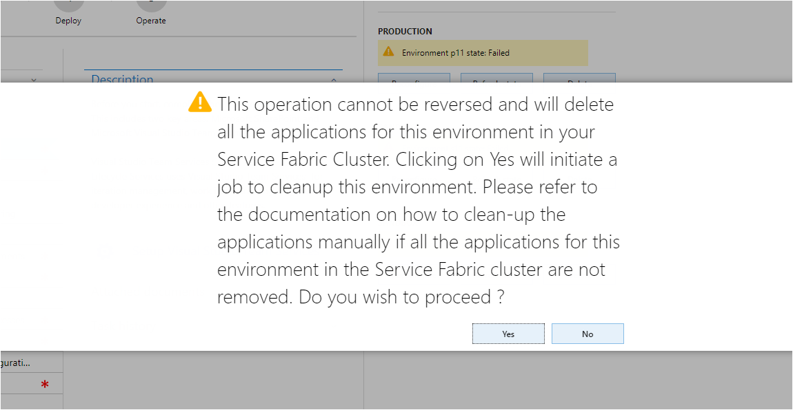

---
# required metadata

title: Apply updates to an on-premises deployment
description: This topic explains how to apply updates to an on-premises deployment of Microsoft Dynamics 365 for Finance and Operations, Enterprise edition.
author: manado
manager: AnnBe
ms.date: 11/16/2017
ms.topic: article
ms.prod: 
ms.service: dynamics-ax-platform
ms.technology: 

# optional metadata

# ms.search.form: 
# ROBOTS: 
audience: Developer, IT Pro
# ms.devlang: 
ms.reviewer: kfend
ms.search.scope: Operations, Unified Operations
# ms.tgt_pltfrm: 
ms.custom: 
ms.assetid: 
ms.search.region: Global
# ms.search.industry: 
ms.author: sarvanis
ms.search.validFrom: 2017-06-30
ms.dyn365.ops.version: Platform update 12

---
# Apply updates to an on-premises deployment

[!include[banner](../includes/banner.md)]

This topic explains how to apply supported updates to an on-premises deployment of Microsoft Dynamics 365 for Finance and Operations, Enterprise edition. All updates to on-premises environments are done through Microsoft Dynamics Lifecycle Services (LCS).

## Update types
Three types of updates can be applied to an on-premises deployment of Finance and Operations:

- Customizations
- Application X++ hotfixes that are released by Microsoft
- Platform updates

> [!NOTE] 
> At this time, application binary updates can't be applied to an on-premises environment.

> [!IMPORTANT]
> Before you apply any updates to an on-premises environment, save the configuration settings that were used to deploy that environment. When you apply updates, you must re-enter the configuration settings. For more information, see [Redeploy an on-premises environment](redeploy-on-prem.md#save-your-configuration).

## Apply code customizations
To apply customizations at the same time that you deploy a new on-premises environment, follow the steps in [Develop and deploy custom models to on-premises environments](develop-deploy-custom-models-on-premises.md). To apply new customizations to an on-premises environment that has already been deployed, follow these steps.

1. In LCS, open the on-premises implementation project.
2. Under **Environments**, select **Delete** to delete the application for the environment. This step cleans up the environment and removes any code that is deployed. **The on-premises agent, the data, and the infrastructure aren't affected when the application is deleted**.

    

3. Select **Configure** to re-deploy by using a new application and custom code.
4. In the advanced settings of the deployment configuration, select the application deployable package to apply, and then select **Done** to continue with the environment deployment process.

## Find and apply application hotfixes
There are two ways to find application hotfixes that are available:

- **Issue search in Lifecycle Services** – For more information about Issue search, see [Issue search](../lifecycle-services/issue-search-lcs.md).
- **Application X++ hotfix tiles** – For cloud-hosted environments, the **Environment details** page shows all hotfixes that are applicable to the environment, based on the version that is currently deployed. However, the tile functionality isn't available for on-premises environments. Therefore, to see the list of applicable hotfixes, you should maintain a cloud-hosted development environment that is the same version as the on-premises sandbox or production environment. Note that this approach is recommended only for X++ hotfixes, not for any other type of update.

Follow these steps to apply a hotfix.

1. Download the required hotfix to your development environment, and then follow the steps in [Create a deployable package](create-apply-deployable-package.md).
2. In the Asset library in LCS, upload the deployable package to the **Software deployable packages** tab.
3. As when you apply code customizations, you can include the above deployable package as an asset when you deploy an environment. To apply the package to a new environment or an environment that was previously deployed, follow the steps in the "Apply code customizations" section of this topic.

## Apply the latest platform update
There are two ways to apply the latest platform update:
- Deploy a new environment, and select the latest platform update topology during deployment. Then follow the usual steps for deploying an environment.
- To update an existing environment with the latest update, you must redeploy the environment. For detailed information about redeploying, see [Redeploy an on-premises environment](redeploy-on-prem.md).

