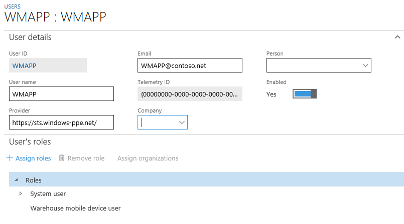
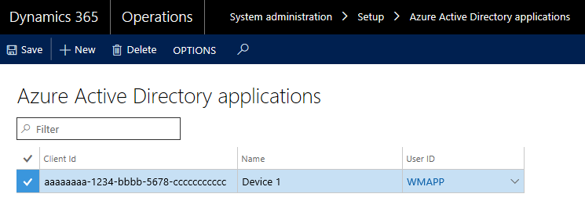

---
# required metadata

title: Warehousing for on-premises deployment
description: This topic describes the prerequisites for the warehousing app for on-premises deployments.
author: MarkusFogelberg
manager: AnnBe
ms.date: 11/08/2017
ms.topic: article
ms.prod: 
ms.service: dynamics-ax-applications
ms.technology: 

# optional metadata

# ms.search.form: 
# ROBOTS: 
audience: Developer
# ms.devlang: 
ms.reviewer: bis
ms.search.scope: Core, Operations
# ms.tgt_pltfrm: 
ms.custom: 24861
ms.assetid: 63e43066-76c7-400b-be7d-d14785e7985d
ms.search.region: Global
# ms.search.industry: 
ms.author: mafoge
ms.search.validFrom: 2017-12-04
ms.dyn365.ops.version: AX 7.3.0

---
# Warehousing for on-premises deployments
This topic describes how to configure Microsoft Dynamics 365 for Finance and
Operations - Warehousing for on-premises deployments.

## Prerequisites
The warehousing app is available on Android and Windows operating systems. To
use the app for on-premise deployments, it must as a minimum be version 1.1.1.0.
You must also have one of the following supported versions of Microsoft Dynamics
365. Use the information in the table below to evaluate if your hardware and
software environment supports the configuration.

| Platform               | Version                                                                            |
|------------------------|------------------------------------------------------------------------------------|
| Android                | 4.4 and up                                                                         |
| Windows (UWP)          | Windows 10 (all versions)                                                          |
| App version            | 1.1.1.0 and above                                                                  |
| Microsoft Dynamics 365 | Microsoft Dynamics 365 for Finance and Operations platform update 11 (on-premises) |

To be able to reach your on-premise resources with the app, you will need to
create DNS records for your AOS and for AD FS. For guidance, see [Create DNS
zones, and add a
record](https://docs.microsoft.com/en-us/dynamics365/unified-operations/dev-itpro/deployment/setup-deploy-on-premises-environments#createdns).

**Create an application entry in AD FS**
For a successful authentication exchange between AD FS and Dynamics 365 for
Finance and Operations, an application entry must be registered in AD FS under
an AD FS application group. To create this application entry, run the following
Windows PowerShell commands on a machine where the AD FS is installed. The user
account must have enough permissions to administer AD FS.

1.  Enter the following command in the Windows PowerShell console to create the
    application entry  
    Add-AdfsClient -Name 'Dynamics 365 for Finance and Operations - Warehousing'
    -ClientId ([guid]::NewGuid()) -ClientType Confidential -GenerateClientSecret
    -RedirectUri '\<Resource URL\>' -ADUserPrincipalName '\<Admin user\>'  

>   The \<Resource URL\> can, for example, be
>   [https://ax.d365ffo.onprem.contoso.com](https://mobiletestax.trial.operations.dev.dynamics.com/namespaces/AXSF)
>   (where
>   [https://ax.d365ffo.onprem.contoso.com](https://mobiletestax.trial.operations.dev.dynamics.com/namespaces/AXSF)
>   is the URL to access Microsoft Dynamics 365)

>   The \<Admin user\> can be any user with admin access to the AD FS machine.

2.  Save the values received.

3.  Run the following command to grant permission to the application  
    Grant-AdfsApplicationPermission -ClientRoleIdentifier '\<Client ID received
    in previous steps\>' -ServerRoleIdentifier '\<Resource URL\>' -ScopeNames
    'openid'

**Create and configure a user account**

To enable Microsoft Dynamics 365 to use your AD FS application, you must create
a user account in Microsoft Dynamics 365 with the same user credentials as the
user of the warehousing app:

1.  Create a user in Microsoft Dynamics 365 and assign the warehousing mobile
    device user role to the user.

    a.  Go to **System administration** \> **Common** \> **Users**.
    b.  Create a new user.
    c.  Assign the warehouse mobile device user role, as shown in the example
        screenshot.

    

2.  Associate your AD FS application with the warehousing app user.

    a.  In Microsoft Dynamics 365, click **System administration** \> **Setup**
        \> **Azure Active Directory applications**.
    b.  Create a new line.
    c.  Enter the client ID that you obtained when you created an application
        entry in AD FS (step 2 in Create an application entry in AD FS), give it
        a name, and select the warehousing app user.

    

**Certificates on device**

You need to make sure that the device with the app installed have the right
certificates to access the resources. If you are using self-signed certificates,
these will need to be installed on each device. For more information, see
[Create and export a self-signed
certificate](https://technet.microsoft.com/en-us/library/ff710475(v=ws.10).aspx).

**Configure the application**

You must configure the warehousing app on the device to connect to the Microsoft
Dynamics 365 server through the AD FS application.

1.  In the app, open **Connection settings**.
2.  Enter the following information:

    a.  A**ctive Directory Client ID** - The client ID that you obtained when
        you created an application entry in AD FS (step 2 in Create an
        application entry in AD FS).

    b.  **Active Directory Client Secret** - The client secret obtained when you
        created an application entry in AD FS.

    c.  **Active Directory Resource** - The DNS URL for the Microsoft Dynamics
        365 AOS. Append the URL with '/namespaces/AXSF'. For example:
        [https://ax.d365ffo.onprem.contoso.com/namespaces/AXSF](https://mobiletestax.trial.operations.dev.dynamics.com/namespaces/AXSF)

    d.  **Active Directory Tenant** - The DNS URL for the Microsoft Dynamics 365
        AD FS machine. Append the URL with '/adfs/oauth2'. For example:  
        <https://adfs.d365ffo.onprem.contoso.com/adfs/oauth2>

>   Make sure to use the CNAME of the ADFS machine (in the example the CNAME is
>   <https://adfs.d365ffo.onprem.contoso.com>)

1.  **Company** - Enter the legal entity in Microsoft Dynamics 365 to which you
    want the application to connect.
2.  Select the **Back** button in the top-left corner of the application.

>   The application will now connect to your Microsoft Dynamics 365 server and
>   the log-in screen for the warehouse worker will display.
