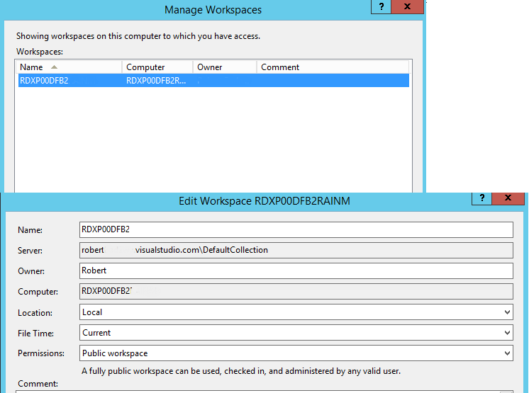

---
# required metadata

title: Create a new user on a development machine
description: When an environment is first deployed, only one user account is enabled as a developer on the virtual machine (VM). This article explains how to enable another user account as a developer on a development VM.
author: RobinARH
manager: AnnBe
ms.date: 06/20/2017
ms.topic: article
ms.prod: 
ms.service: dynamics-ax-platform
ms.technology: 

# optional metadata

# ms.search.form: 
# ROBOTS: 
audience: Developer
# ms.devlang: 
ms.reviewer: robinr
ms.search.scope: Operations
# ms.tgt_pltfrm: 
ms.custom: 31621
ms.assetid: c56d5cdf-3c01-4730-bda5-bb5f8f79e375
ms.search.region: Global
# ms.search.industry: 
ms.author: robadawy
ms.search.validFrom: 2016-02-28
ms.dyn365.ops.version: AX 7.0.0

---

# Create a new user on a development machine

[!include [banner](../includes/banner.md)]

This article explains how to enable another user account as a developer on a development VM.

When an environment is first deployed, only one user account is enabled as a developer on the virtual machine (VM). This user is preconfigured by Microsoft Dynamics Lifecycle Services (LCS) or is the local administrator account on downloaded virtual hard disks (VHDs). However, you can enable a new user account to develop on the VM. Even after you enable a new account, only one developer can develop at a time on the same VM/application.

## Prerequisites
To enable a new user account to develop on the VM, the user account must be an administrator on the VM. Additionally, you must log on to the VM by using the credentials of the default developer account. If the VM is a Microsoft Azure VM, the account information is available on the environment page in LCS. If the VM is a local VM that runs on the downloaded VHD, use the local administrator account. For more information, see [Access Instances](../dev-tools/access-instances.md).

## Steps
1.  Download the following script: ProvisionAxDeveloper.ps1, the script is available at <https://github.com/Microsoft/Dynamics-AX-Scripts>.
2.  Open a Microsoft Windows **PowerShell Command Prompt** window as an administrator.
3.  Run the ProvisionAxDeveloper.ps1 script. Specify the following parameters:

    -   **DatabaseServerName** – Typically, this is the machine name.
    -   **Users** – Use the following format: &lt;domain or machine name&gt;\\user1, … &lt;domain or machine name&gt;\\user n

    **Examples**

        > ProvisionAxDeveloper.ps1 RDXP00DB20RAINM RDXP00DB20RAINM\username1

        > ProvisionAxDeveloper.ps1 -databaseservername RDXP00DB20RAINM -users RDXP00DB20RAINM\username1,RDXP00DB20RAINM\username2

4.  If more than one user account will be developing on the same version control workspace, you need to make the workspace public.
    1.  In Visual Studio, open **Source Control Explorer**, select the workspace dropdown and select **Manage workspaces**.
    2.  Select the application workspace, click **Edit,** then click **Advanced** and set the workspace to **Public workspace**.

