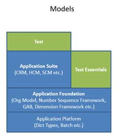
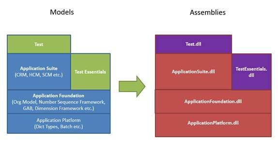
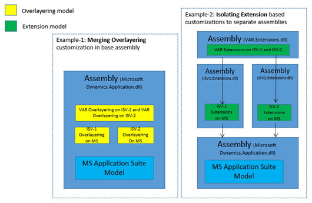
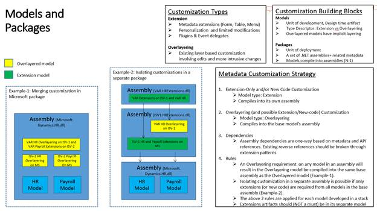

---
# required metadata

title: Model split
description: This topic explains the split of the stack into three main models -  the Application Platform, the Application Foundation, and the Application Suite.
author: maertenm
manager: AnnBe
ms.date: 06/20/2017
ms.topic: article
ms.prod: 
ms.service: dynamics-ax-platform
ms.technology: 

# optional metadata

# ms.search.form: 
# ROBOTS: 
audience: Developer
# ms.devlang: 
ms.reviewer: robinr
ms.search.scope: Operations
# ms.tgt_pltfrm: 
ms.custom: 26941
ms.assetid: feaa09c5-efc7-4594-921e-b42536b18852
ms.search.region: Global
# ms.search.industry: 
ms.author: maertenm
ms.search.validFrom: 2016-02-28
ms.dyn365.ops.version: AX 7.0.0

---

# Model split

[!INCLUDE [banner](../includes/banner.md)]

This topic explains the split of the stack into three main models -  the Application Platform, the Application Foundation, and the Application Suite.

## Overview

Developing modular code is the driving force behind the model split. Splitting the stack into multiple models provides many benefits, including faster compile time and a greater distinction between partner's IP in production. There are three main models: the **Application Platform**, the **Application Foundation**, and the **Application Suite**. 

 

The <strong>Application Platform</strong> is the lowest model and contains the lowest level elements that interface with the kernel. The <strong>Application Object Server **(</strong>AOS<strong>) can be started with only the **Application Platform</strong>. The <strong>Application Foundation</strong> sits atop the <strong>Application Platform</strong> and contains framework functionalities that are shared by all applications. Finally, the <strong>Application Suite</strong> sits atop the <strong>Application Foundation</strong> and contains application specific elements. The Model Breakdown table in the appendix provides examples of components in each of these models. Each model is compiled into its own assembly with dependencies on lower layer model assemblies. The <strong>Application Platform</strong> does not depend on any other models. This implies a direct mapping of the model to an assembly. 

 

Developing in the modular stack allows changes to be made in the **Application Suite** and compiled without touching the rest of the stack. Only models with new changes need to be compiled, greatly reducing compile time. More information can be found in the "Model Breakdown" section at the end of this article.

## Customizing models
There are two methods for customizing: overlayering and extensions. Overlayering allows for changes to be made at multiple layers that alter, or overlay, elements in models at lower levels. Extensions allow for new elements to be added or code to be attached to element events or plug-in points. The type of customization used impacts how a model will be compiled and ultimately packaged. One or more models are compiled into an assembly. An assembly, its non-code metadata, and its compiled artifacts, form a package. A package is an independent deployable unit. A model that contains only extension customizations can be compiled into its own assembly and be deployed in its own package. A model that contains any overlayering must be compiled into the assembly based on the overlayed model. 

   

Using extensions has several advantages, including:

-   For application lifecycle management purposes, you need to manage only your extension artifacts.
-   Building a customization does not require you to recompile the entire application.
-   In the cloud, Microsoft can install, patch, upgrade, and change internal APIs without affecting your customizations.
-   You can service your solutions independently without concerns about other customizations.

There are currently support code extensions, table extensions, form extensions, menu extensions, and enum extensions. The Extensions section in [Customize with extensions and overlayering](../extensibility/customization-overlayering-extensions.md) and [Customize model elements using extensions](../extensibility/customize-model-elements-extensions.md) provide a more detailed explanation on how to use extensions.  Extensions should be used on supported elements wherever possible and are best applied when no change to existing Microsoft code is needed. A change to mask a method’s functionality requires overlayering to change the code itself.  Overlayering should be in areas not covered by extensions and when the customization alters the base functionality. The illustration below summarizes differences between the two customization strategies. 

## Model breakdown
<table>
<colgroup>
<col width="50%" />
<col width="50%" />
</colgroup>
<tbody>
<tr class="odd">
<td><strong>Model</strong></td>
<td><strong>Concept</strong></td>
</tr>
<tr class="even">
<td>Application Platform</td>
<td>The Application Platform interfaces to kernel functionalities that are application logic agnostic. The AOS can be started with just this model.
<ul>
<li>AIF base objects</li>
<li>Batch</li>
<li>Form base objects</li>
<li>RunbaseSysOperations* base objects</li>
<li>DictXX objects</li>
<li>Appl, Info, Global, ClassFactory</li>
<li>Data access objects</li>
<li>Helper Classes</li>
<li>ENUM/EDT/Macros/ConfigKey/LicenseCode</li>
</ul></td>
</tr>
<tr class="odd">
<td>Application Foundation</td>
<td><ul>
<li>Application foundation features:
<ul>
<li>Dimension framework</li>
<li>Global Address Book</li>
<li>Number Sequence</li>
<li>OrgModel</li>
</ul></li>
<li>Feature areas:
<ul>
<li>Business Intelligence</li>
<li>Reports</li>
<li>Upgrade framework</li>
<li>Security</li>
<li>E-Signature</li>
<li>Data Import/Export</li>
<li>Workflow</li>
</ul></li>
<li>SYS objects:
<ul>
<li>Best Practices</li>
<li>CheckList</li>
<li>Policy</li>
<li>RecordTemplate</li>
</ul></li>
<li>Miscellaneous:
<ul>
<li>Currency</li>
<li>Unit of Measure</li>
</ul></li>
</ul></td>
</tr>
<tr class="even">
<td>Application Suite</td>
<td><ul>
<li>Supply Chain Management</li>
<li>Human Capital Management</li>
<li>Professional Services, etc.</li>
</ul></td>
</tr>
</tbody>
</table>

