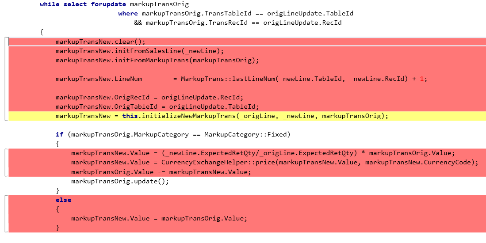
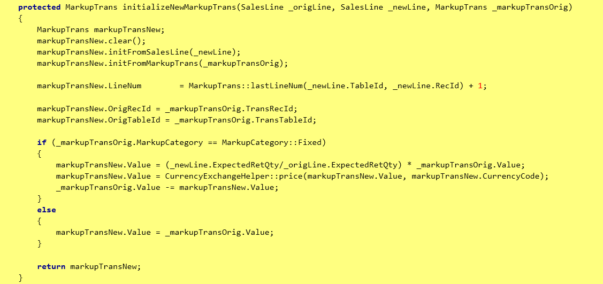

---
# required metadata

title: Writing extensible methods
description: This article how to write extensible methods.
author: Smitha Nataraj
manager: AnnBe
ms.date: 09/09/2018
ms.topic: article
ms.prod: 
ms.service: dynamics-ax-platform
ms.technology: 


# optional metadata

# ms.search.form: 
# ROBOTS: 
audience: Developer
# ms.devlang: 
ms.reviewer: kfend
ms.search.scope: Operations
# ms.tgt_pltfrm: 
ms.custom: 268724
ms.assetid: 
ms.search.region: Global
# ms.search.industry: 
ms.author: Smitha Nataraj
ms.search.validFrom: 2018-09-09
ms.dyn365.ops.version: Platform update 20
---

# Methods

[!include [banner](../includes/banner.md)]

By default all public and protected methods in X++ are extensible, (by Chain of Command). 

**A key guideline when making a method extensible is to assess the exposed functionality and the impact it can have when extended.** Consider:
+ The impact the extensions might have on the scenario where the method is used. For instance, allowing extensions to initialization of a table record is low risk, where as allowing extensions to skip a certain validation is of higher risk depending on the business scenario.
+ The impact if it is extended by multiple extensions in parallel.
+ The ability to modify an extensible method in the future would be restricted - due to considerations of how consumers could be impacted/broken when the method signature and/or logic is modified.
	
Below are some guidelines that could help writing code that is extensible:
	
+ **Short and concise methods** - a method should have one and only one responsibility. This enables easy extensions of the method which can only act on the given agenda of the method. A simple example, is to keep the construction and initialization of a class object in two separate methods.

+ **Only expose what is necessary** for any new class members or methods that are added i.e. allow minimal access to all class members and methods by keeping them private. 

+ Use private, protected, public and final explicitly - for methods and class fields.  This will guide extenders of your code to your extension points, while allowing you to keep full control of the parts the extender shouldn't care or depend on.

+ **Method parameters**:
	For methods that require several parameters:
  - The method is most likely long and should be refactored. Consider if it qualifies to refactor the entire method into a class and/or split into multiple smaller methods requiring fewer parameters. 
  - In other cases, when several parameters are required, they often have a coherence that could be expressed by a class. Encapsulating these parameters in a class, would make it easy to for extenders to add additional parameters and add additional parameters to the base method without breaking APIs in future. Eg. See PriceDiscParameters used in class PriceDisc.

+ **Switch blocks**
  - Avoid switch blocks in the middle of methods; a switch block should be in its **own method** in order to allow extending it. 
  - **Long case blocks** are good candidates to refactor into a class/class hierarchy with subclasses for each of the case blocks.
		See ```SalesLineCopyFromSource``` class hierarchy, for example.
  - Having **default blocks** in switch statements makes the method having the switch block non-extensible.
  - Avoid having **throw statements within the default block** of the switch statement. This makes the switch statement non-extensible. One way to handle the throw in the default case is to refactor the switch block to a separate method that is extensible or make the entire method replaceable.
			
In the example below, making the ```findOrderHeader``` Replaceable, is another solution.

		    private Common findOrderHeader(boolean _forUpdate)
		    {
		        switch (this.InventTransType)
		        {
		            case InventTransType::Sales:
		                return this.salesTable(_forUpdate);
		
		            default: 
		                return this.findOrderHeaderDefault(_forUpdate);
		        }
		    }
		
		    [Replaceable]
		    protected Common findOrderHeaderDefault(boolean _forUpdate)
		    {
		        throw error(Error::wrongUseOfFunction(funcName()));
		    }

+ **While**
Avoid having while blocks in the middle of methods - this makes it difficult to extend the while block. Ideally, logic within the while block should be in a separate method which enables extensions.

Not extensible code:

   
 
 Extensible code after refactoring:
 
 
 
 
+ **If..else statements**
	- To provide the ability to extend the conditions in an if statement, extract out the logic in the if condition to a separate method.
	- Avoid having nested if..else blocks. This makes it difficult to change the logic in one of the blocks.
		- A way to solve this, is to refactor each of the conditions and the logic within each of the blocks to separate methods respectively in order to allow extending the conditions and/or the logic within each block. 
	- When the if..else blocks are  handling specialization, consider moving out the logic into a class hierarchy. 
			Eg. ```SalesLineCopyFromSource```
	- Having a throw in an 'else' block of a method (when the method only has an if..else), also makes the method non-extensible in certain scenarios. A way to handle the throw in the else is to refactor the conditions for the throw in a separate method.
		
+ Avoid using **PrmIsDefault**
When the method is overridden or wrappable the caller of ```super()``` or ```next()``` provides all parameters, which make ```prmIsDefault()``` return false always.

+ Avoid using **enumCnt**
This method will at compile time use a numeric literal of the number of values an enum has.  If the enum is extended or made extensible in the future, it will require your code is recompiled.  Instead use ```DictEnum.values()```.
		
+ **Construct methods** 
	- Use the ```SysExtension``` framework to allow easy extensions.
	- Avoid having a throw in factory methods - a way to solve this is to extract the conditions for the throw in a separate method that is extensible. See more details in throw below.
	
+ **Static methods**
Static methods cannot be extended with extra state. For instance method an extender can introduce properties, that can be set via parm methods. Prefer instance methods when possible.

+ **Ability to extend part of the logic in between a long method** 
If it is not possible to refactor entire methods, but the goal is to make a part of it extensible, apply the extract method refactoring. The new protected method must have a single responsibility and a name that conceptually and precisely describes its responsiblilty. This allows owners and all extenders to use the method without breaking each other.

Examples:
Initialization, insertion, updates to a table record or instantiation and initialization of a class could be extracted out into smaller methods enabling each of these for extensions. And the original method then calls these individual methods, hence not breaking the callers to this method.
			
+ **Throw statements**
If a throw is added to an existing method that is extensible, then it can potentially break extenders. Consider adding the conditions for the throw in an extensible method, to give extenders the ability to leverage that as needed and get rid of the throw. 

Not extensible code:

 

Extensible code after refactoring:

 

+ CRUD statements 
	- Use Query objects in scenarios where the queries should be extensible. Implement a protected method building the query and may be several separate methods to add joined datasources, ranges and selection fields. This way different parts of the query are extensible individually.
	- Use ```SysQueryInsertRecordSet``` to convert insert_recordset to query
	- Avoid using field lists in select statements, where possible - this will enable extenders to retrieve their additional fields without having to extend.
	- Using the 'in' keyword in query ranges, in order to allow extenders to add more values to the query range. This is recommended especially for query ranges with enum values.
