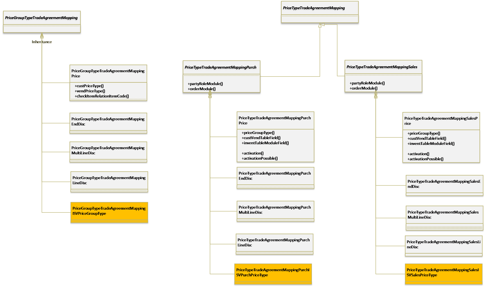
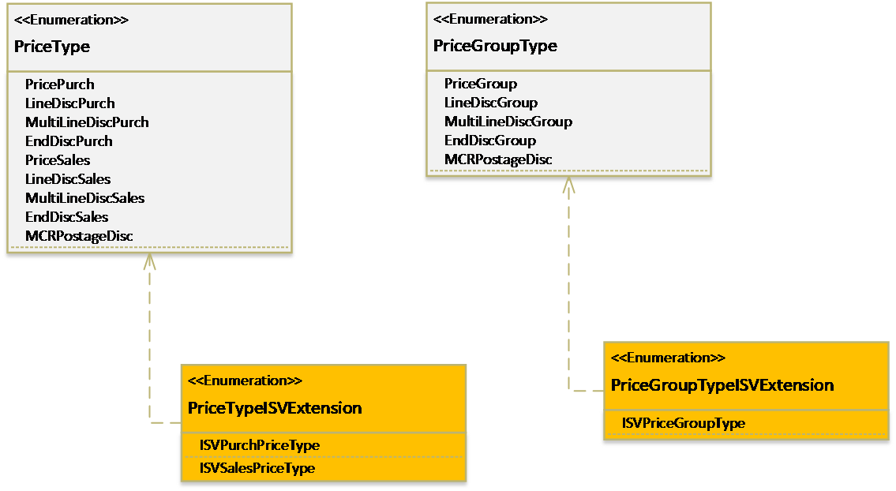

---

# required metadata

title: Price and discounts changes in the Fall Release 2017
description: This topic describes the changes in the price and discount area in the Fall Release 2017.
author: smithanataraj
manager: AnnBe
ms.date: 06/20/2017
ms.topic: article
ms.prod: 
ms.service: dynamics-ax-platform
ms.technology: 

# optional metadata

# ms.search.form: 
# ROBOTS: 
audience: Developer
# ms.devlang: 
ms.reviewer: robinr
ms.search.scope: Operations
# ms.tgt_pltfrm: 
ms.custom: 89563
ms.assetid: 
ms.search.region: Global
# ms.search.industry: 
ms.author: smnatara
ms.search.validFrom: 2017-07-01
ms.dyn365.ops.version: Platform update 11
---

# Price and discounts changes in the Fall Release 2017

This is an overview of the changes being done to make the pricing area extensible.This article outlines the extensibility changes part of the Fall Release 2017 in the pricing area.

You would be interested to read this if you currently have any customizations around the price and discount search in Dynamics 365. 

Some of the most commonly seen customizations in the pricing area are:

1. Adding new price group types and the corresponding price types (enum values for PriceType and PriceGroupType) and adding search mechanisms for the new price types.
2. Modifying the price and discount search, including passing in any additional parameters to the PriceDisc class. 

The solution here is targeting to address the above.

## PriceType and PriceGroupType enums:

Typically, adding a new type of price discount search would start with adding a new enum value in the two enums - PriceGroupType and PriceType. To enable these for extensibility, the behavior around the PriceGroupType  and PriceType enum values are now encapsulated in the class hierarchies PriceGroupTypeTradeAgreementMapping and PriceTypeTradeAgreementMapping respectively. These should be extended for any new PriceGroupType and PriceType extended enum values.

PriceTypeTradeAgreementMapping would also be where the mapping of fields on the Customer/Vendor tables or InventTable table corresponding to the price types, is defined. 

NOTE: In the diagram below, the methods are only shown on one of the sub-classes (only for the purpose of illustration), though the implementation needs to be on each. 

## PriceDisc class: 

The PriceDisc class is the search engine for price and discounts. This class will now use a PriceDiscParameters object as a member for passing in the parameters, used in the price and discount search. This should enable passing in the additional search parameters for the specific solutions.

Only the parameters specific for a given PriceGroupType search are passed through the corresponding find methods on the PriceDisc class. 

The possibility to wrap and modify the instantiation of the PriceDiscParameters class is enabled for all price and discount search calls made throughout AppSuite.

Below you can see how the PriceDisc class can be extended to modify existing searches or to add a new search method corresponding to the new extended PriceType enum values.

## Walkthrough: Add a new price search

Let's say we have extended the PriceGroupType enum with a new value  PriceGroupTypeISVExtension, and two corresponding PriceType enum values - ISVPurchPriceType and ISVSalesPriceType. 

The below diagram illustrates how a new price search can be added for the above PriceGroupType and PriceType values added:

In this example:

1. For the newly created PriceGroupType value, a PriceGroupTypeTradeAgreementMappingISVPriceGroupType class decorated with the attribute ISVPriceGroupType should define the behavior of the price group type.
2. For the newly created PriceType value, the PriceTypeTradeAgreementMappingISVPurchPriceType and PriceTypeTradeAgreementMappingISVSalesPriceType classes corresponding to Purchase and Sales would be implemented.
3. The PriceDiscParameters class should be augmented to add any generic parameters for the price discount search.
4. The PriceDisc class should be augmented to create the new price discount search methods for the new price types.

The PriceDiscParameters is accessible from all classes related to price and discount search and these could be augmented, based on the requirements. 
