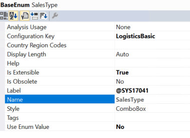
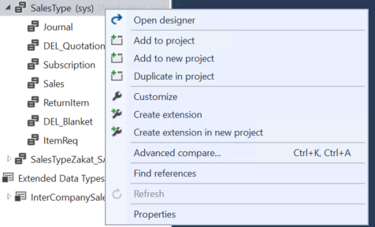
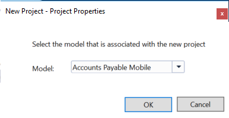

---

# required metadata

title: Add an enum value
description: This topic explains how to add new values to an enum by extending the enum.
author: smithanataraj
manager: AnnBe
ms.date: 06/20/2017
ms.topic: article
ms.prod: 
ms.service: dynamics-ax-platform
ms.technology: 

# optional metadata

# ms.search.form: 
# ROBOTS: 
audience: Developer
# ms.devlang: 
ms.reviewer: robinr
ms.search.scope: Operations
# ms.tgt_pltfrm: 
ms.custom: 89563
ms.assetid: 
ms.search.region: Global
# ms.search.industry: 
ms.author: smnatara
ms.search.validFrom: 2017-07-01
ms.dyn365.ops.version: Platform update 9
---

# Add an enum value

To add new values to an enum, you should extend the enum. Any enum that is marked as **Extensible** (**IsExtensible = true**) can be extended. You can find the extensibility information in the **Properties** window in Microsoft Visual Studio, as shown in the following illustration.

When enum values of extensible enums are synchronized, the integer values of the baseline enum are deterministic, whereas the integer values of the extension enum values are non-deterministic. The values are generated during synchronization. Therefore, you can't have logic that depends on the integer value of the enum values. Here are some examples:

+ Range comparisons, such as `<`, `>`, and `..`
+ Modeled ranges in views and queries
+ Query ranges that are created from code 

Usually, an extended enum must have its own implementation wherever it's used. Look for all uses of the enum, and uptake the implementation where it's required. Here are some significant places to look for:

+ Switch blocks:

    - If the switch block doesn't have a default case block or a default case block that doesn't throw an exception, handle the extended enum value by subscribing to a delegate, if a delegate is provided. Otherwise, add a post-event handler to the method. 
    - If the enum is used in a switch that has a default case block that throws an exception, contact Microsoft to request a delegate.

+ If the enum has an associated class hierarchy that handles the enum, create a subclass for the extended enum–specific implementation, and uptake the construct on the base class as required. For more information, see [Register a subclass for factory methods](register-subclass-factory-methods.md).
	
## Extend an enum

There are two ways to extend an enum:

+ Create a project that has a model reference where you want the new enum extension. Right-click the enum to extend, and then select **Create extension**.

    

+ Right-click the enum to extend, and then select **Create extension in new project**. You're prompted to select the model that the extension enum should be created in.
		
    
		
The enum extension is created in the selected model. You can add new enum values to this extension.
