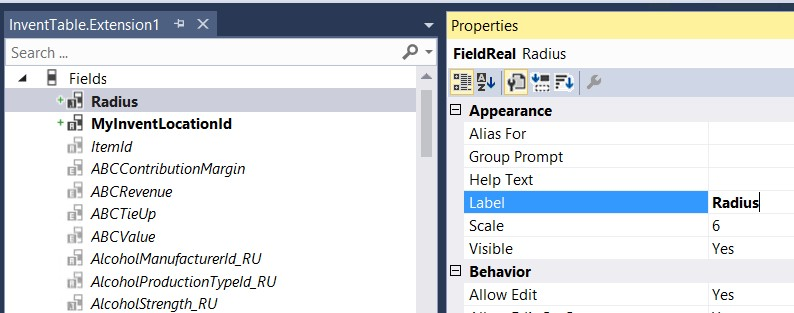
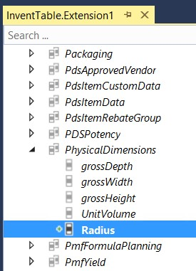
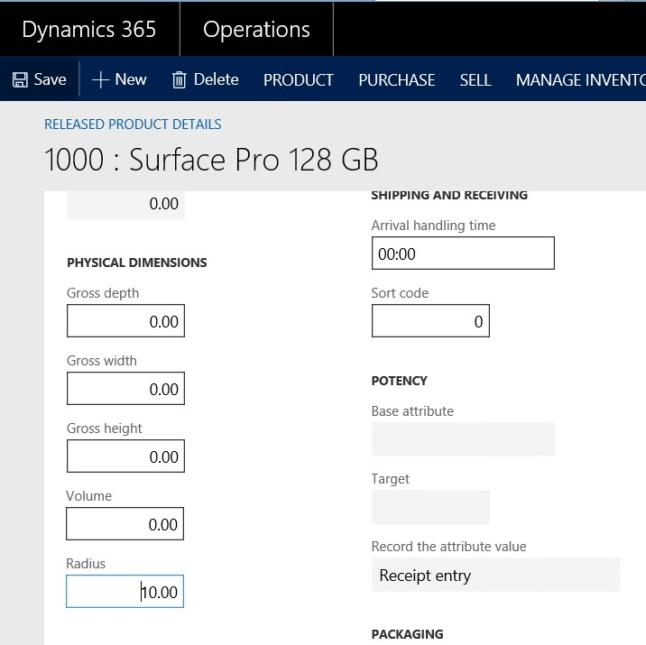

---
# required metadata

title: Add a new field to an existing table
description: This topic describes how to use a table extension to add a field to a table.
author: ivanv-microsoft
manager: AnnBe
ms.date: 06/20/2017
ms.topic: article
ms.prod: 
ms.service: dynamics-ax-platform
ms.technology: 

# optional metadata

# ms.search.form: 
# ROBOTS: 
audience: Developer
# ms.devlang: 
ms.reviewer: robinr
ms.search.scope: Operations
# ms.tgt_pltfrm: 
ms.custom: 268724
ms.assetid: 
ms.search.region: Global
# ms.search.industry: 
ms.author: ivanv
ms.search.validFrom: 2017-06-01
ms.dyn365.ops.version: Platform update 4

---

# Add a new field to an existing table

[!include[banner](../includes/banner.md)]

To add a new field to an existing table, you must first create a table extension. For example, to add a field that holds the radius of the released product, you must create an extension for the InventTable table in your model, as shown in the following illustration.

 

You can now add the field to the extension, just as you would add a field to a table in your model. You can use two methods:

+ In the designer, right-click the **Fields** node, select **New**, and then select the type of field to add.
+ Drag an existing Extended Data Type or Base Enumeration from your project onto the **Fields** node.

When you've finished, you can modify the properties of the new field. In the following illustration, only the **Label** property was modified.

You can now optionally add the new field either to one of the existing field groups or to a new field group that you create. In the following illustration, the **Radius** field was added to the **PhysicalDimensions** field group.

After compilation and synchronization of the database, you can see and edit the new field in the user interface.

