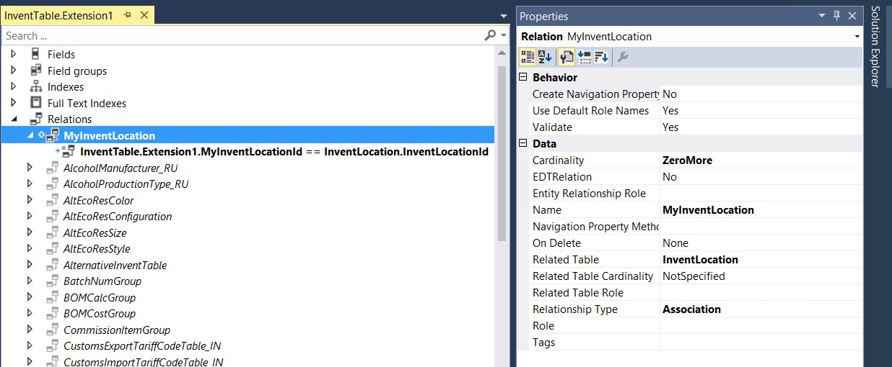

---

# required metadata

title: Add relations to tables through extension
description: This topic explains how to add a relation to a table.
author: ivanv-microsoft
manager: AnnBe
ms.date: 07/10/2017
ms.topic: article
ms.prod: 
ms.service: dynamics-ax-platform
ms.technology: 

# optional metadata

# ms.search.form: 
# ROBOTS: 
audience: Developer
# ms.devlang: 
ms.reviewer: robinr
ms.search.scope: Operations
# ms.tgt_pltfrm: 
ms.custom: 268724
ms.assetid: 
ms.search.region: Global
# ms.search.industry: 
ms.author: ivanv
ms.search.validFrom: 2017-07-01
ms.dyn365.ops.version: Platform update 4

---

# Add relations to tables through extension

[!include [banner](../includes/banner.md)]

To enable rich and secure interactions with data in multiple tables, you must help guarantee referential integrity by defining relations that describe the link between two tables. By defining relations, you enable validation of the data that is entered and lookup capabilities for the related information. 

You can add a new relation by extending a table.

In the following example, a new field, **MyInventLocationId**, is added to the InventTable table. This field is a reference to the InventLocation table that contains warehouses.

1. In the new extension model, create an extension of the InventTable table.
1. Create a new relation, just as you would create a relation on a regular table.
1. Specify the **Related Table**, **Relationship Type**, and **Cardinality** properties, and any other properties that apply to the relation.
1. Add the link by specifying the fields from the InventTable table and the InventLocation table that have the same value. In this case, the fields are **MyInventLocationId** in the InventTable table and **InventLocationId** in the InventLocation table.

The following illustration shows the new relation.

