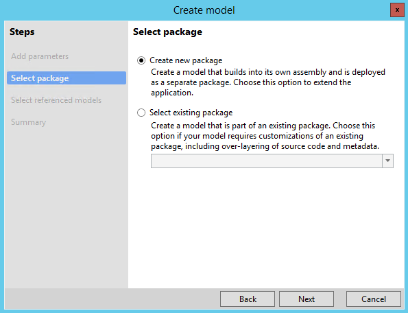
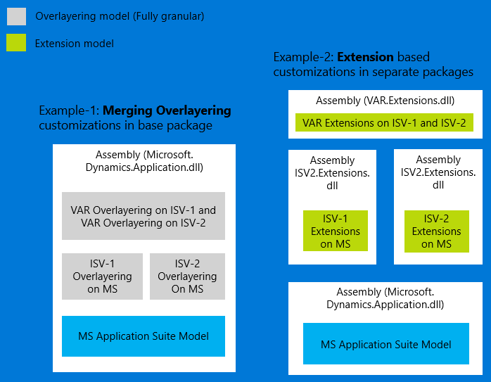
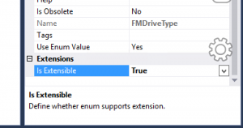
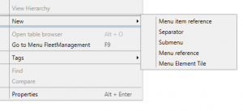
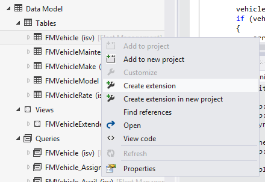
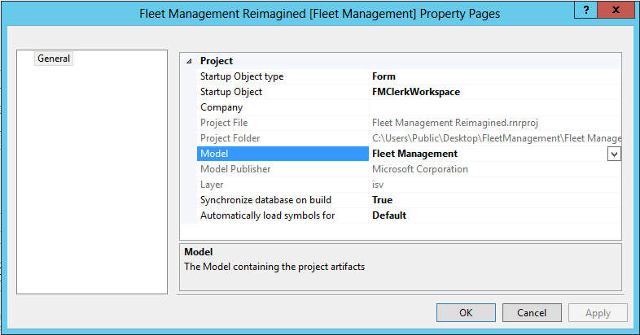
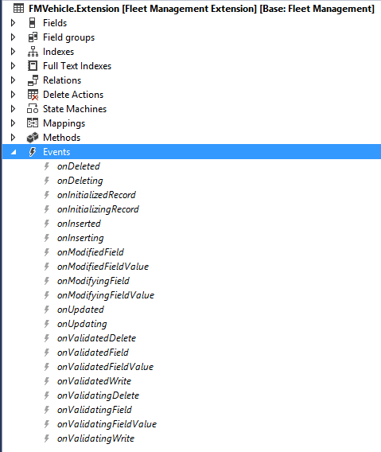
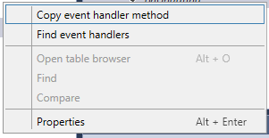

---
# required metadata

title: Customize with extensions and overlayering
description: This topic discusses the two methods of customizing source code and metadata of model elements -  overlayering and extensions and details supported extension capabilities.
author: robadawy
manager: AnnBe
ms.date: 11/08/2017
ms.topic: article
ms.prod: 
ms.service: dynamics-ax-platform
ms.technology: 

# optional metadata

# ms.search.form: 
# ROBOTS: 
audience: Developer
# ms.devlang: 
ms.reviewer: robinr
ms.search.scope: Operations
# ms.tgt_pltfrm: 
ms.custom: 26961
ms.assetid: 8a2b3107-247d-4362-8d4d-6ee6257abfcc
ms.search.region: Global
# ms.search.industry: 
ms.author: robadawy
ms.search.validFrom: 2016-02-28
ms.dyn365.ops.version: AX 7.0.0

---

# Customize with extensions and overlayering

[!INCLUDE [banner](../includes/banner.md)]

This topic discusses the two methods of customizing source code and metadata of model elements -  overlayering and extensions and details supported extension capabilities.

## Overlayering

You can customize source code and metadata of model elements that are shipped by Microsoft or third-party Microsoft partners. In order to customize metadata and source code of a model, the developer must create a new model that overlays the model they want to customize. For example, solution developers can provide code in the SLN layer, independent software vendors can use the ISV layer, and value-added resellers can use the VAR layer. Functionality defined in higher layers (VAR layer in this example) can override the functionality of lower layers. The overlaying model must belong to the same **Package** as the source model and belong to a layer that is higher than the source model. Overlayering is a powerful tool to perform advanced customizations of metadata and source code, but may increase the cost of upgrading a solution to a new version. Click on this [link](https://mix.office.com/watch/1ol6ov90jrd4w) to open an Office Mix that provides a good introduction on how to customize model elements.

## Extensions
You can customize an application by using *extensions*. An extension enables you to add functionality to existing model elements and source code. Extensions provide the following capabilities:

-   Creating new model elements.
-   Extending existing model elements.
-   Extending source code using class extensions.
-   Customizing business logic. Ways to customize business logic include:
    -   Creating event handlers to respond to framework events, such as data events.
    -   Creating event handlers to respond to event delegates that are defined by the application.
    -   Creating new plug-ins.

To get started, review or complete this tutorial: [Customize model elements using extensions](customize-model-elements-extensions.md).

## Extension models and packages
You can create a model that contains only new model elements, new code, or extensions. This model is compiled into its own separate assembly. These assemblies, along with related metadata and runtime artifacts can be packaged (as a deployable package file) and deployed on runtime sandbox or production environment. To create an extension model, go through the Create model wizard and select **Create new package** on the second step. 

 

Extension models have several advantages, including:

-   **Application lifecycle management (ALM):** Extension models simplify and improve the performance of deployments, builds, test automation and delivery to customers.
-   **Design time performance:** Building your model or project doesn't require you to recompile the entire application.
-   **Servicing:** In the cloud, Microsoft can install, patch, upgrade, and change internal APIs without affecting your customizations.
-   **Upgrades:** Unlike overlayering, extensions reduce the cost of upgrading to a new version, as this approach eliminates costly code and metadata conflicts.

The following diagram illustrates how extensions get isolated in their assemblies. 

## Code extensions
You can extend source code in 3 ways:

-   By subscribing to events (framework events and delegates)
-   By writing plug-ins.
-   By creating class extensions (aka class Augmentation), see section below.

You should understand the following characteristics of framework events:

-   Events are implemented as multi-cast delegates, which means that more than one event handler can be subscribed to any particular event.
-   Events are broadcast; there's no sequencing of calls to event handlers.
-   Event handlers execute within the transaction scope of the base methods.

### Events

Events are raised as preceding and succeeding operations around the base methods. This means that you have the opportunity to run code before a base method is called and after it has completed. Microsoft Dynamics AX 2012 introduced XPP events, which are also available in this release and can be subscribed to in your extensions.

### Plug-ins

Plug-ins are extension points that are defined by the base application. By using a class-factory pattern, plug-ins enable you to replace the base functionality. You can see how to implement a plug-in in the tutorial, [Customize model elements using extensions](customize-model-elements-extensions.md).

### Class Extensions

Class extensions enable you to augment a class by adding methods and variables to existing classes, tables and forms. For more details refer to the topic [class extensions](class-extensions.md).

## Form extensions
You can extend the functionality of a form by extending its controls and data sources. For example, in a form extension, you can:

-   Add a new control.
-   Enable or disable a control.
-   Change the text or label property of a control.
-   Change a control's visibility.
-   Change a form's help text.
-   Change a form's caption.
-   Add a new data source.
-   Add a form part.

Other ways to customize a form, such as reordering controls in the form are planned to be included in a future release. In Microsoft Dynamics AX 2012, you could override form methods. In the current version, you use extensions to implement event handlers that are called from the base implementations of form methods. The following table lists each method and its associated events.

|**Published form DataSource method**|**Preceding event**|**Succeeding event**|
|---|---|---|
|active|N/A|Activated|
|delete|Deleting|Deleted|
|validateWrite|ValidatingWriting|ValidatedWrite|
|write|Writing|Written|
|create|Creating|Created|
|executeQuery|N/A|QueryExecuted|
|linkActive|N/A|PostLinkActive|
|init|N/A|Initialized|
|validateDelete|ValidatingDelete|ValidatedDelete|
|reread|N/A|Reread|
|selectionChanged|N/A|SelectionChanged|
|markChanged|N/A|MarkChanged|
|leaveRecord|LeavingRecord|LeftRecord|

|**Published form Object method**|**Preceding event**|**Succeeding event**
|---|---|---|
|init|Initializing|Initialized
|close|Closing|N/A
|run|N/A|PostRun
|activate|N/A|Activated

|**Published form Control method**|**Preceding event**|**Succeeding event**
|---|---|---|
|modified|N/A|Modified
|validate|Validating|Validated
|leave|Leaving|LostFocus
|enter|N/A|Enter
|gotFocus|N/A|GotFocus
|clicked|N/A|Clicked
|selectionChange|SelectionChanging|N/A
|pageActivated|N/A|PageActivated
|allowPageDeactivate|AllowPageDeactivate|N/A
|expand|Expanding|Expanded
|tabChanged|N/A|TabChanged
|dialogClosed|N/A|DialogClosed

### Code behind extension forms

You can use class extensions to author X++Â logic associated with form extensions. This allows the definition of state variables accessible to form and control event handlers. It also allows overriding form methods without overlayering code. Refer to [this](https://community.dynamics.com/ax/b/newdynamicsax/archive/2016/10/11/code-behind-extension-forms-how-to-add-state-variable-and-override-methods-without-overlayering) blog article for an example.

## Table extensions
You can create a table extension to extend a table's design and logic. You can add new fields, field groups, indexes, mappings and relations. You can also add new fields to existing field groups, change the label of a table field, change the Created By, Created Date Time, Modified By, Modified Date Time properties. Using table extensions, you can also change the Extended Data Type property on fields and set it to an EDT that is derived from the current EDT (*This is available as of platform update 8*).

In Microsoft Dynamics AX 2012, you could override the virtual methods of a table's base class to control the behavior that occurred during table operations, such as when creating, reading, updating, or deleting. In the current version, you instead use extensions to implement event handlers that are called from the base implementations of the table methods. The following table lists each table method and its events.

|**Published Table method**|**Preceding event**|**Succeeding event**|
|---|---|---|
|validateWrite|ValidatingWrite|ValidatedWrite|
|validateDelete|ValidatingDelete|ValidatedDelete|
|validateField|ValidatingField|ValidatedField|
|validateFieldValue|ValidatingFieldValue|ValidatedFieldValue|
|modifiedField|ModifyingField|ModifiedField|
|modifiedFieldValue|ModifyingFieldValue|ModifiedFieldValue|
|Insert|Inserting|Inserted|
|Update|Updating|Updated|
|Delete|Deleting|Deleted|
|Initvalue|InitializingRecord|InitializedRecord|
|FinalDeleteValidation|Executed when a delete operation is performed on a table object, before the operation is committed to the underlying database table|N/A|
|FinalInsertValidation|Executed when an insert operation is performed on a table object, before the operation is committed to the underlying database table|N/A|
|FinalReadValidation|Executed when a read operation is performed on a table object.|N/A|
|FinalUpdateValidation|Executed when an update operation is performed on a table object, before the operation is committed to the underlying database table.|N/A|

Validation events capture and return results by using the **DataEventArgs** parameter. The display and edit method modifiers are supported on table extensions.

## View and Data entity extensions
You can extend a View or Data entity to achieve much of the functionality available with table extensions.

## Enum extensions
You can extend any Enum that is marked extensible (IsExtensible=True). 

 

By extending an Enum, you can add new Enum values to it. It is important to keep the following in mind when dealing with extensible Enums:

1.  You cannot have X++ logic that depends on the integer value of Enum values (For example. *If (Enum1.v1 &gt; Enum1.v2) ...* is not supported for extensible enums)
2.  When Enum values of extensible Enums are synchronized into the database:
    -   Integer values that belong to the baseline enum are deterministic, they come from the metadata.
    -   Integer values that are an extension are generated during the synchronization process and are not deterministic.

## EDT extensions
You can extend an EDT element in order to modify any of the following properties:

-   Form help
-   Label
-   String size
-   Help text

## Query extensions
You can extend a Query element to achieve the following:

-   Add ranges to an existing data source.
-   Add new (embedded) data sources to an existing data source.
-   Add new fields to an existing data source.

## Menu extensions
You can extend a Menu element to achieve the following:

1.  Add new menu items, submenus, menu references and tile references to an existing menu.
2.  Hide an existing menu item, tile, or sub-menu in a menu by setting the **Visible** property to No.

#### 

## Security role and duty extensions
You can extend a Security Role or a Security Duty to add new duties/privileges to these elements.

## Report extensions
You can customize reports and business docs using extensions, below is a list of tutorials that help you learn more. 

[Customizing App Suite reports using extensions](../analytics/customize-app-suite-reports-with-extensions.md): Customizations to reporting solutions in the standard application are fully supported using a pure ‘Extension’ model.  This article offers guidance on how to add the most common customizations to standard application reports without over-layering Application Suite artifacts.  Here are some… 

[How To: Custom designs for business docs](../analytics/custom-designs-business-docs.md): This article focuses on the steps involved in crafting a custom report design for an existing application business document using a ‘pure’ extension model. Follow the steps below to associate a custom report design with an application document instance…. 

[How To: Expanding App Suite report data sets](../analytics/expand-app-suite-report-data-sets.md): This article focuses on the expansion of an existing report data set produced using X++ business logic in a Report Data Provider (RDP) class. Use custom delegate handlers and table extensions to include additional field data and/or calculations without… 

[How To: Extending report menu items](../analytics/extend-report-menu-items.md): This article focuses on the process of extending existing application menu items to redirect navigations with minimal code changes. Using this technique you will avoid the hassle of tracking down and replacing all references to an existing application…

## Label extensions
You can create label extension files in order to modify the string value of a label, add new labels to the same label file or add new languages. To create a label extension file you must name it with a \_extension suffix. For example, to extend the **FLM** labels of the Fleet Management model, do the following:

1.  Create a project that belongs to a model that references Fleet Management (The model Fleet Management Extension is an example).
2.  Add a new label file to the project and name it **FLM\_Extension**.
3.  Within the FLM\_Extension label file, you can create new labels or modify the value of labels that are defined in the **FLM** label file of the Fleet Management model. Use the standard label editor to define new labels or redefine labels that already exist in the original FLM label file.
4.  If your goal is to create translations of the FLM label, right-click on the FLM\_Extension element in your project and select **Add new languages**. Follow the wizard to add translation files to the FLM labels.

> [!NOTE]
> If the FLM_Extension file already exists in another model, you can name your file **FLM_ExtensionN** where N is any integer (For example FLM_Extension2, FLM_Extension3, ...etc)

## Extension of Country/Region Codes

> [!NOTE]
> This functionality is available as of Platform update 7.

The **Country Region Codes** property enables developers to restrict functionality to certain regions or countries based on the current legal entity’s primary address. Developers can extend this functionality by setting the Country Region Codes property on the following extension element types: Menu extension, Menu Item extension, Table extension (and fields), Form extensions (form controls), EDT extensions, Enum extensions, and View extensions.

You can specify additional country/region codes in their extension. The effective country/regions (at runtime) associated with an element will be the union of all codes from the baseline element and all its extensions.

## Event argument types
When an event takes place, the delegates described in the sections above get triggered. In this section, we provide the details of the types of the arguments that are passed as the event arguments. Some of the entries in the table below have a null in the column designating the event args; this means that no arguments are passed - the relevant information is in the first argument (typically called sender) in this case.

|                                 |                                  |
|---------------------------------|----------------------------------|
| **Event**                       | **Argument type**                |
| onDefaultedField                | DefaultFieldEventArgs            |
| onDefaultedRow                  | null                             |
| onDefaultingField               | DefaultFieldEventArgs            |
| onDefaultingRow                 | null                             |
| onDeleted                       | null                             |
| onDeletedEntityDataSource       | DataEntityContextResultEventArgs |
| onDeleting                      | null                             |
| onDeletingEntityDataSource      | DataEntityContextResultEventArgs |
| onFindingEntityDataSource       | DataValidationEventArgs          |
| onFindingEntityDataSource       | DataValidationEventArgs          |
| onFindingEntityDataSource       | DataValidationEventArgs          |
| onFindingEntityDataSource       | DataValidationEventArgs          |
| onFindingEntityDataSource       | DataEntityContextRecordEventArgs |
| onFoundEntityDataSource         | DataEntityContextRecordEventArgs |
| onGettingDefaultingDependencies | DefaultingDependenciesEventArgs  |
| onGotDefaultingDependencies     | DefaultingDependenciesEventArgs  |
| onInitializedEntityDataSource   | DataEntityContextEventArgs       |
| onInitializedRecord             | null                             |
| onInitializingEntityDataSource  | DataEntityContextEventArgs       |
| onInitializingRecord            | null                             |
| onInserted                      | null                             |
| onInsertedEntityDataSource      | DataEntityContextResultEventArgs |
| onInserting                     | null                             |
| onInsertingEntityDataSource     | DataEntityContextResultEventArgs |
| onMappedDatasourceToEntity      | DataEntityContextEventArgs       |
| onMappedEntityToDataSource      | DataEntityContextEventArgs       |
| onMappingDatasourceToEntity     | DataEntityContextEventArgs       |
| onMappingEntityToDataSource     | DataEntityContextEventArgs       |
| onModifiedField                 | ModifyFieldEventArgs             |
| onModifiedFieldValue            | ModifyFieldValueEventArgs        |
| onModifyingField                | ModifyFieldEventArgs             |
| onModifyingFieldValue           | ModifyFieldValueEventArgs        |
| onPersistedEntity               | DataEntityContextEventArgs       |
| onPersistingEntity              | DataEntityContextEventArgs       |
| onPostedLoad                    | null                             |
| onPostingLoad                   | null                             |
| onUpdated                       | null                             |
| onUpdatedEntityDataSource       | DataEntityContextResultEventArgs |
| onUpdating                      | null                             |
| onUpdatingEntityDataSource      | DataEntityContextResultEventArgs |
| onValidatedDelete               | ValidateEventArgs                |
| onValidatedField                | ValidateFieldEventArgs           |
| onValidatedFieldValue           | ValidateFieldValueEventArgs      |
| onValidatedWrite                | ValidateEventArgs                |
| onValidatingDelete              | ValidateEventArgs                |
| onValidatingField               | ValidateFieldEventArgs           |
| onValidattingFieldValue         | ValidateFieldValueEventArgs      |
| onValidatingWrite               | ValidateEventArgs                |

## Development tools support
The development tools in Visual Studio provide integrated features to help you create and work with extensions. For example, when you right-click an element name in **Application Explorer**, you can create an extension for that element. 

 

To create an extension, the current project in **Solution Explorer** must belong to a model that references the model of the selected element in **Application Explorer**. To view the model for a particular project, view the project properties. 

 

Visual Studio creates the extension file for you, either in the current project or in a new project. You can then work with the extension file either as source code or by using a designer. You package a code-extension model for deployment exactly like you would package any other model. On the **Dynamics 365** menu, point to **Deploy**, click **Create Deployment Package**, and then select the check box for the package name.

### Framework events

Tables, form data sources, form controls, and other element types that support extension events list the available events (and delegates) under an **Events** collection node. For example, viewing the **Events** node of a table extension shows events that are defined by the framework, and delegate methods that are defined by application developers. 

 

**Note**: Events are exposed on the designer on different element and sub-element types, like table events, form events, form data source events, form control events, and others. Open the context menu of an event node to interact with events: 

-   **Copy event handler method**: This option copies a method signature to the clipboard. You can paste it in any X++ code editor to define a method that subscribes to the selected event.
-   **Find event handlers**: Searches and lists all methods subscribed to the selected event.

## See also

[Customize model elements using extensions](customize-model-elements-extensions.md)

