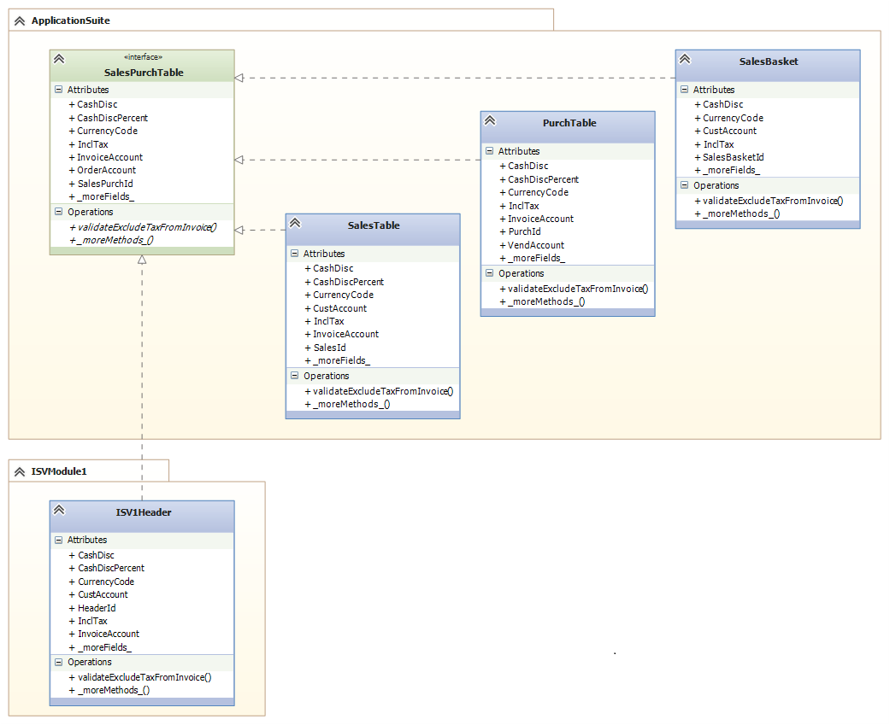

---
# required metadata

title: Table map extension
description: 
author: LarsBlaaberg
manager: AnnBe
ms.date: 12/20/2017
ms.topic: article
ms.prod: 
ms.service: dynamics-ax-platform
ms.technology: 

# optional metadata

# ms.search.form: 
# ROBOTS: 
audience: Developer
# ms.devlang: 
ms.reviewer: robinr
ms.search.scope: Operations
# ms.tgt_pltfrm: 
ms.custom: 89563
ms.assetid: 
ms.search.region: Global
# ms.search.industry: 
ms.author: lolsen
ms.search.validFrom: 2017-07-01
ms.dyn365.ops.version: Platform update 11
---

# Table map extension

This topic applies to App Update 7.3 and later.

## Requesting add a field or method extension capability to existing table maps 

The platform team has received requests to provide add a field or method capabilities to table maps through extensions. 

Adding a field or a method to an existing table map, however, presents some challenges which can lead to unforeseen runtime errors. The reason being that the party adding the field does not have control over all the tables which implement mapping to the table map. The same is true for adding a method to a table map, if the method is called directly as an instance method on the table map.

One of the issues with table maps, is that it is not enforced, that fields on table maps are mapped to fields on all tables implementing the table map. Likewise another issue is, that it is not enforced, that methods on the table map are implemented as methods on all tables implementing the table map.

The below diagram is meant to illustrate the issue. The diagram shows the SalesPurchTable table map which is implemented by the SalesTable, PurchTable, and SalesBasket tables in the ApplicationSuite model. In addition, an ISV1Header table being part of an ISVModule1 model is implementing the SalesPurchTable table map.

Assume that a new field named AccountingGroupId and a new method named validateAccountingGroup are added to the table map. As the change is made in the ApplicationSuite model, then the tables known to be implementing the table map can be fixed, and get the field and method added as well.

The ISV1Header table in the ISVModule1 model is, however, outside of the control of engineer making the changes to the ApplicationSuite model.

Logic implemented in the ApplicationSuite model, that query the value of a the AccountingGroupId table map field will result in a runtime error, if the table map record is of type ISV1Header.

        SalesPurchTable      headerTable;
        ...
        ...
        if (headerTable.AccountingGroupId)

Also logic in the ApplicationSuite model, calling the validateAccountingGroup table map method will result in a runtime error, if the table map record is of type ISV1Header.

        SalesPurchTable      headerTable;
        ...
        ...
        if (headerTable.validateAccountingGroup())

Until the time, when the ISV1Header table has added mapping to the AccountingGroupId field and added the validateAccountingGroup method, then the combined solution is essentially broken.

If we played with the thought of adding the ability to add fields or methods to table maps through extension, the issues above are not being mitigated. Instead they remain the same.

This is illustrated in the next diagram where the ISVModule2 includes extensions of the table map and the implementing tables in the ApplicationSuite model. 

The engineer implementing the ISVModule2 has no control over the ISV1Header table in the ISVModule1 model, and therefore the ISV1Header table is still lacking a mapping of the AccountingGroupId field and implementation of the validateAccountingGroup method.

If the compiler enforced, that all fields on table map had to be mapped on all tables implementing the table map, and enforced that methods added to a table map had to be implemented on all tables as well, then the issues would be somewhat the same.
Instead of receiving runtime errors, then adding a field or a method would be a clear breaking change, as tables not having a new field mapped or a new method implemented would result in a compile when the model containing the added field/method is applied.

Because of the issues described and the lack of ability to control which tables implement the table map, then we have taken a route of refactoring the usage of the table maps into a model, which allows extending with solution with additional fields and methods.

