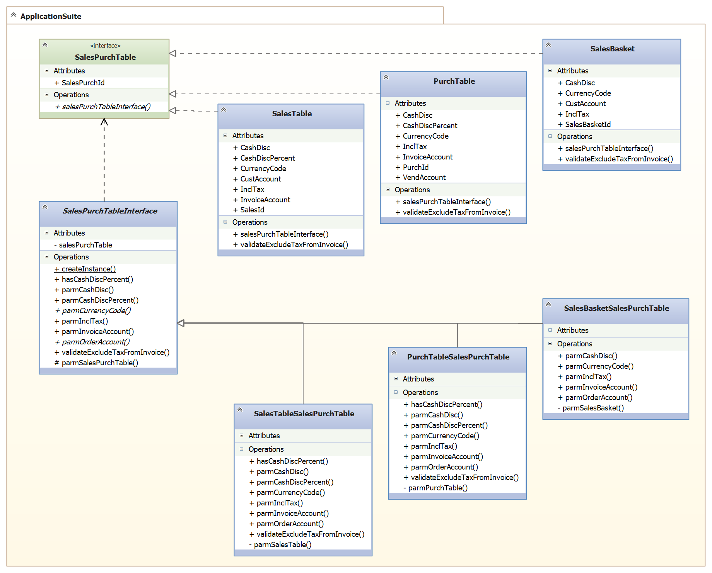
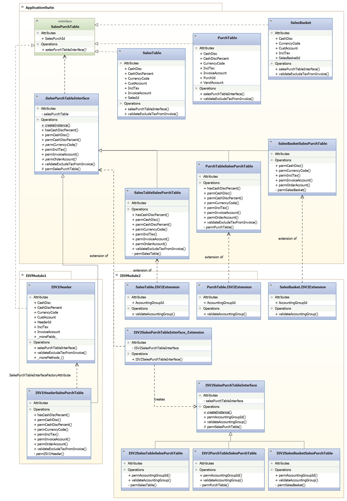

---

# required metadata

title: Extend table maps used as interfaces
description: This topic describes how to extend table maps that are used as interfaces.
author: LarsBlaaberg
manager: AnnBe
ms.date: 12/10/2017
ms.topic: article
ms.prod: 
ms.service: dynamics-ax-platform
ms.technology: 

# optional metadata

# ms.search.form: 
# ROBOTS: 
audience: Developer
# ms.devlang: 
ms.reviewer: robinr
ms.search.scope: Operations
# ms.tgt_pltfrm: 
ms.custom: 89563
ms.assetid: 
ms.search.region: Global
# ms.search.industry: 
ms.author: lolsen
ms.search.validFrom: 2017-07-01
ms.dyn365.ops.version: Platform update 11
---

# Extend table maps used as interfaces

[!include [banner](../includes/banner.md)]

The **SalesPurchLine** and **SalesPurchTable** table maps expose a set of common fields and methods that are used by a variety of product features. The mapping of fields and the implementation of methods have been refactored into a class hierarchy. Some of these changes include:
- Methods on the table maps have been moved to the class hierarchy.
- Fields are exposed through parm-methods on the class hierarchy.
- The table map still exists and tables still implement the mapping to the table map, but the fields on the table map have been made obsolete, and field mapping has been removed.
- The methods on the table map have been made obsolete.

## SalesPurchTableInterface hierarchy

The new **SalesPurchTableInterface** class is the abstract base class for the ApplicationSuite functionality that has been introduced by the refactoring of the **SalesPurchTable** table map. The class contains abstract methods for fields and methods, which must exist for each table implementing the interface. It also contains the default logic in methods, which is common across all implementations. Each table that implements the **SalesPurchTable** table map must be represented as a derived class in the **SalesPurchTableInterface** class hierarchy. Each derived class must be decorated with a **SalesPurchTableInterfaceFactory** attribute class. The attribute is used to associate the derived class with the table, so that it is possible to instantiate a class of the correct type depending on a **SalesPurchTable** record.

Even though the table map methods have been made obsolete, the corresponding methods still exist on the implementing tables. The logic in these methods have been refactored from delegating calls to the method on the table map, to the corresponding method on the base class of the hierarchy.

## Extension scenario

In this example, if you want your ISVModule2 model to extend the interface class hierarchy and the tables implementing the **SalesPurchTable** table map, you must perform the following steps:
1. Add the fields and methods through table extension to the necessary tables implementing the **SalesPurchTable** table map.
2. Create a new interface class hierarchy, which exposes the new fields as parm-methods and other additional methods. The base class of the class hierarchy must be concrete and not abstract.
3. Create derived classes for each table that has been extended.
    1. Decorate each derived class with the **SalesPurchTableInterfaceFactory** attribute class to associate the class with the correct table.
    2. Create a static factory method on the base class of the new class hierarchy. The factory method should instantiate the proper derived class that leverages the **SalesPurchTableInterfaceFactory** attribute. If no derived class can be found, then an instance of the base class must be returned.
4. Create an extension class of the **SalesPurchTableInterface** class. The class augments the **SalesPurchTableInterface** class with a method that creates an instance from the new class hierarchy by calling the factory method on the new class hierarchy.
	
The class and extensions described above are shown in the following diagram.

The diagram contains an ISVModule1 model, which includes the **ISV1Header** table that implements the **SalesPurchTable** table map and contains its own **SalesPurchTableInterface** derived class. The model is independent of the ISVModule2, so when logic in the ISVModule2 creates an instance from the **ISV2SalesPurchTableInterface** class hierarchy, then an instance of the base class will be returned when the **SalesPurchTable** record is of type **ISV1Header**. If the methods on the base class return a reasonable result for unknown tables, then the two ISV models will co-exist within the same installation.
