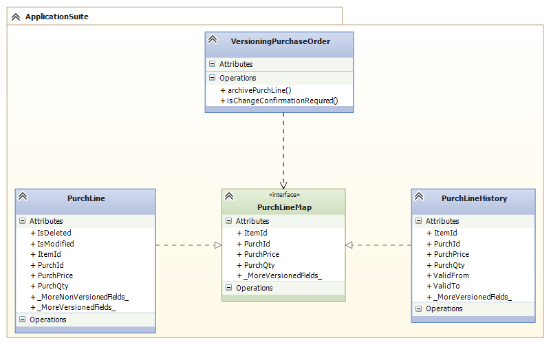
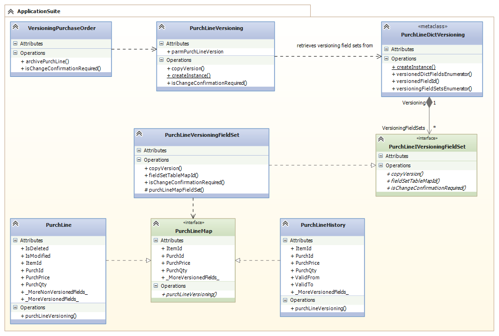
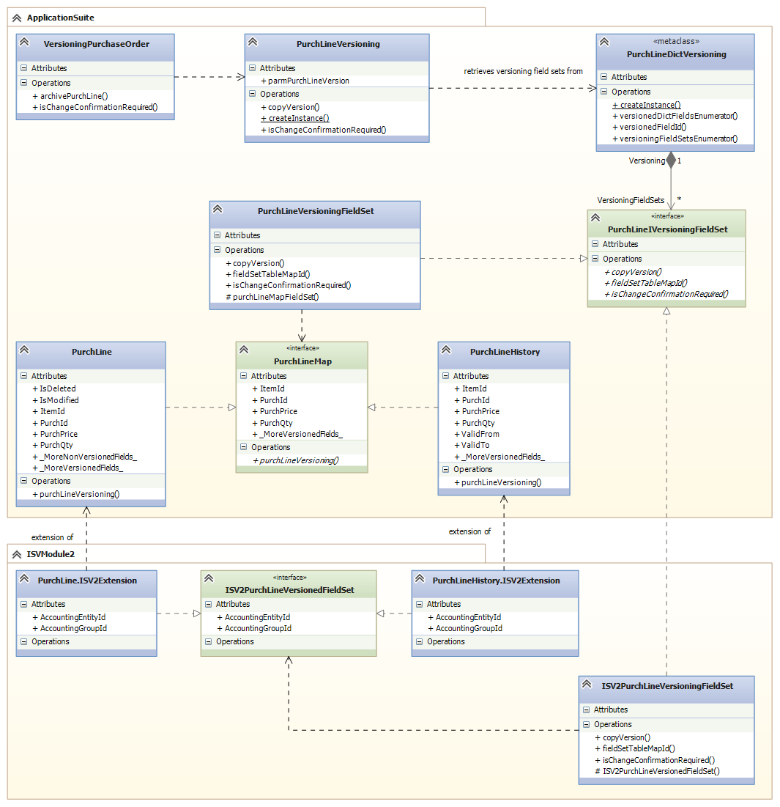

---

# required metadata

title: Extend table maps used for versioning
description: This topic describes how to extend table maps that can be used for versioning.
author: LarsBlaaberg
manager: AnnBe
ms.date: 12/10/2017
ms.topic: article
ms.prod: 
ms.service: dynamics-ax-platform
ms.technology: 

# optional metadata

# ms.search.form: 
# ROBOTS: 
audience: Developer
# ms.devlang: 
ms.reviewer: robinr
ms.search.scope: Operations
# ms.tgt_pltfrm: 
ms.custom: 89563
ms.assetid: 
ms.search.region: Global
# ms.search.industry: 
ms.author: lolsen
ms.search.validFrom: 2017-07-01
ms.dyn365.ops.version: Platform update 11
---

# Extend table maps used for versioning

[!INCLUDE [banner](../includes/banner.md)]

This topic applies to Dynamics 365 for Finance and Operations, Enterprise edition 7.3 and later.

## PurchLineMap table map logic

When new fields are added to the **PurchLine** and **PurchLineHistory** tables using table extensions, the new fields must be copied between the tables when a purchase order is versioned. The **PurchLineMap** table map specifies the fields that must be copied between the **PurchLine** table and the **PurchLineHistory** table when a new purchase order version is created or edited. To accomplish this, extend the **PurchLineMap** map table to include the additional fields. Additionally, the **PurchLineMap** is used by the **VersioningPurchaseOrder** class when archiving purchase order lines. The model is shown in the following diagram.

To be able to specify new fields to be copied, the **PurchLineMap** table map logic and its usage have been refactored. The copy logic has been moved to the **PurchLineVersioning** class, so the **VersioningPurchaseOrder** class references the **PurchLineVersioning** class instead of the **PurchLineMap** table map. The **PurchLineVersioning** class delegates the logic to copy the fields and the logic to determine whether a confirmation is required from the classes that implement the **PurchLineIVersioningFieldSet** interface. Each class that implements the interface is associated with a table map that specifies the fields to copy.

The **PurchLineDictVersioning** class instantiates the **PurchLineIVersioningFieldSet** object using reflection. The **PurchLineDictVersioning** class collects the entire set of fields which need to be copied. The field data is collected based on all the table maps associated with a class that implements **PurchLineIVersioningFieldSet**. The following diagram displays the new classes and their dependencies.

## How to extend PurchLine and PurchLineHistory tables with new fields

Suppose that you want the ISVModule2 model to extend the **PurchLine** and **PurchLineHistory** tables with new fields that must be copied when creating a new version of a purchase order. 

> [!NOTE] 
> You must have developer access to the ISVModule2 model. 

To complete this task, you must perform the following steps:
1. Add fields by using table extensions to the **PurchLine** and **PurchLineHistory** tables.
2. Create a new table map containing the fields that must be copied, and implement the new table map on the two new table extensions.
3. Create a new class to implement the **PurchLineIVersioningFieldSet** interface and implement the following required methods.
    - **copyVersion** method - Copies data between two records of the new table map type.
    - **fieldSetTableMapId** method - Returns the ID of the new table map.
    - **isChangeConfirmationRequired** method - Returns true or false based on whether the change to the newly added field values requires a confirmation to be created.

The classes, interfaces, and extensions described in these steps are shown in the following diagram.

