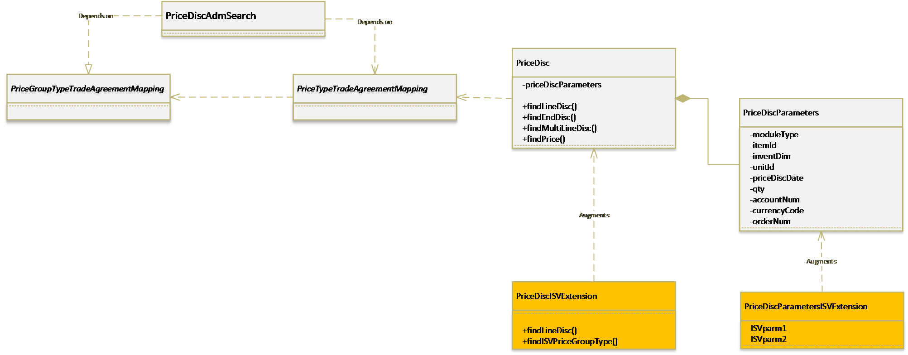
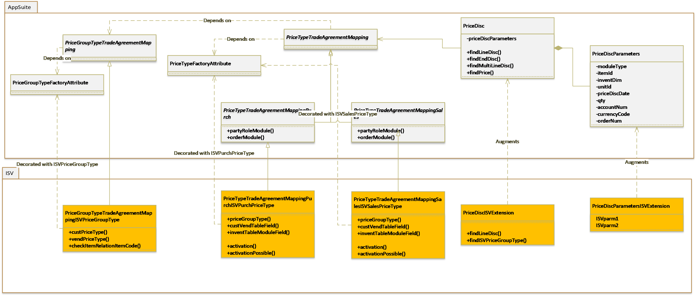

---

# required metadata

title: Price and discount extensibility
author: smithanataraj
manager: AnnBe
ms.date: 12/21/2017
ms.topic: article
ms.prod: 
ms.service: dynamics-ax-platform
ms.technology: 

# optional metadata

# ms.search.form: 
# ROBOTS: 
audience: Developer
# ms.devlang: 
ms.reviewer: robinr
ms.search.scope: Operations
# ms.tgt_pltfrm: 
ms.custom: 89563
ms.assetid: 
ms.search.region: Global
# ms.search.industry: 
ms.author: smnatara
ms.search.validFrom: 2017-12-10
ms.dyn365.ops.version: Platform update 11
---

# Price and discount extensibility

In Dynamics 365 for Finance and Operations, Enterprise edition 7.3 and later, the pricing area is extensible. Some common customizations for pricing area are:
- Adding new price group types and the corresponding price types (enum values for **PriceType** and **PriceGroupType**) and adding search mechanisms for the new price types.
- Modifying the price and discount search, including passing in any additional parameters to the **PriceDisc** class. 

## PriceType and PriceGroupType enums
Typically, adding a new type of price discount search starts with adding a new enum value in the two enums - **PriceGroupType** and **PriceType**. To support extensibility, **PriceGroupType** and **PriceType** enum values are now encapsulated in the class hierarchies **PriceGroupTypeTradeAgreementMapping** and **PriceTypeTradeAgreementMapping**, respectively. These should be extended for any new **PriceGroupType** and **PriceType** extended enum values.

**PriceTypeTradeAgreementMapping** is where the mapping of fields on the **Customer**, **Vendor**, and **InventTable** tables that  correspond to the price types is defined. 

The following diagram highlights the implementation. Note that the methods show only one of the sub-classes. The implementation needs to be on each sub-class. 

## PriceDisc class

The **PriceDisc** class is the search engine for price and discounts. This class now uses a **PriceDiscParameters** object as a member for passing in the parameters that are used in the price and discount search. This enables you to pass in the additional search parameters for the specific solutions. Only the parameters specific for a given **PriceGroupType** search are passed through the corresponding find methods on the **PriceDisc** class. 

The ability to wrap and modify the instantiation of the **PriceDiscParameters** class is enabled for all price and discount search calls made throughout AppSuite.

In the following diagram, you can see how the **PriceDisc** class can be extended to modify existing searches or to add a new search methods corresponding to the now extended **PriceType** enum values.

## Add a new price search

Suppose you have extended the **PriceGroupType** enum with a new value **PriceGroupTypeISVExtension**, and two corresponding **PriceType** enum values - **ISVPurchPriceType** and **ISVSalesPriceType**. 

The following diagram illustrates how a new price search can be added for the **PriceGroupType** and **PriceType** values that you added:

In this example:

1. For the newly created **PriceGroupType** value, a **PriceGroupTypeTradeAgreementMappingISVPriceGroupType** class decorated with the attribute **ISVPriceGroupType** defines the behavior of the price group type.
2. For the newly created **PriceType** value, the **PriceTypeTradeAgreementMappingISVPurchPriceType** and **PriceTypeTradeAgreementMappingISVSalesPriceType** classes corresponding to Purchase and Sales is implemented.
3. Augment the **PriceDiscParameters** class to add any generic parameters for the price discount search.
4. Augment the **PriceDisc** class to create the new price discount search methods for the new price types.
5. The **PriceDiscParameters** is accessible from all classes related to price and discount search and these could be augmented, based on the requirements. 
