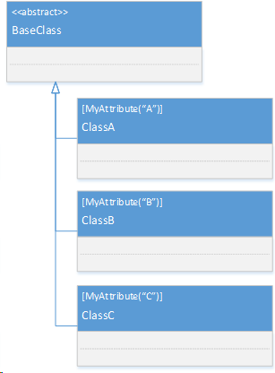

---

# required metadata

title: Register a subclass for factory methods
description: This topic describes how to register your own variations for the factories.
author: MichaelFruergaardPontoppidan
manager: AnnBe
ms.date: 07/10/2017
ms.topic: article
ms.prod: 
ms.service: dynamics-ax-platform
ms.technology: 

# optional metadata

# ms.search.form: 
# ROBOTS: 
audience: Developer
# ms.devlang: 
ms.reviewer: robinr
ms.search.scope: Operations
# ms.tgt_pltfrm: 
ms.custom: 89563
ms.assetid: 
ms.search.region: Global
# ms.search.industry: 
ms.author: mfp
ms.search.validFrom: 2017-07-01
ms.dyn365.ops.version: Platform update 9

---

# Register a subclass for factory methods

Class inheritance is a central concept in X++, as in other object-oriented languages. The object-oriented strategy pattern is used throughout the X++ business logic. In this pattern, variations in behavior can be encapsulated by subclasses, and the business process uses an abstract base class or interface. A factory method determines the variation that is used, by creating an instance of a specific subclass.

This topic describes how to register your own variations for the factories.

In X++, the factories use reflection to perform the following tasks:

+ Find the correct subclass. The factory uses an extension framework to search all subclasses in a hierarchy for a specific set of attributes. If the attributes that decorate a subclass match the parameters that were passed to the factory, that specific class is used.
+ Create an instance. After the right type is identified, reflection is used to create an instance of the class.

The following illustrations shows a typical decorated hierarchy.

In X++, two extension frameworks serve the same purpose. The implementer of the factory method determines which extension framework should be used:

+ [SysExtension](https://blogs.msdn.microsoft.com/mfp/2013/06/12/sysextension-framework-to-the-rescue/)

  - This extension framework uses custom attributes that make it easier to consume.
  - It supports singletons that save a little performance when the same instance is created repeatedly. This extension framework is especially useful for stateless subclasses.
  - It seamlessly supports extensible enums that are often used to determine the variant.

+ SysPlugin

  - This extension framework is based on the Managed Extension Framework. The Managed Extension Framework makes the SysPlugin extension framework available to non-X++ code.
  - It uses the **ExportMetadataAttribute** attribute to decorate the variants and is string-based.
  - It uses the **ExportAttribute** attribute to make the variant discoverable.

## Introduce a new variant

1. Identify the base class (or interface) of the variant that you must implement.
2. Create a new subclass of the base class, and implement your variation.
3. Identify which attribute is required in order to register your class. There are two approaches:

    + Look for attributes that are defined on other subclasses in the hierarchy.
    + Look at the implementation of the factory method. That implementation will contain the attributes that the factory method is searching for.

4. Decorate your subclass with the attribute that was used to match your variation.

**SysExtension example**

    [WHSWorkExecuteMode(WHSWorkExecuteMode::About)]
    class WHSWorkExecuteDisplayAbout extends WHSWorkExecuteDisplay
    {
        // Your code here.
    }

**SysPlugin example**

    [ExportMetadataAttribute('CaseIAssociation', 'Lead'),
    ExportAttribute('Dynamics.AX.Application.CaseIAssociation')]
    class smmLeadCaseAssociationProvider implements CaseIAssociation
    {
        // Your code here.
    }
