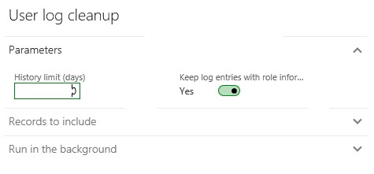

---
# required metadata

title: Manage access to sensitive data
description: This topic provides information about the user log functionality in Microsoft Dynamics 365 for Finance and Operations.
author: ToddLefor
manager: AnnBe
ms.date: 12/31/2017
ms.topic: article
ms.prod: 
ms.service: dynamics-ax-platform
ms.technology: 

# optional metadata

# ms.search.form: 
# ROBOTS: 
audience: Developer
# ms.devlang: 
ms.reviewer: robinr
ms.search.scope: Operations
# ms.tgt_pltfrm: 
ms.custom: 10031
ms.search.region: Global
# ms.search.industry: 
ms.author: 
ms.search.validFrom: 2017-12-31
ms.dyn365.ops.version: AX 7.0.0

---

# Manage access to sensitive data

[!INCLUDE [banner](../includes/banner.md)]

System administrators can use the **User log** page in Microsoft Dynamics 365 for Finance and Operations to keep an audit log of users who have logged on to the system. Knowing who has logged in can help protect your organization's data. We've enhanced the user logging capability to let the administrator identify roles that provide access to sensitive data. 

## What is sensitive data?
An organization can define what constitutes *sensitive data* in whatever way serves its needs. For some organizations, sensitive data might be any data that is related to financial or human resource data, or just data that is personal data. Some industries or some countries or regions might have a more specific definition of sensitive data that an organization can adopt for itself. It's up to each organization to decide whether and how to use the sensitive data identifier. 

The sensitive data identifier enhances the user logging experience by letting your organization produce audit logs that show who in your system has access to sensitive data. This capability is helpful for organizations that might have multiple roles that have varying degrees of access to certain data. It can also be helpful for organizations that want a detailed level of auditing to track users who have had access to data that's been identified as sensitive data.

## Language-specific information
The role information in the user log is language-specific and matches the current user language.

## Log retention
The log entries of users who have access to data that's been declared to be sensitive data can be retained separately from all other data in the log. The administrator can enable this functionality by setting an option on the **User log cleanup** page.

## Additional resources
You can learn more about the GDPR on the [European Union's website](http://europa.eu/) and on the [Microsoft Trust Center](https://www.microsoft.com/en-us/TrustCenter/Privacy/gdpr/default.aspx).

### Disclaimer
(c)2018 Microsoft Corporation. All rights reserved. This document is provided "as-is." Information and views expressed in this document, including URL and other Internet Web site references, may change without notice. You bear the risk of using it. This document does not provide you with any legal rights to any intellectual property in any Microsoft product. You may copy and use this document for your internal, reference purposes.
