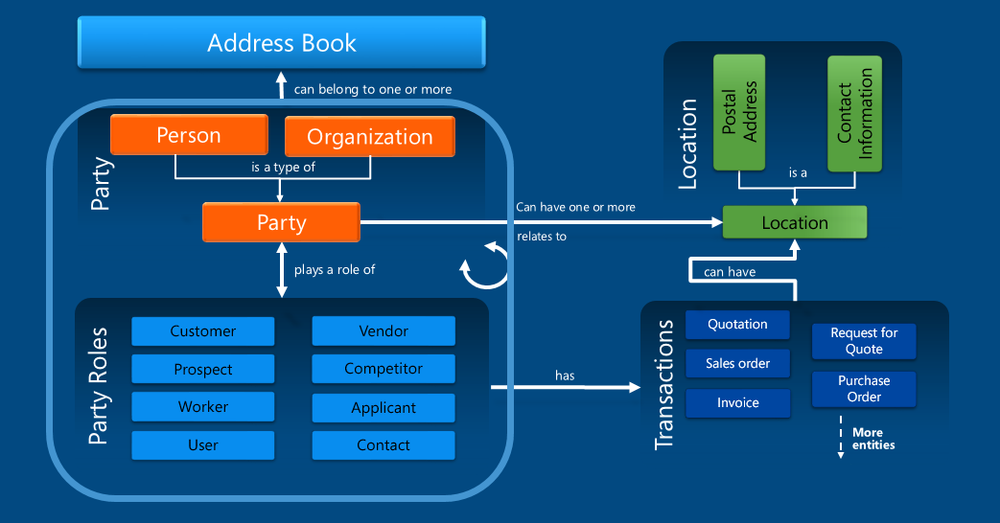
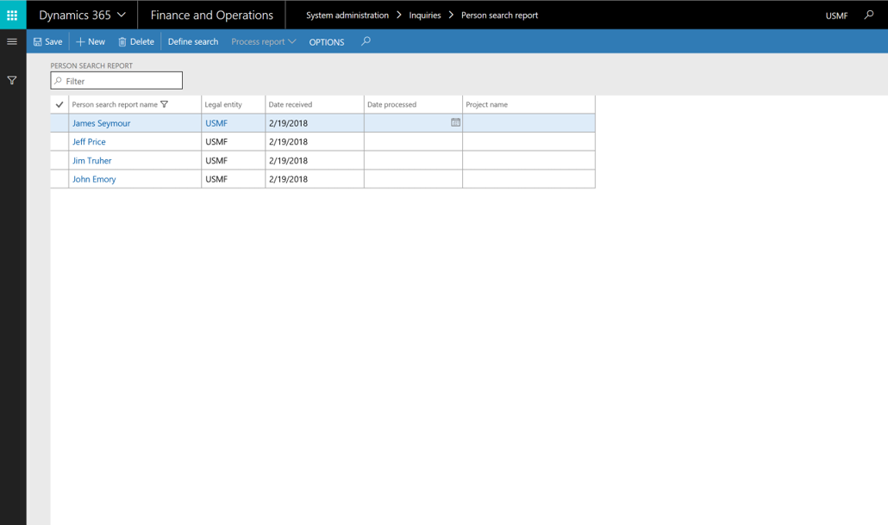
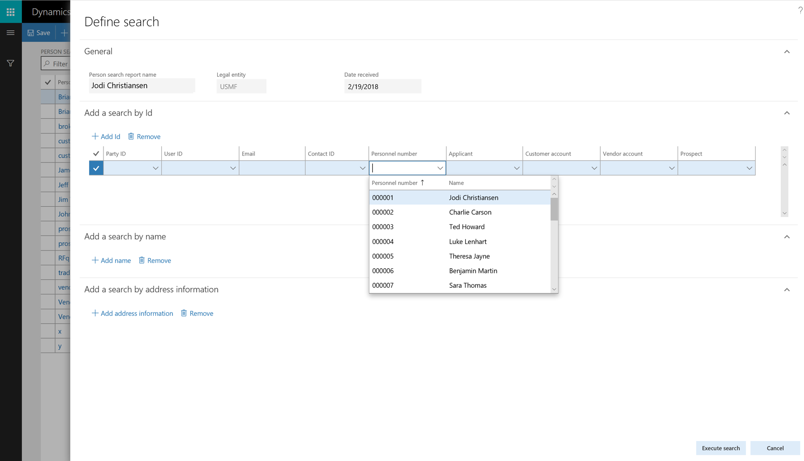
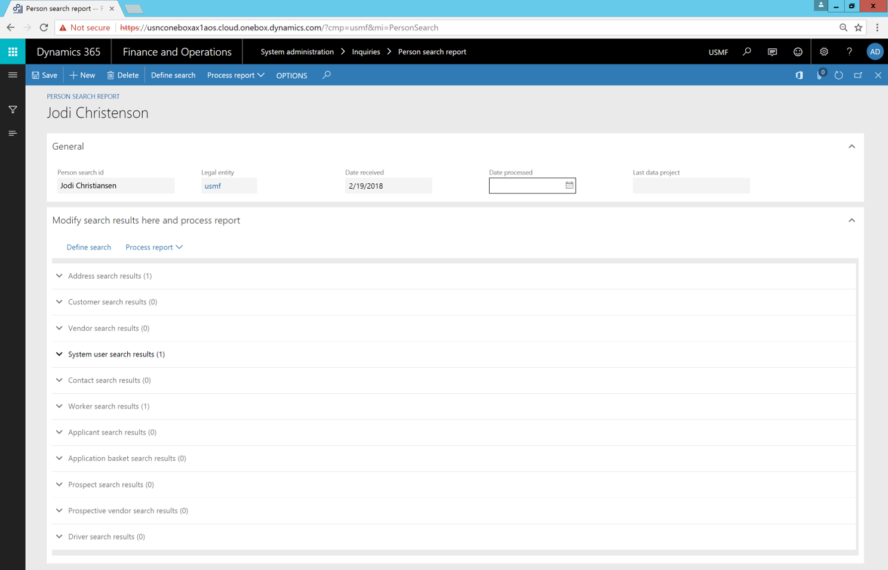
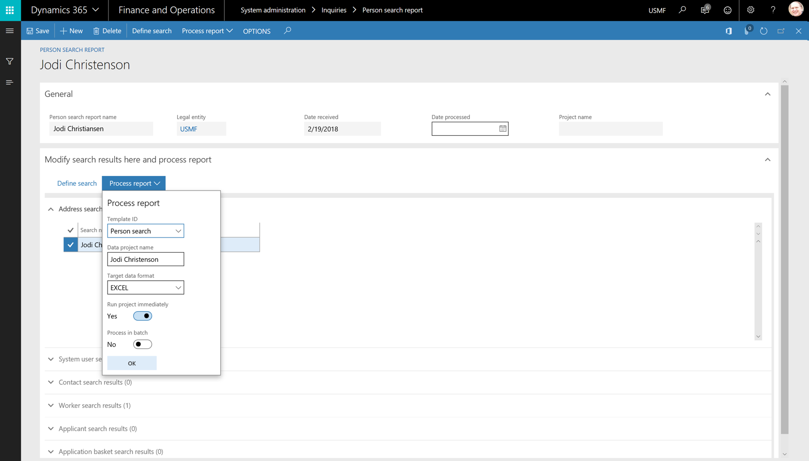

---
# required metadata

title: Person search report
description: This topic provides information about the Personal data report for Microsoft Dynamics 365 for Finance and Operations, Enterprise edition.
author: rschloma
manager: AnnBe
ms.date: 01/24/2018
ms.topic: article
ms.prod: 
ms.service: dynamics-ax-platform
ms.technology: 

# optional metadata

# ms.search.form: 
audience: IT Pro
# ms.devlang: 
ms.reviewer: rschloma
ms.search.scope: Operations
# ms.tgt_pltfrm: 
# ms.custom:
ms.search.region: Global
# ms.search.industry: 
ms.author: rschloma
ms.search.validFrom: 2017-12-31
ms.dyn365.ops.version: AX 7.0.0

---

# The Person search report

The Person search report is a refinement of the existing Data management framework of Finance and Operations. The Data management framework offers a pre-packaged set of entities that Microsoft authored to identify personal data that is used to define a person and the roles that a person might be assigned to in Finance and Operations. 

> [!Note]
> The Person search report will be available in an upcoming release. When available, you'll be able to use the report with Microsoft Dynamics 365 for Finance and Operations, Enterprise edition (Finance and Operations), Microsoft Dynamics 365 for Retail, and Microsoft Dynamics 365 for Talent. References to Finance and Operations in this topic also apply to Retail and Talent.

You can use the Global address book in Microsoft Dynamics 365 for Finance and Operations, Enterprise edition (Finance and Operations) to create an instance of a person that is described in the data model as a party. 

When you add a contact, customer, user, worker, or other person in Finance and Operations data, you typically start by creating an address book entry for that person. Each person in the address book is referred to as a party and is assigned a PartyID. The person also takes on a role in the system, such as customer, user, or worker, and has a role ID: CustID, UserID, WorkerID, and possibly others.

At times, you might want to verify that the information that is entered and used to describe or otherwise identify a person in Finance and Operations is correct. Situations might also arise where it's useful to share that information with the data subject who requested the data.  The Person search report  can help with both these tasks.

The Person search report is extensible. If you find that the existing entities do not contain all of the personal data you are looking for, they can be extended, or new entities can be written. In addition, you can change the data mappings for each entity and remove fields that you don't want to export.

The Person search report lets you specify different identifiers for a person, such as a CustomerID or VendorID. It will then collect, filter, and populate the entity collection set with personal data that is related only to the person you specified.

On rare occasions, a single person might be entered in your system more than once. The Person search report lets you specify each person instance to be included on a single report. For example, someone named Fred Smith might be both "Fred Smith" and "F. D. Smith" in your address book.

An individual might exist as multiple parties in Finance and Operations data. You can provide multiple identifiers for each party type, and each party type's personal data will be included on a single report.

To use the Person search report, you must complete these tasks.

1.	From the System administration menu, open the Person search list page, and create a new search.

    

2.  The search gives you three options: you can search by ID, by name, or by address. Add the type of search that you want.

    

3.  Run the search to show the results.

4.  Verify that the results are valid. Clear any selections that return information that you don't want to include on the report.

    

5.  Select **Process report**, and then select the Person search template.

    

6.  Select **OK**. A data package is generated.

7. When the package has been generated, export it to your selected data format. 

> Documents that are attached to records are not included in the data export. Attachments must be manually downloaded and shared with the individual who requested personal data.

## Additional resources

If you're using the Person search report to respond to a request for data under the General Data Protection Regulation (GDPR) in the European Union, more information about that regulation is available in the [Guide to the GDPR for Microsoft Dynamics 365 for Finance and Operations, Enterprise edition](./gdpr-guide.md).

You can learn more about the GDPR on the [European Union's website](http://europa.eu/) and on the [Microsoft Trust Center](https://www.microsoft.com/en-us/TrustCenter/Privacy/gdpr/default.aspx).

### Disclaimer
(c)2018 Microsoft Corporation. All rights reserved. This document is provided "as-is." Information and views expressed in this document, including URL and other Internet Web site references, may change without notice. You bear the risk of using it. This document does not provide you with any legal rights to any intellectual property in any Microsoft product. You may copy and use this document for your internal, reference purposes. 
