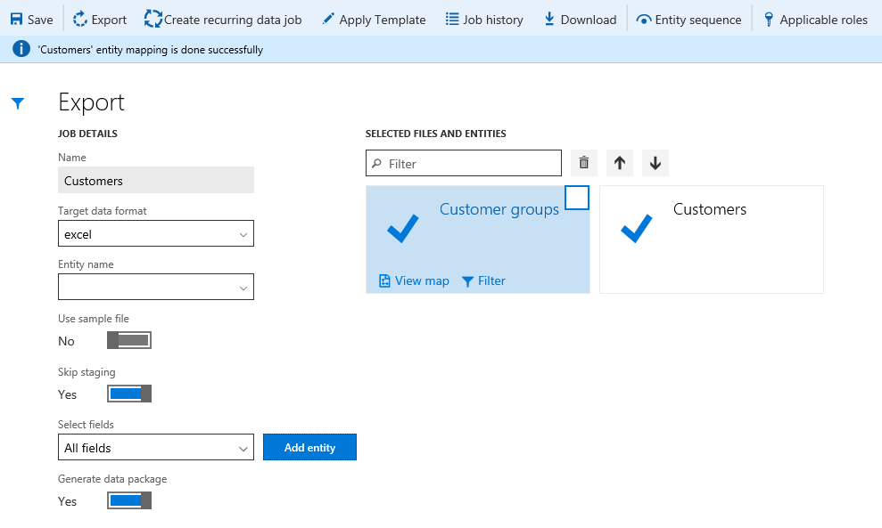
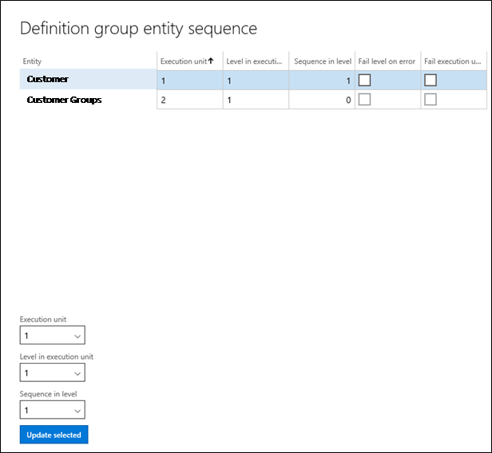
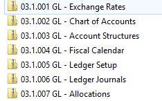
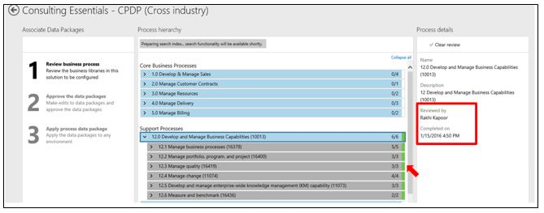

---
# required metadata

title: Process and consume data packages in a Dynamics 365 for Finance and Operations solution
description: A Microsoft Dynamics 365 for Finance and Operations data package can consist of one to many data entities. A typical data package consists of a group of entities for a particular task, process, or function.
author: kfend
manager: AnnBe
ms.date: 04/13/2018
ms.topic: article
ms.prod: 
ms.service: dynamics-ax-platform
ms.technology: 

# optional metadata

# ms.search.form: 
# ROBOTS: 
audience: Developer, IT Pro
# ms.devlang: 
ms.reviewer: kfend
ms.search.scope: Lifecycle Services
# ms.tgt_pltfrm: 
ms.custom: 197113
ms.assetid: ff06961e-2d11-4e4c-addf-5e4b9528a924
ms.search.region: Global
# ms.search.industry: 
ms.author: omarc

---

# Process and consume data packages in a Dynamics 365 for Finance and Operations solution

[!include[banner](../includes/banner.md)]

A Microsoft Dynamics 365 for Finance and Operations data package can consist of one to many data entities. A typical data package consists of a group of entities for a particular task, process, or function. For example, the data entities that are required for general ledger setup might be part of one data package. The format of a data package is a compressed file that contains a package manifest, package header, and any additional files for the data entities that are included.

Before you create your data package, make a plan for what it should include to ensure that the correct entities, entity sequence, and fields are included. You create a data package by using the **Data management** workspace in Finance and Operations. Follow these steps to create a data package.

1.  In Finance and Operations, click **System administration** &gt; **Workspaces** &gt; **Data Management IT**.
2.  Click the **Export** tile, and then, in the **Name** field, enter **Data project**.
3.  In the **Target data format** field, select the format for the export. The data formats that are available include comma separated value (CSV) format and Microsoft Excel format.
4.  In the **Entity name** field, enter or select an entity. You can add multiple entities, but you must add each entity separately.
5.  In the **Select fields** field, select a field setting, and then click **Add entity** to add the entity to the project.
6.  Repeat steps 4 and 5 to add more entities to the project. **Note:** As you add each entity to the project, a tile appears that contains the entity's name and two buttons: **View map** and **Filter**. To automatically create a data package when you export the data project, set the **Generate data package** option to **Yes**. If you don't set this option, you can create a data package at the time of export.
7.  On the Action Pane, click **Export**.
8.  Click **Download**. The package is saved to the **Downloads** folder of the computer where the browser session is running. When you work with data packages, you must plan for and consider any prerequisites for the entities that will be included in the packages. For example, the customer groups are required in order to create customers. Therefore, you should either import the customer groups into a package before you import customers, or sequence customer groups within a data package that will be completed before customers are imported. For example, in the following illustration, sequencing is set within the data package. As you can see, the Customer groups entity and Customers entity are part of the Customers data project. 

9.  On the Action Pane, click **Entity sequence** to open the **Definition group entity sequence** page. Based on the current setup, the Customer groups entity and Customers entity are run at the same level. However, this sequence might not be ideal. 

10. To create a better sequence, select the **Customers** entity, and then update the value of the **Execution unit** field from **1** to **2**. This change helps guarantee that customer groups are imported before the Customers entity is run. 

Microsoft Dynamics Lifecycle Services (LCS) contains multiple base data packages that you can use to reduce implementation time. These packages contain the elements that are required in each module/area in order to meet the minimum requirements. For advanced business processes, you might have to add more entities to the list of packages. The data packages that Microsoft publishes on LCS use a numbering sequence that is based on the module, data type, and sequence. Here is an example:

-   Module/area number 

-   Data type numbering 

-   Numbering format 

The names of data packages include the numbering format, which is followed by the module abbreviation and then a description. For example, the following illustration shows the General ledger data packages. 

## Process data packages
A process data package (PDP) consolidates Data import/export framework (DIXF) data packages into a unified bundle. The PDP is then used to configure a business process or a group of business processes in one business process library. Together, DIXF data packages, dependencies between those packages, and business processes that require the packages for their configuration make up a PDP. This section describes how to create a PDP for your LCS solution package. To create a PDP, you must have the following items and knowledge:

-   An implementation business process library for the solution in your working LCS project.
-   DIXF data packages that have configurations that follow best practices. These packages should include master and reference data for the whole solution.
-   An understanding of the dependencies among the data in the packages.
-   An understanding of the data dependencies between the data packages.

Follow these steps to create a PDP.

1.  In LCS, click the **Asset library** tile.
2.  Select **Data package** as the asset type, and then click the plus sign (**+**) to add a data package.

Follow these steps to consolidate the data packages that you uploaded to LCS into a single PDP.

1.  In LCS, click the **Asset library** tile.
2.  Select **Process data package** as the asset type, and then click the plus sign (**+**) to add a PDP.
3.  Enter a name and description for the PDP, and then click **Confirm**.
4.  For step 1, "Add business process library," select the implementation business process library that your solution is built for, and then click **Continue**.
5.  For step 2, "Add data packages," click **Edit**, and add the data packages that are required in order to configure the system and enable the business process library transactions to be run. When you've finished adding data packages, click **Select**. The order in which data packages in the PDP are loaded into the system might be important. For example, before a chart of accounts (COA) can be loaded, the legal entity setup and currencies are required. Those data entities are in 01.1.002 System Setup. Therefore, 03.1.1001 COA Setup depends on 01.1.002 System Setup. In the next step, you must make a note of this dependency.
6.  For step 3, "Add data package dependencies," select a data package, and then click **Edit**. Select the dependent data packages that must be loaded into your target environment before the data package that you selected, and then click **Select**.
7.  For step 4, "Associate business process to data packages," select the business process that will be used to configure the process nodes.

## Consume a PDP
The Consume flow lets you review a business process and apply the required configuration and data for implementing the business process to your Finance and Operations environment. To consume PDPs, you must have the following items:

-   An implementation business process library for the solution in your working LCS project
-   PDPs
-   A target environment that includes an existing legal entity

Follow these steps to consume the PDP.

1.  In LCS, click the **Asset library** tile.
2.  Select **Process data** **packages** as the asset type, and then click **Consume**.
3.  The **Consume process data package** page shows a list of the existing PDP assets. Click the plus sign (**+**) to create a new Consume PDP.
4.  Enter a name for the Consume PDP, select the PDP that you created and saved in the Asset library, select a target environment, and then click **Create**.
5.  The Consume PDP that you created appears in the list of PDP assets. Click the package. **Note:** The asset that you created can be consumed only in the target environment that was linked to it.

**Note on the PDP consumption requirement:** For this requirement you have the option to consume data packages directly via the Data Management Framework in your Dynamics 365 for Finance and Operations Environment. Please note that only the consumption of data packages via the LCS PDP tool is optional. You still have to create PDP and upload it to your Asset library. 

### Review and approve BPMs

-   For step 1, "Review business process," review the business process models (BPMs), and then click **Mark as reviewed**. The review status is updated for all dependent processes, and a green bar appears to the right of them. The **Reviewed by** and **Completed on** fields are also updated for each business process.

### Review and approve data packages that are associated with a BPM

1.  In the BPM library that you just reviewed, click **2 Approve the data packages** in the left pane.
2.  Select the business process that is associated with the data packages. The data packages appear in the right pane, under **Process details**. Click **Review and Approve** in the right pane.
3.  On the **Consume process data package** page, select a package, and then click **Download** to download the data package. Save the package locally. You can then update the data files in the data package with data that is specific to your target environment. When you've finished updating the data files, click **Upload data package** to upload your changes.
4.  After the data package has been updated and completed, click **Approve**. The status is changed to **Approved**. You can approve as many data packages as necessary.
5.  Click the **Back** button, click **2 Approve the data packages** again, and then select the business process. You should see the **Approved** status in the right pane, under **Process details** &gt; **Dependent packages**.

### Apply a process data package

1.  In the BPM library, click **3 Apply process data package** in the left pane.
2.  Select the business process, and then, in the right pane, click **Apply Data Packages**.
3.  On the **Consume process data package** page, select a package, and then click **Apply**.
4.  Select the destination company in the target environment that is linked to the PDP, and then click **Apply**.

### View the data package history

-   On the **Consume process data package** page, select a package, and then click **History**. You can review the status of the data package. The available information includes the target environment, company, package name, start and end times, status by data entity, and the overall status of the data package. To see the details of any errors that occurred, you can sign in to the target environment.

**Note** on the PDP consumption requirement: For this requirement you have the option to consume data packages directly via the Data Management Framework in your Dynamics 365 for Finance and Operations environment. Please note that only the consumption of data packages via the LCS PDP tool is optional. You still have to create a PDP and upload it to your Asset library. 

See also
--------

[Publishing an App for Dynamics 365 for Finance and Operations in AppSource](lcs-solutions-app-source.md)

