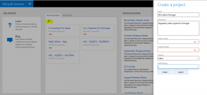
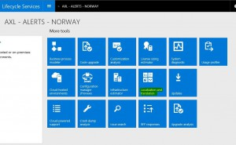
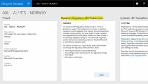
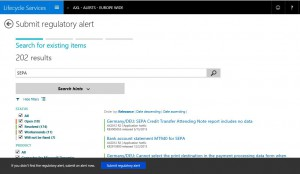
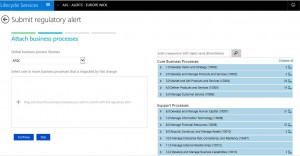
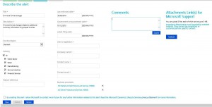
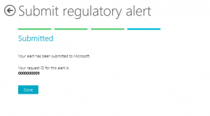
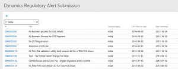
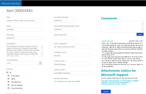
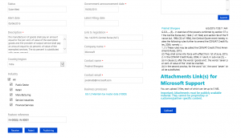

---
# required metadata

title: Regulatory watch and regulatory update communication
description: As part of the requirements for LCS solutions for localization &amp; translation, localization ISV solution providers must undertake their regulatory watch by taking advantage of localization tools in Microsoft Dynamics Lifecycle Services (LCS).
author: ShylaThompson
manager: AnnBe
ms.date: 06/20/2017
ms.topic: article
ms.prod: 
ms.service: dynamics-ax-platform
ms.technology: 

# optional metadata

# ms.search.form: 
# ROBOTS: 
audience: IT Pro
# ms.devlang: 
ms.reviewer: shylaw
ms.search.scope: Operations
# ms.tgt_pltfrm: 
ms.custom: 27831
ms.assetid: 32723600-2e9c-4517-b582-78dca3c166cc
ms.search.region: global
# ms.search.industry: 
ms.author: janeaug
ms.search.validfrom: 2016-02-28
ms.dyn365.ops.version: AX 7.0.0

---

# Regulatory watch and regulatory update communication

[!include [banner](../includes/banner.md)]

As part of the requirements for LCS solutions for localization &amp; translation, localization ISV solution providers must undertake their regulatory watch by taking advantage of localization tools in Microsoft Dynamics Lifecycle Services (LCS).

## Set up an alerting project in LCS

Localization independent software vendor (ISV) solution providers must create a new project in Microsoft Dynamics Lifecycle Services (LCS) to record regulatory alerts.

Follow these steps to set up the project.

1.  Add a new project by clicking the plus sign (**+**).
2.  Enter a name that uses the following project naming convention: **REG-Alerts-Country/region name**
3.  Enter a project description.
4.  For the product name, specify the latest version of Microsoft Dynamics 365 for Finance and Operations.
5.  For the product version, specify the latest version.
6.  Specify the industry:
    -   Select **Other** if the solution is related to all industries.
    -   Select an appropriate specific industry.

7.  For the methodology, specify **Sure step**.
8.  Click **Create**.

## Invite participants to the project
Invite participants that should have access to the project, so that they can submit and review regulatory alerts. For information about how to invite users, see [Configure lifecycle services security](../lifecycle-services/configure-lcs-security.md).

## Access the regulatory alert submission service
1.  In your LCS project, scroll to the right side of the page, and then, under **More tools**, click **Localization and translation**.

2.  Select **Dynamics Regulatory Alert Submission**, and then click **Enter**. The **Dynamics Regulatory Alert Submission** page opens. Use this page to view any previous alerts that have been submitted by you or your organization.

## Submit a regulatory alert
To enter a new regulatory alert, click the plus sign (**+**) at the top of the form, above the filter. The **Submit regulatory alert** wizard starts. Follow these steps to complete the wizard.

1.  On the **Search for existing items** page, follow these steps:
    1.  Use Issue search to identify whether a regulatory feature that is related to the alert already exists. Enter search terms to specify criteria such as a keyword, country/region, Microsoft Knowledge Base (KB) number, or Application Object Tree (AOT) object. For example, you can search for the payment term "SEPA" to return related items.
    2.  After you've finished entering the search terms, click the **Search** button. Search returns all items that meet search criteria as it searches across both product issues and regulatory features.
    3.  You can narrow down the search results by using the filter/criteria that are available.
    4.  If you don't find the regulatory feature that you're searching for, you can submit a regulatory alert by clicking **Submit regulatory alert** on the bottom ribbon.

    
2.  On the **Attach business processes** page, follow these steps:
    1.  In the **Global business process libraries** field, you can select business process libraries.
    2.  You can enter search criteria to return business processes that are related to a search term. The tool highlights these business processes in yellow.
    3.  You can drag business processes into the marked area on the left side of the page. You can select one or many related business processes in the process list. After you've dragged business processes to the marked area on the left, you can edit them further. Deselect business processes by clicking the **x**.
    4.  When you've finished, click **Continue** to go to the next page in the wizard. When you receive a confirmation message, click **Yes**. If no relevant business processes are found, you can skip this page in the wizard.
    5.  You receive a message that asks whether you want to add the selected business processes to the alert. You can click either **Yes** or **Cancel**.

    
3.  On the **Describe the alert** page, follow these steps:
    1.  Enter information for the alert in the appropriate fields. Required fields are indicated by a red asterisk (\*).
    The following table provides more information about the submission fields.

| Field name                   | Field type        | Description  |
|------------------------------|-------------------|--------------|
| Title                        | Text              | A descriptive title to identify the area of impact. For example, you might enter **Changes in invoice document per Jan. 1st 2014**.    |
| Description                  | Text              | A brief, pragmatic overview of the law. The description should focus on issues that are relevant to enterprise resource planning (ERP). It should have three to ten lines of details, so that users gain a high-level understanding of the requirement without having to read the legislation first.   |
| Country                      | Valid values list | The country/region that the legislation applies to.  |
| Industry                     | Valid values list | A list of industries, if the requirement applies only to selected industries (for example, Public sector, Retail, or Communication).   |
| Link to legislation          | Text (URL format) | Add links to the published law, interpretation guideline, implementation guidance, or any other documentation that will be useful for understanding and implementing the requirement.|
| Feature reference            | Text              | The feature reference ID (if it's known). |
| Law enforcement date         | Date              | Date from which impacted customers must comply with the law  |
| Government announcement date | Date              | The date when the authority announced the change. |
| Latest filing date           | Date              | The deadline for the first submission of the new/changed report.|
| Company name                 | Text              | The company name for the person who is submitting the alert.|
| Contact name                 | Text              | The contact name of the person who is submitting the alert.|
| Contact email                | Email address     | The contact email address of the person who is submitting the alert. This value must be in a valid email address format. |
| Business processes           | Default           | The business processes are selected through the **Submit regulatory alert** wizard and entered automatically on the submission page.  |
        | Comments                     | Text              | Enter any additional information that is related to the alert, and that might be useful for understanding or implementing the requirement. You can add multiple comments. Click **Submit** to save comments separately to the submission page. Comments are saved in order of date.   |
        | Attachments                  | Upload            | Add alert attachments by using the attachment tool. Click the **Upload** button to open File explorer. After you select and upload a file, the file is appears as a linked file. You can upload up to three files, each of which can be up 5 MB. To delete a file that you've uploaded by mistake, click **Remove** under the file title. **Important:** Attachments must be publicly available materials. They can't be propriety or customer/partner specific. |
        | Consent check box            | Check box         | Give appropriate consent to being contacted. The **Submit** button doesn't become available until you select this check box. |

    2.  When you've finished adding all the required fields, you must provide appropriate consent by selecting the consent check box: **By creating this alert I allow Microsoft to contact me in the future for any further information related to this alert. Read the Microsoft Dynamics Lifecycle Services privacy statement for more information.**
    3.  After you select the check box, the **Submit** button becomes available. Click **Submit** to submit the alert. If you've partially completed an alert, you can save the information that you've already entered for later completion or review. Click **Save** before you submit the alert.
    

    4.  When you receive a confirmation message that states that the alert has been successfully submitted, click **Done** to exit the wizard. If you chose to save the alert before you submitted it, an alert ID is generated, and you are notified that the alert has been saved.
    

## Review regulatory alerts that have been entered into the project
To view the regulatory alerts that have been entered into your alerting project, use the alert grid. This grid provides a high-level list view of the alerts that have been submitted, and shows the alert title, country/region, law enforced date, and so on.

 

You can search the contents of the grid by using the filter/search field and then selecting from the default search options. You can drill into the detail of an alert by clicking the alert ID, which is a hyperlink. The completed alert submission page opens, where you can review the alert details, and also any comments and attachments.

## Process submitted alerts options
After an alert has been submitted to the LCS alert project, you can process it from the grid view by clicking the alert ID hyperlink. Project owners can then change the status of the alert to notify project members whether action will continue to be taken for the alert. Options appear when you drill into details of the alert.

The following table describes the processing options that are available for alerts.

| Status    | State  | Actions  |
|-----------|--------|----------|
| Submitted | The alert has been submitted to (entered into) LCS by a Loc. Community member. | The alert can be either received or rejected.   |
| Received  | The alert has been reviewed by an internal Sol. Partner resource and has been received for further review.  | The alert is marked **Received**. A comment and feature reference can be added.  |
| Rejected  | The alert has been reviewed by an internal Sol. Partner resource and has been rejected. | The alert is marked **Rejected**. A comment must be added to explain why the alert was rejected. |
| Reopened  | The alert was rejected but has been reopened by a Loc. Community member, and new/additional information has been entered (a comment is mandatory). | The alert can be reviewed again to assess whether it should be received or rejected. |

> [!NOTE]
> 
> Submitted alerts can be rejected for various reasons. Here are some examples:
>    -   The alert is too vague to identify the underlying localization feature.
>    -   The alert is related to an area where no features are localized.
>    -   The alert is related to an area that isn't currently supported by Finance and Operations functionality.
> 
> Alerts can be stored in LCS as references.
> 
> Further processing, such as potential engineering of a related feature, will be handled in the ISV solution provider's existing systems.

