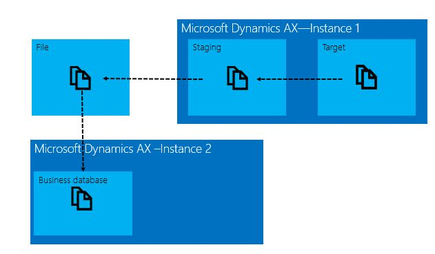

---
# required metadata

title: Copy data between Dynamics AX instances (AX 2012)
description: This topic provides information about how to copy data between Dynamics AX instances using the data import/export framework (DIXF).
author: kfend
manager: AnnBe
ms.date: 10/26/2017
ms.topic: article
ms.prod: dynamics-ax-2012 
ms.service: 
ms.technology:

# optional metadata

# ms.search.form: 
# ROBOTS: 
audience: Developer, IT Pro
# ms.devlang: 
ms.reviewer: kfend
ms.search.scope: AX 2012
# ms.tgt_pltfrm: 
ms.custom: 20251
ms.assetid: f608a318-106e-4edb-8a6f-c7a753a27640
ms.search.region: Global
# ms.search.industry: 
ms.author: kfend
ms.search.validFrom: 
ms.dyn365.ops.version: 2012

---

# Copy data between Dynamics AX instances (AX 2012)

[!include[banner](../../includes/banner.md)]

This walkthrough illustrates the following tasks:

-   Define the format of your source data
-   Define a processing group
-   Process data from source to staging
-   Validate the data in staging
-   Export the data to a file
-   Import the data
-   Validate the data in target

## Prerequisites
To complete this walkthrough you will need:

-   Microsoft Dynamics AX 2012, Microsoft Dynamics AX 2012 R2, or Microsoft Dynamics AX 2012 R3
-   Data Import/Export Framework
-   Demo data for Microsoft Dynamics AX 2012, Microsoft Dynamics AX 2012 R2, or Microsoft Dynamics AX 2012 R3

The following diagram illustrates the path that data takes during the export and import processes. 

## Define the format of your source data
1.  Open **Data Import/Export Framework** &gt; **Setup** &gt; **Source data formats**.
2.  Click **New**, enter a name and a description, and then select **AX** from the **Type** list.

## Define a processing group to export data from Microsoft Dynamics AX
1.  Change the company to **CEU**.
2.  In **Data Import/Export Framework**, click **Common** &gt; **Processing group**, and then click **New** to create a new processing group.
3.  Set the group name to Export-Cust and add a description.
4.  Click **Entities** to select the entities to include in the processing group.
    1.  In the **Select entities for processing group** form, click **New**, and then, for an entity name, select **Customer**.
    2.  In the **Source data format** field, select the Microsoft Dynamics AX source data format that you created.
    3.  Click the **Select** button, and then in the **DMFCustomerTargetEntity** form, on the **Range** tab, for **Field**, choose **Created date and time**, and for **Criteria**, enter &gt; 9/1/2007, and then click **OK**.
    4.  Close the **Select entities for processing group** form.

## Process data from source to staging
1.  In the **Processing group** form, select the Export-Cust group that you created, and click **Get staging data**. The **Create a job ID for the staging data job** form opens.
2.  By default, an ID for the job is generated. If needed, you can modify the ID and add a description. Click **OK**. The **Staging data execution** form opens.
3.  In the **Staging data execution** form, click **Run**. The **Get data from source to staging** form opens.
4.  In the **Get data from source to staging** form, click **OK** to run immediately. The source data is copied to the staging tables.

## Validate the data in staging
1.  In **Data Import/Export Framework**, click **Common** &gt; **Processing group** &gt; **Execution history**, and then select the job that ran.
2.  Click **View staging data**.
3.  Review the staging data to validate that it matches the source.
4.  Click **Validate all** to verify that all the related reference data is correct and present in the system.

## Export the data to a file
1.  In **Data Import/Export Framework**, click **Common** &gt; **Processing group**, and then select the processing group to work with.
2.  Click **Export to AX**, enter a file name, and then click **OK**. A .dat file of the data identified by the processing group is created.

## Import the data
1.  Open a client that is connected to the instance of Microsoft Dynamics AX that you want to import data into.
2.  Validate that the current company is the one that you want to import the data into.
3.  Click **System administration** &gt; **Common** &gt; **Data export/import** &gt; **Import**.
4.  On the **General** tab, select the data file that you want to import.
5.  On the **Batch** tab, select the batch group that you want the import file to be processed with. All import jobs are run as batch tasks.

## Validate the data in target
Verify that the customer data from the original instance is now displayed in the **All Customers** form. Click **Accounts receivable** &gt; **Common** &gt; **Customer** &gt; **All Customers **form.

