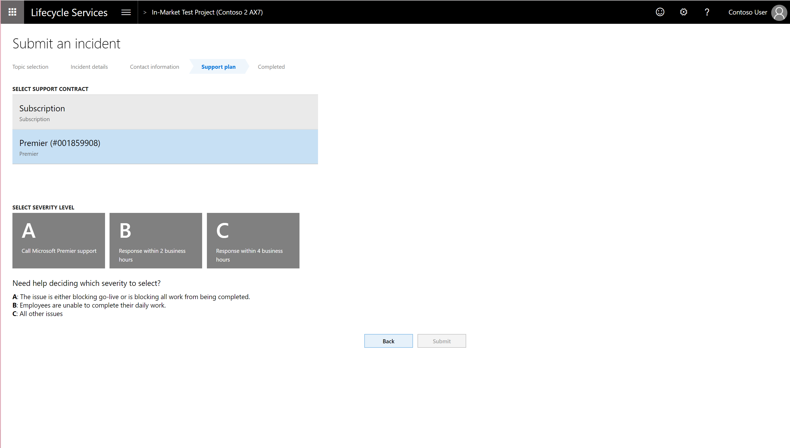

---
# required metadata

title: Manage Finance and Operations Support experiences
description: This topic provides information about using the Support tool to on Microsoft Dynamics Lifecycle Services (LCS) to manage support incidents. 
author: kfend
manager: AnnBe
ms.date: 06/23/2017
ms.topic: article
ms.prod: 
ms.service: dynamics-ax-platform
ms.technology: 

# optional metadata

# ms.search.form: 
# ROBOTS: 
audience: Developer, IT Pro
# ms.devlang: 
ms.reviewer: kfend
ms.search.scope: Operations
# ms.tgt_pltfrm: 
ms.custom: 60373
ms.assetid: 0fa10573-8146-446e-8124-8a7af9546add
ms.search.region: Global
# ms.search.industry: 
ms.author: anupams
ms.search.validFrom: 2016-02-28
ms.dyn365.ops.version: AX 7.0.0

---

# Manage Finance and Operations Support experiences

[!include[banner](../includes/banner.md)]

To use the Support tool, you must have previously created a project in Lifecycle Services and installed and ran the System diagnostics in your environment. For more information, see [System diagnostics (Lifecycle Services, LCS)](ax-2012/system-diagnostics-lcs.md).

## Open a new incident
1.  From LCS, use the **Support** tile to manage support incidents. To submit issues directly to Microsoft, go to the **Support** tile in your LCS project.

2.  From the **Submitted to Microsoft** tab, click the **Submit an incident** button.

3.  Before you submit an incident, use the Issue Search tool to search for existing solutions. Enter a description or by object path in the Application object Tree (AOT) of the issue and click the search icon.

4.  If you cannot find an existing solution to your issue from the Issue search tool, click **Create incident** to create a new incident.

5.  Select issue **category**.

6.  Select issue **area**.

7. In the **Describe your issue** window -  
 - Toggle **Yes** if the issue occure in an environment and select the environment name.  
 - Enter a short description of your issue in **Title**
 - Provide issue detail and repo steps
 - If applicable, enter **error message**. 
 - It’s also a good idea to attach screenshots that illustrate the problem, to do this, use **Attach file from computer**.
 
 
 
8. Enter the **primary contact information**. These contact details will be used by the customer support to contact you about the case.

9. Select **support contract** and **severity level**. 
  
  - Support contract for on-premises products with limited incident counts, we show your available support contract(s), and you choose which support option to use if you have multiple tier support contracts.  
  - Support contract for cloud products have unlimited incidents, therefore, we show your the best available support plan(s). 

10. Click **Submit** to complete. 

After you click **Submit**, the following steps occur:
-   An incident is created and added to the Incidents list.
-   You receive an email message from the Microsoft Support Engineer who is working on your case. 

## Manage support plans
If you have purchased support plan(s), you will need to add the new purchased support contract(s) to LCS Support before creating a new ticket.  This is a one time setup, you won't need to add it again the next time you create a ticket.    

1. From the **Submitted to Microsoft** tab, click the **Manage support plans** button. 

   
   
2. In the **Manage support plans** slide, click **Add contract** to enter the **Access ID** and **Password/Contract ID** to add - contract.

    
