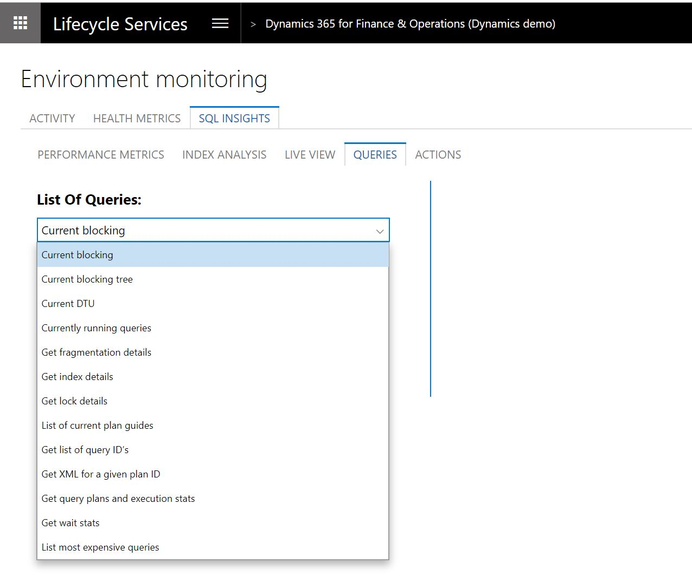
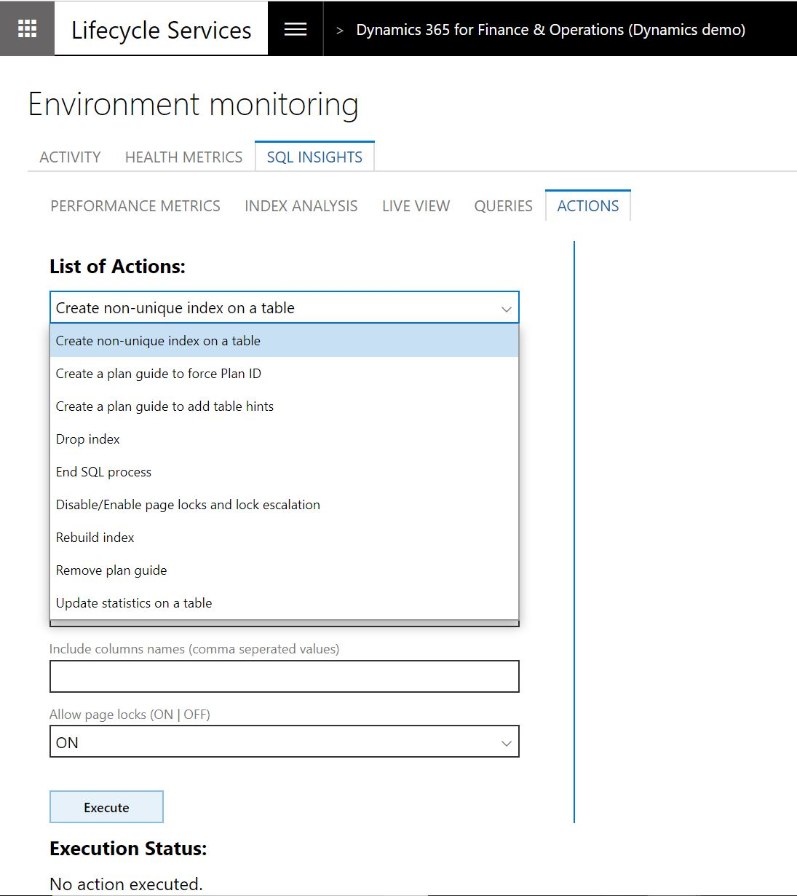
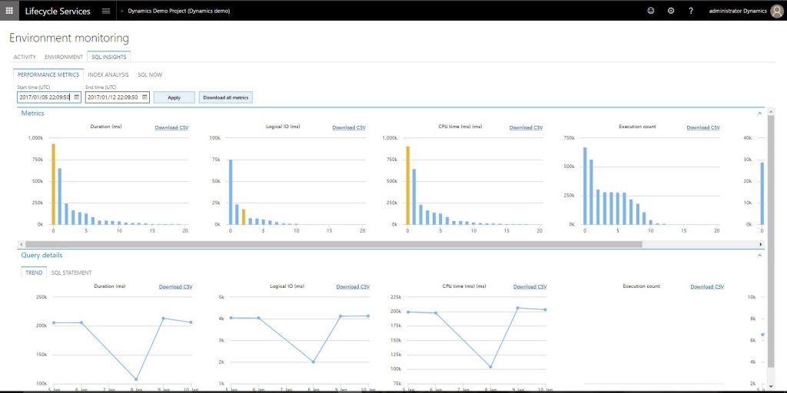
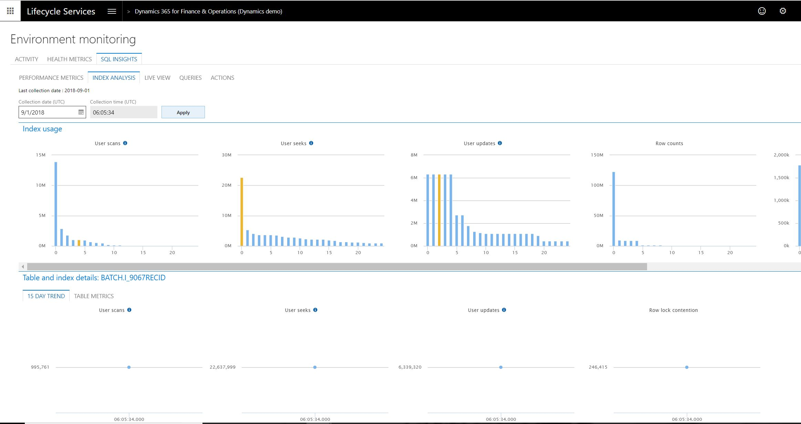

---
# required metadata

title: Performance troubleshooting using tools in Lifecycle Services (LCS)
description: This topic describes the various tools that Microsoft Dynamics Lifecycle Services (LCS) provides to help you diagnose and mitigate performance issues in your sandbox and production environments.
author: manalidongre
manager: AnnBe
ms.date: 09/21/2018
ms.topic: article
ms.prod: 
ms.service: dynamics-ax-platform
ms.technology: 

# optional metadata

# ms.search.form: 
# ROBOTS: 
audience: Developer, IT Pro
# ms.devlang: 
ms.reviewer: sericks
ms.search.scope: Operations
# ms.tgt_pltfrm: 
ms.custom: 267184
ms.assetid: eb056816-ccf4-43a5-aed3-cf72543353de
ms.search.region: Global
# ms.search.industry: 
ms.author: manado
ms.search.validFrom: 2016-11-30
ms.dyn365.ops.version: Version 1611

---

# Performance troubleshooting using tools in Lifecycle Services (LCS)

[!include [banner](../includes/banner.md)]

This topic describes in detail how you can troubleshoot and mitigate performance issues using the tools available in Microsoft Dynamics Lifecycle Services (LCS).

# Overview
Common feedback from customers and partners has been that they are unable to successfully diagnose performance issues using the tools in LCS. We have addressed this feedback by creating a more reliable way to collect performance metrics on demand, and enabled customers and partners to execute a pre-defined set of actions that can be used to mitigate issues in a sandbox or production environment. This feature queries SQL Server directly, so you get query store metrics in near real-time. We have also added an audit trail on the action performed so that you can easily go back and determine who performed the action and when it was performed.

# Details
All performance tools in LCS are available under the **SQL Insights** tab in the **Environment Monitoring** page for a specific environment. Below is a description of the tabs you will see:

- **Live View** - Shows current DTU, executing statements, and blocking statements. The current SQL Now page that shows performance issues will be replaced with Live View.

- **Queries** - Shows a list of pre-defined queries that can be used to retrieve metrics on demand. Examples of queries include a current blocking tree, a list of active plan guides, and a list of most expensive queries.

- **Actions** - Shows a list of pre-defined actions that should be taken to mitigate issues in the Sandbox and Production environments. Examples of actions include adding/dropping an index, updating stats on a table, rebuilding indexes, and terminating a blocking statement.  Any time that an action is performed, the environment history for an environment will show a record for the action performed. A history record is created only for actions and not when queries are executed.

- **Performance Metrics** – Shows the most expensive queries that were run in the system during the selected period, based on logical I/O, execution count, duration, CPU time, and wait count. This data is queried from the SQL query store. The data is retained for 30 days, and the tool runs its data collection every day at 10 PM Coordinated Universal Time (UTC). To use the tool, Select a period during the last 30 days. When the query results appear, select the bar in the duration chart to highlight where the query falls on other metrics. On the Statement tab, view the query, or download the query execution plan.

- **Index Analysis** - Shows aggregated index and table information, based on user scans, user seeks, user updates, and row count. Like performance metrics, this tool shows the trend for the selected index together with additional table metrics.

# How do I use this feature?

1. Go to your project in LCS and open the environment details page. Select the Environment Monitoring link in the Monitoring section. Click the SQL Insights tab to access this feature.
2. You can navigate to each of the tabs (Live View, Queries, and Actions, Performance Metrics, Index Analysis) to view or query for more information.
3. You have the option to Search or Export to Excel any of results from the query execution.
4. After you have narrowed down the reason for the performance issue, you can use a predefined action to mitigate the issue.
5. After an action is performed, an entry is made on the Environment History page which shows the details of the action, the parameters that were passed in, a timestamp, and who triggered the action.

# Sample flow

**Scenario** : Users report slow performance when using the system. One issue could be a blocking statement. Blocking by itself is typical in a healthy system and is only a problem when it becomes excessive or starts degrading business activities.

1. Go to the **Live View** tab and check if there are any blocking statements. If there is a blocking statement, copy the blocking query ID.
2. Open the **Queries** tab and select the **Current Blocking Tree** query. This will return the root blocker that is blocking the SQL operation.
3. To resolve the issue, you can either let it run and clear naturally, or end the process for the lead blocker, which will roll work back. Typically, you should only end the lead blocker process if you do not think that it will not clear naturally (such as a bad query plan), or in situations where a critical process is unable to run and needs to complete immediately.
4. Confirm that it&#39;s okay to terminate the statements that are currently being executed.
5. Open the **Actions** tab and select the **End SQL Process** action and pass in the root blocker query ID. This will execute a query against the SQL database to terminate the blocking statement.
6. Go to the **Queries** tab and run **Current blocking query** to verify if the blocking statement was terminated.
7. You can also check the **Environment History** page to see details on what process was terminated.
8. To avoid this issue in the future, you should use indexes or plan guides, or turn off lock escalation or use page locks if processes are blocking each other while operating on different records. If processes are operating on the same records, then the only way to avoid blocking is by refactoring or rescheduling the processes to not operate on the same records at the same time.

## Other resources

- For details on queries shown on the Queries and Actions tab, check the [query cookbook.](https://docs.microsoft.com/en-us/dynamics365/unified-operations/dev-itpro/lifecycle-services/querycookbook)
