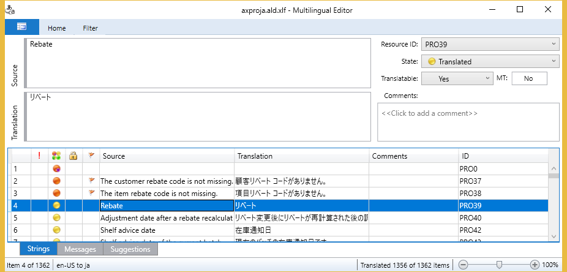
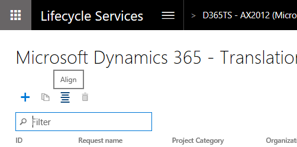
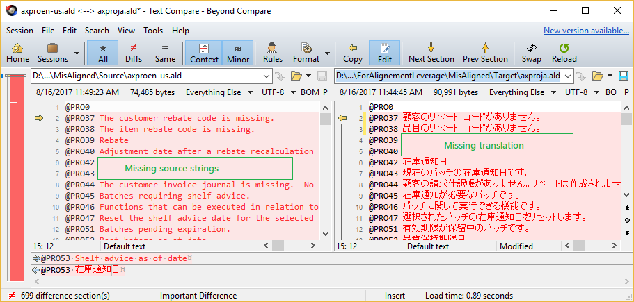
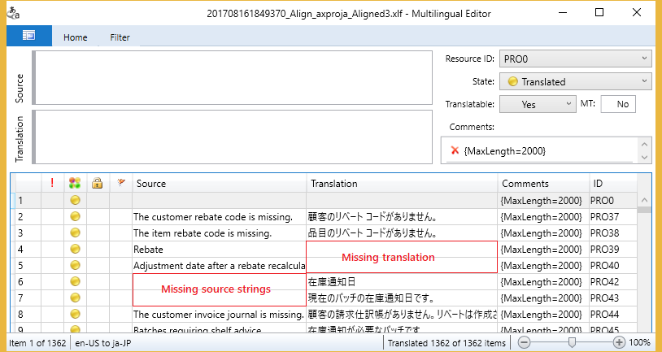

# Microsoft Dynamics 365 Translation Service user guide 

[!include[banner](../includes/banner.md)]

## XLIFF Translation Memory (TM)
DTS uses a bilingual XLIFF format to store source language and target language pairs. The XLIFF format is based on XML. Therefore, you can open XLIFF files in any text editor. However, we recommend that you use XLIFF editors that are specifically designed to work with this format. You can use the free Microsoft Multilingual Editor that is available in the [Multilingual App Toolkit (MAT)](https://developer.microsoft.com/en-us/windows/develop/multilingual-app-toolkit).

In DTS, you can obtain an XLIFF TM in two ways:

+ **Run the Align tool** – When you have files that were previously translated, and corresponding source files, you can use the Align tool to create an XLIFF TM. For more details, see the [Alignment](./use-translation-service.md#preparing-a-translation-memory---alignment) section of this topic.
+ **Complete a translation request** – When a translation request is completed, DTS provides XLIFF TMs. It also provides the translated files in the source format.

XLIFF files contain a series of TUs that are extracted from the source files. The following illustration shows an example of a TU.

The following illustration shows the same TU (highlighted in blue) in the Multilingual Editor.

### State
Each translation in the XLIFF file is associated with a state value. The value that DTS assigns to each translation depends on the way that the string is translated. When an XLIFF TM is created by using the Align tool, all translations are marked as **Translated**, because the aligned TUs are produced from known good translations, such as a previous product version.

However, when the XLIFF files are generated as a result of a translation request, two types of states can be used:

+ **Needs Review** – The string has been machine translated.
+ **Translated**, **Final**, or **Signed off** – The string has been recycled. The states were inherited from the XLIFF TM.

In this way, you can immediately identify the **Needs Review** strings during the post-editing process. After strings have been reviewed, they should be marked as **Translated**, **Final**, or **Signed off**, so that they can be used for recycling. Translations that are marked as **Needs Review** won't be included for recycling.

Inherited state values for recycled strings are also helpful, because you will never have to review the same string (that is, a string that has the same ID) again.

## Preparing a translation memory - Alignment
If you have files that were previously translated, you can recycle the translated files for a newer version of the source files by creating a translation memory (TM) that uses XML Localization Interchange File Format (XLIFF). On the DTS dashboard, select the **Align** icon to access the Align tool.

> [!NOTE]
> Align tool currently supports User Interface files only.  
> You might have to explicitly allow pop-up windows in your browser.

On the **Align** page, select the source language and target language, and select the files to align. Then select **Align** to complete the alignment. When the alignment is completed, a message box appears.

To create the best XLIFF TM, make sure that the following conditions are met:

- Both the source file and the target file have the same number of resources.
- The resources are in the same order in both the source file and the target file.
- There are no empty strings. The following illustration shows examples of empty strings from the source and the target.

These empty strings are inherited by the XLIFF TM. If a **Rebate** string in the source has an empty string in the target, it will likely be translated as an empty string if this XLIFF TM is used.

Although the Align tool can resolve some of these issues, it's easier if you prevent them before you see unexpected results in the output.

Review the aligned XLIFF file before you use it as a TM. Translation units (TUs) that have been reviewed should be marked as **Final** or **Signed off**, so that they aren't mistaken for unreviewed TUs.

