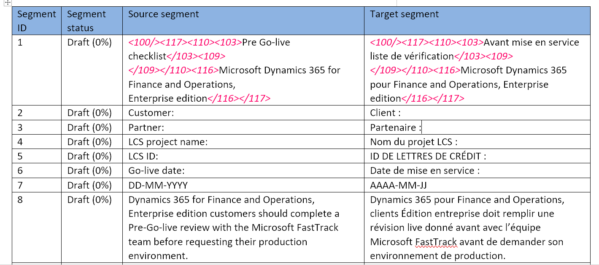
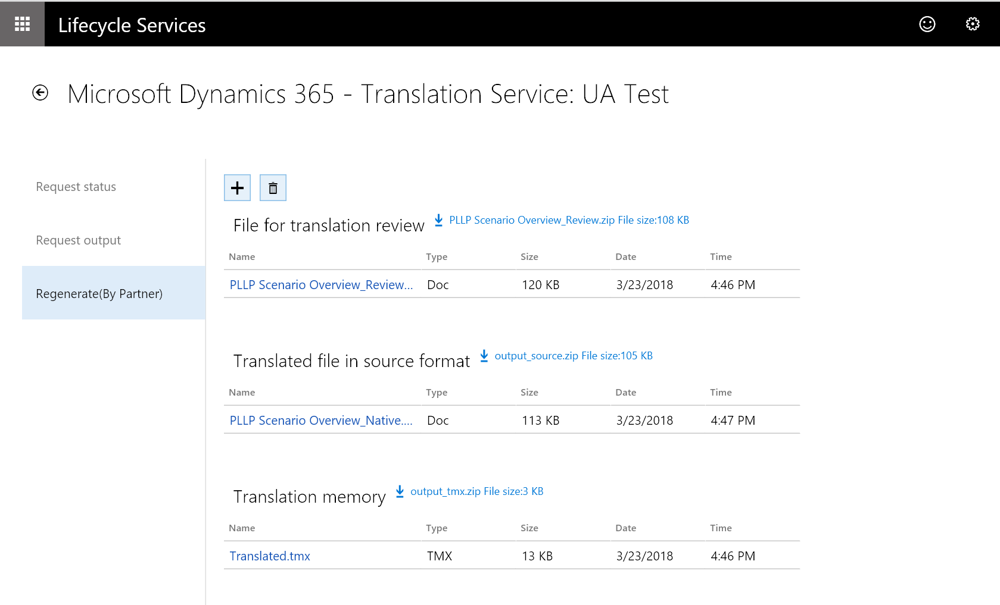

---
# required metadata

title: Microsoft Dynamics 365 Translation Service - Documentation file translation
description: This topic provides information about how to translate a documentation file for a Microsoft Dynamics product or solution.
author: kfend
manager: AnnBe
ms.date: 03/29/2018
ms.topic: article
ms.prod: 
ms.service: dynamics-ax-platform
ms.technology: 

# optional metadata

# ms.search.form: 
# ROBOTS: 
audience: Developer, IT Pro
# ms.devlang: 
ms.reviewer: kfend
ms.search.scope: Operations
# ms.tgt_pltfrm: 
ms.custom: 6154
ms.assetid: 
ms.search.region: Global
# ms.search.industry: 
ms.author: ejchoGIT
ms.search.validFrom: 2018-03-27
ms.dyn365.ops.version: AX 7.3.0

---

# Microsoft Dynamics 365 Translation Service - Documentation file translation

[!include[banner](../includes/banner.md)]

This topic provides information about how to translate a documentation file for Microsoft Dynamics products and solutions. 

For more information about the Microsoft Dynamics Translation Service (DTS), see [Microsoft Dynamics 365 - Translation Service Overview](./translation-service-overview.md).  
For information about how to translate a user interface (UI( file, see [Microsoft Dynamics 365 Translation Service - User interface file translation](./use-translation-service.md#). 

## Create a translation request
1. On the DTS dashboard, select **Add** to create a new translation request.  

    

2. Enter the required information for the request.   

    | Field name        | Description |
    |-------------------|-------------|
    | Request name      | Enter a name for the request. |
    | File type      | Select **Documentation**. This option is only available if you have turned on the **Dynamics 365 Translation Service - Documentation Translation Support** from [LCS Preview features](./translation-service-overview.md#accessing-lcs-preview-features). |
    | Product name      | Select a product name. If you accessed DTS from within a LCS project, this field is automatically filled in and is read-only. |
    | Product version   | Select a product version. If you accessed DTS from within a LCS project, this field will show the default product version information. You can select a different version if needed.|
    | Target country/region | Select the country/region where the translated file will be released.|
    | Translation source/target languages | Select the language pair from/to which translation will be done. All languages that are supported for the selected product name and version will be available in these fields. In the list, a language name in **BOLD** represents a Dynamics product General Availability (GA) language. Microsoft-trained machine translation (MT) systems are available in those languages. In other words, the MT system is trained on Microsoft Dynamics terminology. For non-GA languages, the MT system falls back to the general domain training.|

3. Click **Create**.
        
    > [!NOTE]
    > To take advantage of the Microsoft-trained MT system on Microsoft Dynamics linguistic assets, you must select **English – United States** as either the source language or the target language.

    For example,

    | Source language         | Target language         | MT system that will be used |
    |-------------------------|-------------------------|-----------------------------|
    | English – United States | Japanese	              | Microsoft-trained MT system |
    | Japanese                | English – United States	| Microsoft-trained MT system |
    | German                  | Japanese                | Generic MT system, unless the user provides an XLIFF TM that has more than 10,000 TUs |

## Upload files
Select the plus sign (**+**) in each section to open the **File upload** form. 

### Upload files to translate (Required)
Currently only Microsoft Word (.docx) file format is accepted for translation. Create a zip file that includes all the docx files you want to translate. You can upload only one zip file. 

### Upload XLIFF or TMX translation memory files (Optional)
If you have a TMX translation memory from a previous DTS request, and/or a XLIFF TM from a user interface file translation, you can attach them for recycling in the new document you are submitting. Zip the files before you upload. Only one zip file is accepted. 

After you've uploaded the required files, select **Submit** to start the translation process. After you have submitted and a new request ID is created in the DTS dashboard, click the request ID to see the summary of your request and the status in **Request status** tab. 

Note that the processing time depends on the number of requests that are in the DTS queue and the volume of the word count in the source files that you submit. 

## Completed translation 
When DTS is done processing your translation request, you will receive an email notification from DTS. The result is available on the **Request output** tab of your request details page.

There are three types of output files available:

+ **File for translation review** - Download this file to review and edit the translated document strings in a table view. The file provides the side-by-side source and target languages segments.
+ **Translated file in source format** - Download this file if you don't intend to review or edit the translations. This file is in the same style as the source docx file you submitted and ready to use. 
+ **Translation memory** - Download this file if you want to recycle these translations the next time you are submitting a new translation request with a newer version of the source document. 

### Review and edit the translation
DTS provides the translation review file in .docx format. You can download the file using the steps included in the section, **File for translation review** earlier in this topic, and open it in Microsoft Word. It provides a convenient side-by-side table view as shown in the following example so that you can easily compare the source and target text. After you have reviewed the file, you will have to save and upload it back to DTS to generate the refreshed .docx file output in the original source style.     

 
 
When editing the review .docx file, please make note of the following:

+ Only edit the text in the **Target segment** column.
+ Do not add or remove any row.
+ Do not change the order of the rows or columns.
+ Do not add or remove the red tags. Most red tags represent formatting and styles. 
+ If it is necessary to move the red tags, be careful not to switch a start tag (i.e. <116>) and its end tag (i.e. </116>).

### Regenerate output files
When you've finished reviewing and editing a review docx file, you must regenerate the output file in the source document style so you can apply the latest translations you edited into your target language document.

1. On the **Request output** tab, click **Regenerate** to add a new tab **Regenerate(By Partner)**. 
2. Click the plus sign (**+**) to open the **File upload** form, and upload the edited files. Do not change the .docx review file name from what DTS provided in **Request output** tab. Be sure to zip the files before you upload them.
3. After you select **Upload** button, you're prompted to confirm that action. It may take a while for DTS to process to regenerate the refreshed docx in the source document style and you will receive an automated email notification once it's ready. Then you can come back to the request to download the final output files in the **Regenerate(By Partner)** tab.  

4. Repeat the regeneration process as many times as you require.

