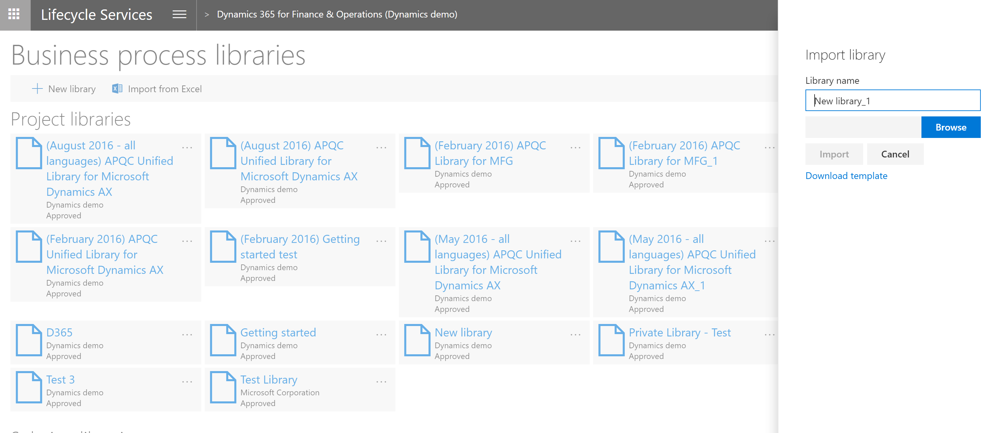
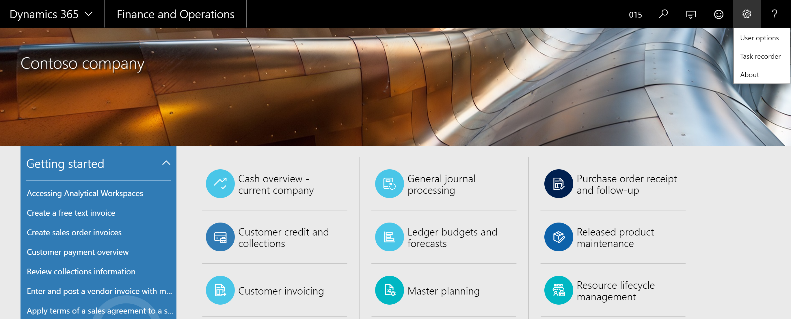
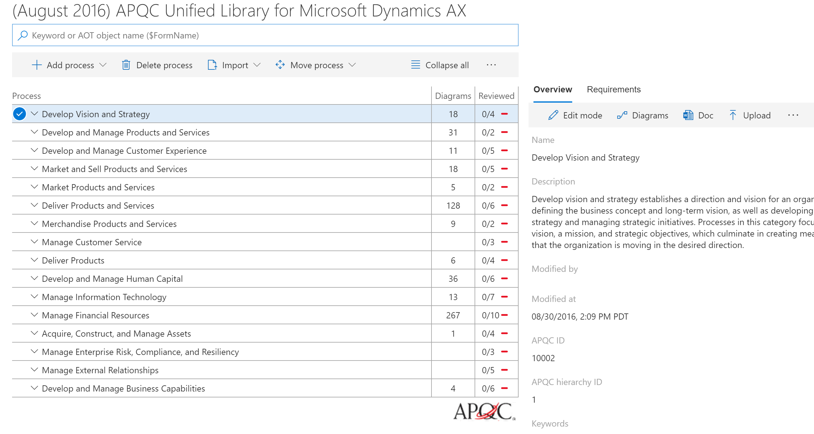
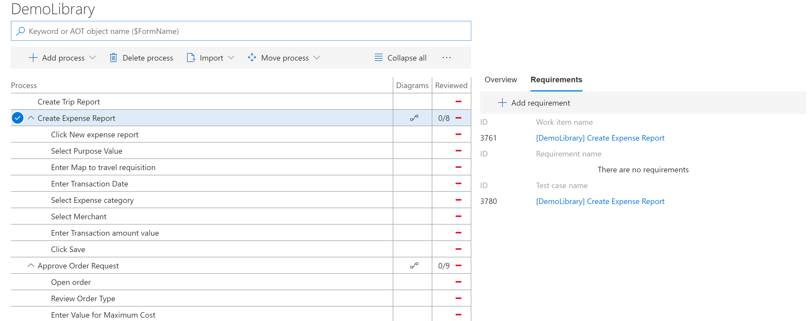

# Use Task Guide and BPM to create an acceptance test suite

You can use Taks Guides and BPM to create your user acceptance test plan. This enables you to organize your acceptance tests by business processes and synchronize BPM to VSTS allowing you to manage test execution and results. This article walks through the process of creating an acceptance test suite to be used for either manual or automatic testing in four easy steps.

## 1 .Create a BPM library

There are several ways to create a Business process modeler (BPM) library. For instructions on how to create libraries in BPM see [Create, Edit, and browse BPM libraries](creating-editing-browsing.md).

For illustration purposes, this article uses a library with common business processes (Create Expense Report, Approve Order Request, etc) that was created via Excel Import.  

## 2. Record Test Cases and Upload to BPM 

Once you have created a BPM library, you'll need to create your test cases using Task Recorder and upload them to BPM, there are several ways to do this. 

If you're using a library that already has all desired Task Recordings attached, skip this step. Otherwise, you can create a new Task Recording in the client and save it directly to LCS, or download the AXTR file and later upload it to an BPM. 

###  Create and Save a new Task Recording 
First, open the client and log in. 

Select the company that you want to use while recording.

Go to **Settings &gt; Task recorder**.

Click **Create a new recording**.

Enter a name for the recording and click **Start**. Recording begins the moment **Start** is clicked.

When recording is complete, click **Stop** in the **Task Recorder Pane.**

To save the Task Recording to an attached BPM, click **Save to Lifecycle Services**.

Select the library you want to save the recording to and **Save**.

Otherwise, Select **Save to Disk** and follow the instructions below to upload the file to BPM.

### Upload an AXTR file to BPM 

In Microsoft Dynamics Lifecycle Services (LCS), in your project, on the **Business process libraries** page, select the library to upload the task recording to.

Select the process to upload the task recording to.

In the right pane, select **Upload**. 

Select **Browse** to find and select the file to upload, and then select **Upload**.

### Save an existing Task Recording to BPM

If you'd like to attach an existing Task Recording, log into the client.

Go to **Settings &gt; Task recorder**.

Select **Edit Task Recording** and attach using either method outlined above.

## 3. Sync with VSTS   

Next, you'll need to synchronize your BPM library with your VSTS project. For details on how to configure, see [Configure your LCS project and connect to LCS](synchronize-bpm-vsts.md#configure-your-lcs-project-to-connect-to-vsts). 

Once configuration is complete, to synchronize a BPM library with a VSTS project, on the **Business process libraries** page, on the tile for the library that you want to synchronize, select the ellipsis button (…), and then select **VSTS sync**.

You can also start VSTS synchronization from the toolbar in a BPM library. Select the ellipsis button (…), and then select **VSTS sync**.

After VSTS synchronization is complete, select the ellipsis button (…), and then select **Sync test cases**.

Once this step is complete, your task recordings will become test cases in VSTS and a link will appear under the requirements tab. 

In addition to the test steps, the task recording XML file is attached to the VSTS test case. This file will be needed in case you wish to automate test execution. 

## 4. Create a test suite in VSTS

Now you will need to create a test suite in VSTS. This will allow you to run a suite of tests and manage, investigate, and track results. 

To create a test suite in VSTS, log into VSTS and select the project and test plan you want to test in. 

Select **Test** from the toolbar.

Select **+** from the left pane and select **Static suite** and enter a name for the suite.

Select **Add existing** and query the Tag **LCS:Test Cases**.

Select **Run** then **Add test cases**.

 
You can click on the test case to view details and attached xml file, create a work item, and more.   

Note: This examples shows the creation of a comprehensive acceptance test suite with all test cases added. You can create various test suites (i.e. basic acceptance test suite) and use custom queries to add specific test cases. 

### Executing manual test cases

Once you have a test suite, you are ready to use it for regression testing after updates made to your D365FO application in a sandbox or test environment. Either execute the test cases in your test suite manually or play the task recordings that are part of the test suite and use VSTS to mark the test cases as passed or failed.

VSTS also proivdes a tool, **Test Runner**, to manage manual test case execution. For instructions on how to use Test Runner, see [Run manual tests](https://docs.microsoft.com/en-us/vsts/manual-test/getting-started/run-manual-tests).

We highly encourage users to take advantage of VSTS as it provides a rich set of management features not only for testing, but result managment and mititigation.

### Executing automated test cases

The Dynamics 365 Unified Operations platform provides developers with tools to author test cases based on task recordings and use VSTS to manage the automated execution of these test cases. Execution of test cases are part of the build and test automation capabilities of **build and test** environment topologies.
For details see the [Continuous delivery hompage](http://docs.microsoft.com/en-us/dynamics365/unified-operations/dev-itpro/dev-tools/continuous-delivery-home-page) and the [Dev ALM blog](http://blogs.msdn.microsoft.com/axdevalm/)
We are also working on developping a tool that enables non developers to author and automate the execution of task recorder based test cases that will significantly reduce the cost of user acceptance testing.
