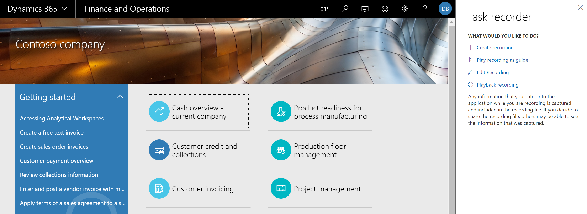
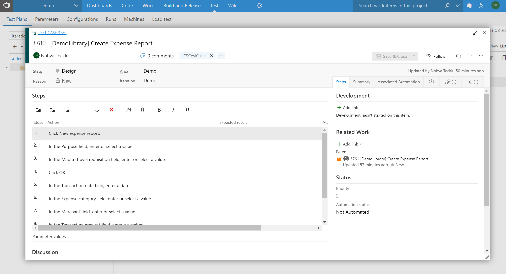

# Create user acceptance test libraries by using task guides and BPM

You can use Task guides and Business process modeler (BPM) to create a user acceptance test library. Organize your acceptance tests by business processes and then synchronize BPM to Visual Studio Team Services (VSTS) to manage test execution and test results. This topic walks through the process of creating and executing acceptance test suites to be used for manual or automatic testing.

## Create a Scenario Acceptance Testing BPM library
BPM is a great LCS tool to describe a hierarchy of tasks and business processes. LCS also allows Microsoft partners and customers to author and distribute BPM libraries across LCS projects via the Asset library. This section describes how to take advantage of BPM to define your acceptance test library.

### Create a BPM library
There are several ways to create a Business process modeler (BPM) library. For more information about how to create libraries in BPM, see [Create, edit, and browse BPM libraries](creating-editing-browsing.md).

For illustration purposes, this topic uses a library that contains common business processes such as Create expense report and Approve order requests. The library was created by using the Excel import functionality.  

### Record test cases and save to BPM 

After you have created a BPM library, you'll need to use Task recorder to create your test cases and then upload the cases to BPM. There are several ways to do this. 

If you're using a library that already has all of the necessary task recordings attached, you can skip this step. Otherwise, create a new task recording in the client and save it directly to LCS, or download the AXTR file and upload it to a BPM library later. 

#### Create and save a new task recording
1. Open the client and sign in. 
2. Select the company that you want to use while recording.
3. Go to **Settings** > **Task recorder**.

4. Click **Create a new recording**.
5. Enter a name for the recording, and then click **Start**. Recording begins the moment that you click **Start**.
6. When the recording is complete, in the Task recorder pane, click **Stop**.
7. To save the task recording to an attached BPM, click **Save to Lifecycle Services**.

8. Select the library that you want to save the recording to, and then click **Save**. Otherwise, select **Save to Disk** and follow the steps in the next section, "Upload an AXTR file to BPM."

 >[!NOTE]
 > To enable the effective execution of your tests using automation tools, make sure all of your task recordings start on the main dashboard of Dynamics 365 for Finance and Operations. 

#### Upload an AXTR file to BPM
1. In Lifecycle Services (LCS), in your project, on the **Business process libraries** page, select the library to upload the task recording to.
2. Click **Author and edit** and in the lines, locate and select the process to upload the task recording to.
3. In the right pane, click **Upload**. 

4. Click **Browse** to find and select the file to upload, and then click **Upload**.

#### Save an existing task recording to BPM
1. To attach an existing task recording, sign in to the client.
2. Go to **Settings** > **Task recorder**.
3. Select **Edit Task Recording** and attach the file by either saving directly to LCS or downloading the AXTR and then uploading to BPM.

## Synchronize and configure your test plan in VSTS

Once you have selected your acceptance test BPM library, synchronize it with VSTS and create your test plan.

### Sync with VSTS
Synchronize your BPM library with your VSTS project. For more information, see [Configure your LCS project and connect to LCS](synchronize-bpm-vsts.md#configure-your-lcs-project-to-connect-to-vsts). 

After configuration is complete, synchronize the BPM library with a VSTS project.
1. On the **Business process libraries** page, on the tile for the library that you want to synchronize, select the ellipsis button (…), and then select **VSTS sync**.

You can also start VSTS synchronization from the toolbar in a BPM library. Select the ellipsis button (…), and then select **VSTS sync**.

2. After VSTS synchronization is complete, select the ellipsis button (…), and then select **Sync test cases**.

3. When this step is complete, your task recordings will become test cases in VSTS and a link will appear under the **Requirements** tab. 

In addition to the test steps, the task recording XML file is attached to the VSTS test case. This file will be needed if you want to automate test execution. 

### Create a test suite in VSTS
Next, you will need to create a test suite in VSTS. This will allow you to run a suite of tests so you can easily manage, investigate, and track the results. 

1. Sign in to VSTS and select the project and test plan that you want to test in. 
2. On the toolbar, select **Test**.
3. In the left pane, select **+**, and then select **Static suite**. 
4. Enter a name for the suite.
5. Click **Add existing** and query the tag **LCS:Test Cases**.
6. Click **Run** > **Add test cases**.

 
7. Select the test case to view details and the attached XML file, and to create a work item.   

 >[!NOTE]
 > This example shows how to create a comprehensive acceptance test suite with all test cases added. You can create various test suites and use custom queries to add specific test cases. 

## Execute your tests

### Run manual test cases
After you have a test suite, you are ready to use it for regression testing after updates have been made to your Dynamics 365 for Finance and Operations application in a sandbox or test environment. You can run the test cases in your test suite manually or play the task recordings that are part of the test suite and use VSTS to mark the test cases as passed or failed.

VSTS also provides a tool, **Test Runner**, to manage manual test case execution. For more information about using Test Runner, see [Run manual tests](https://docs.microsoft.com/en-us/vsts/manual-test/getting-started/run-manual-tests).

We recommend that you take advantage of VSTS as it provides a rich set of management features not only for testing, but result management and mitigation.

### Run automated test cases
The Dynamics 365 Unified Operations platform provides developers with tools to author test cases based on task recordings and use VSTS to manage the automated execution of these test cases. Execution of test cases are part of the build and test automation capabilities of **build and test** environment topologies.
For details, see the [Continuous delivery home page](../dev-tools/continuous-delivery-home-page.md) and the [Dev ALM blog](http://blogs.msdn.microsoft.com/axdevalm/).

#### Investigate test runs
Once an automate run is complete, on the VSTS toolbar, select **Test > Runs** to investigate your test run. Select the desired test run to investigate individial test case failures and errors. You can also go to your test suite in VSTS to see the latest results associated with your test cases.
For more information on testing and test management in VSTS, see the [Visual Studio Team Services documentation](https://docs.microsoft.com/en-us/vsts/?view=vsts).

