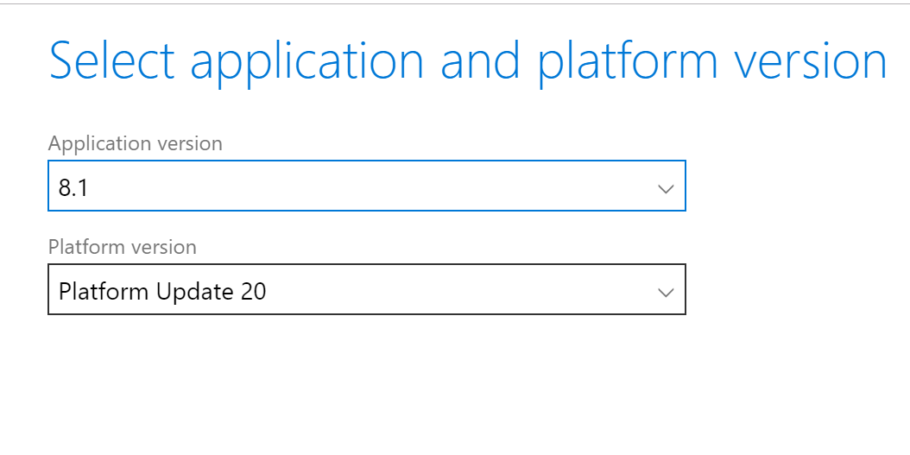
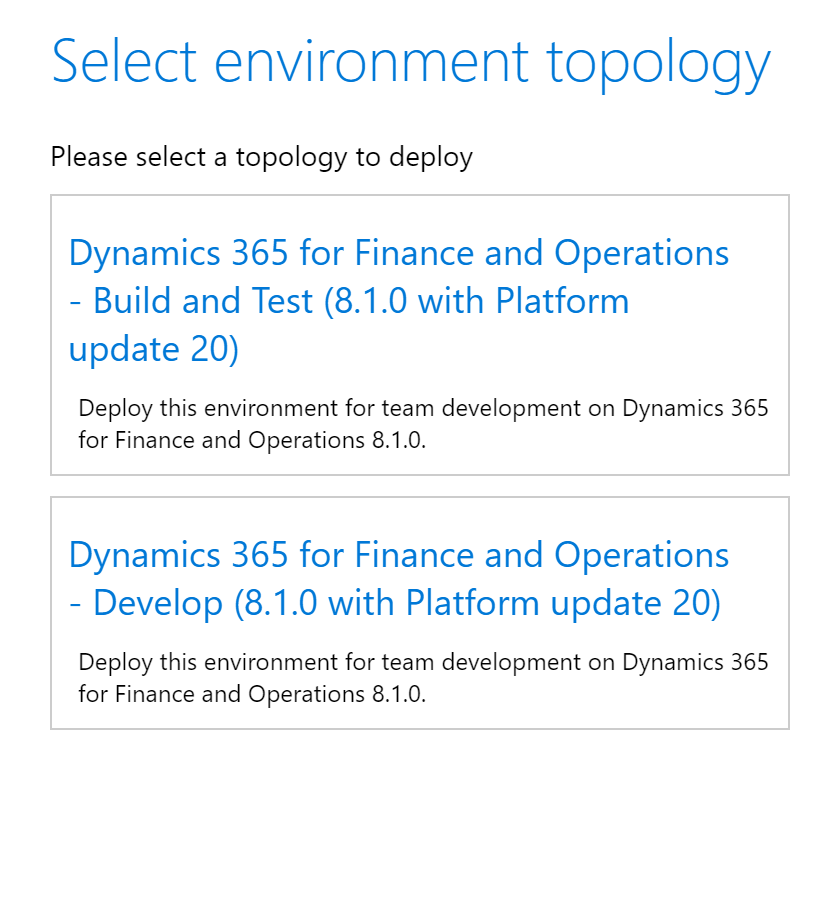
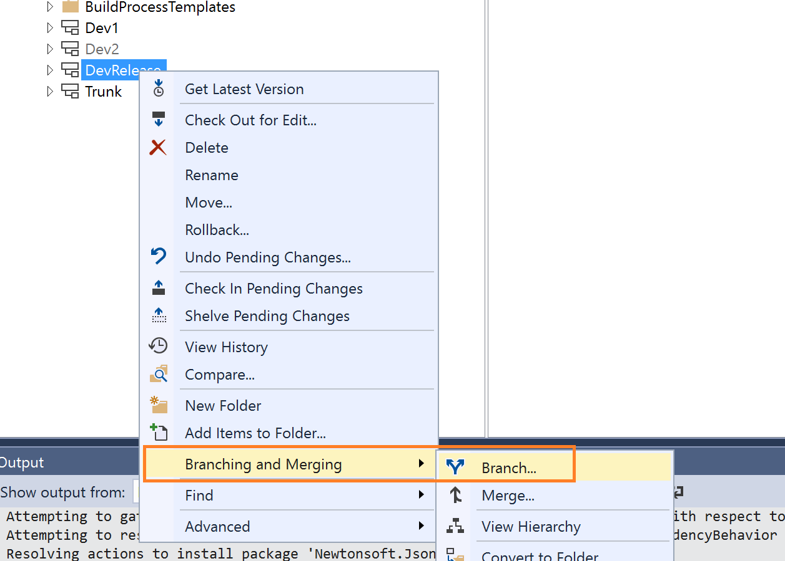

---
# required metadata

title: Update environments from 8.0 to 8.1
description: This topic explains the effort and steps required to update existing 8.0 environments to the 8.1 application release.
author: laswenka
manager: meeram
ms.date: 10/02/2018
ms.topic: article
ms.prod: 
ms.service: dynamics-ax-platform
ms.technology: 

# optional metadata

# ms.search.form: 
# ROBOTS: 
audience: Developer, IT Pro
# ms.devlang: 
ms.reviewer: margoc
ms.search.scope: Operations
# ms.tgt_pltfrm: 
ms.custom: 203764
ms.assetid: 45efdabf-1714-4ba4-9a9d-217143a6c6e0
ms.search.region: Global
# ms.search.industry: 
ms.author: laswenka
ms.search.validFrom: 2016-05-31
ms.dyn365.ops.version: AX 8.0

---

# Update environments from 8.0 to 8.1

[!include [banner](../includes/banner.md)]

This topic explains the effort and steps required to update existing 8.0 environments to the 8.1 application release.

## Background

Traditionally moving to a newer application version has involved a rigorous upgrade that involves deployment of additional virtual machines, code upgrade, data upgrade, and scheduling several days in advance with the DSE Team.  With the direction of One Version in the market, we have begun to make uptaking the latest version simpler.  This will continue to improve over time.

To this end, we are supporting an update experience as compared to a full upgrade.  This is possible because there are no Data Upgrade or Code Upgrade steps between 8.0 and 8.1 application schema.  The target environments will be updated just like you would apply a Platform update.

The high-level process to update from 8.0 to 8.1 includes the following:

1. Deploy 8.1 developer and build environments
2. Branch in version control and remove any application hotfixes
3. Recompile custom extensions and/or ISV solutions
4. Produce single software deployable package
5. Merge deployable package with 8.1 binary update package
6. Deploy to target environment(s) for validation
7. Deploy to Production

## Deploy 8.1 developer and build environments
Using Lifecycle Services, deploy at least one developer environment and a single new build environment on application 8.1 release.

This on average takes 3-4 hours and can be done simultaneously.  For the build environment, **create a new agent pool** and assign to this environment in Advanced options

In Azure DevOps (formerly known as VSTS), visit your existing Build Definition and ensure that it is not using your new agent pool for 8.1.  This will keep your new build agent from trying to compile older application code.

## Branch in version control and remove any application hotfixes
While the new environments are deploying, begin the branching work for your update.  Let's take the following branch structure in version control as an example.  Branching design varies by each customer, please adjust your steps accordingly for how your branches are setup.

### Prepare using Visual Studio
On any machine other development machine other than the new ones being deployed, open Visual Studio and visit the Source Control Explorer.  Here we will create our new branch which will be isolated for the 8.1 update.  

Next, **delete** any package folders in this branch belonging to Microsoft.  You may have packages such as ApplicationSuite checked in from applying hotfixes on 8.0 which need to be removed.  When only your custom packages or ISVs remain, check in these changes to the branch.
>[!Important]
> It is critical that this is done before you map version control workspaces on your new development environments.  This is to avoid the deletion of the Microsoft hotfixes to cascade to your working envirionment and delete untouched 8.1 application code.

## Recompile custom extensions and/or ISV solutions
Now you are ready to map this branch to a new development environment and compile your extensions and ISV solutions if they have provided you with source code.  If your ISVs have only provided binary packages, you can check them in to source control as well, and the build environment will merge the binaries with your extension package to produce a single software deployable package.  More on this process can be found at [Deployable packages from third parties](../dev-tools/manage-runtime-packages#deployable-packages-from-third-parties.md).  This will help later when you merge your package with the 8.1 binary update.

This **step is necessary** as the 8.1 application code is not backwards compatible with 8.0 from a binary level.  In future application releases this step will be optional.

## Produce single software deployable package
After you have compiled in a developer environment and there are no errors to resolve, kick off a build in VSTS using your new 8.1 build environment agent that was setup earlier.  When this finishes, a deployable package Artifact will be attached to your build results.  Download this package and upload it to the Lifecycle Services Asset Library.  This single package should have all of your extensions and ISV solutions.

## Merge deployable package with 8.1 binary update package
In Lifecycle Services, visit your Production 8.0 environment details page.  In the **All binary updates** tile, you will see an option for the 8.1 Application Release.  Save this package to your Asset Library.  

From the Asset Library, find both your new 8.1 software deployable package and the 8.1 binary update package that was just saved.  Highlight both packages and select the **Merge** button.  This will combine the files in to a merged update package.  You are now ready to apply this package to your various test environments.

## Deploy to target environment(s) for validation
Using the merged update package, deploy this to your various test environments.  For more on how to do this, see [Apply updates to cloud environments](../deployment/apply-deployable-package-system.md).  At minimum you must deploy this to your sandbox Tier-2 environment that comes with your subscription.  After you have finished with validation, mark the merged update package as a Release Candidate.

## Deploy to Production
After you have marked the Release Candidate in your Asset Library, you can schedule the deployment to your Production environment.  This will follow the same process for applying any other software deployable package.