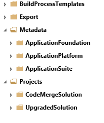
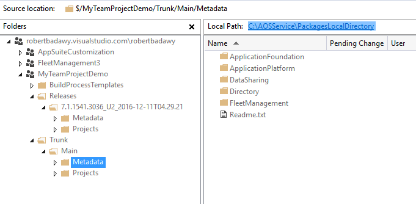
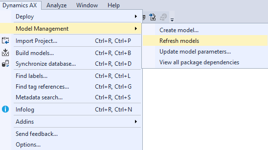

---
# required metadata

title: Configure Visual Studio Team Services mapping during code migration
description: This tutorial shows how to map your development box to the Visual Studio Team Services (VSTS) project after the LCS code upgrade service has completed. 
author: RobinARH
manager: AnnBe
ms.date: 06/20/2017
ms.topic: article
ms.prod: 
ms.service: dynamics-ax-platform
ms.technology: 

# optional metadata

# ms.search.form: 
# ROBOTS: 
audience: Developer
# ms.devlang: 
ms.reviewer: kfend
ms.search.scope: Operations
# ms.tgt_pltfrm: 
ms.custom: 25951
ms.assetid: 60b8c895-0d5d-4d6b-8e32-e9c2f688ca69
ms.search.region: Global
# ms.search.industry: 
ms.author: robadawy
ms.search.validFrom: 2016-02-28
ms.dyn365.ops.version: AX 7.0.0

---

# Configure Visual Studio Team Services mapping during code migration

[!INCLUDE [banner](../includes/banner.md)]

This tutorial shows how to map your development box to the Visual Studio Team Services (VSTS) project after the LCS code upgrade service has completed. 

The LCS code upgrade service automatically checks your upgraded code into Visual Studio Team Services (VSTS) (formerly called Visual Studio Online). You will then need to map your development box to the upgrade folder/branch in your VSTS project (The name of the upgrade folder/branch depends on the version you migrated to). Within your upgraded folder, you will find three folders:

-   Export
-   Metadata
-   Projects

## Key concepts
-   **Export** is the project that contains the XML files after exporting from Microsoft Dynamics AX 2012. This is your metadata in XML format before it is upgraded. This is only relevant if you are upgrading from Dynamics AX 2012.
-   **Metadata** is your upgraded code (metadata XML file) on the latest version of Microsoft Dynamics 365 for Finance and Operations.
-   **Projects** are two solutions that you can use during upgrade. One solution, CodeMergeSolution, is the solution that contains projects with the elements that have conflicts and need to be resolved. The other solution, UpgradedSolution, contains a collection of projects, one for each upgraded model. For example, in VSTS, you should see something like the following structure. 

## Map VSTS to your development box
1.  In Visual Studio, connect to your account by going to **Team explorer &gt; Select Team Projects &gt; Servers &gt; Add.**
2.  Enter the URL to your team project. Click **Close**.
3.  Make sure the VSTS account shows up. On the right, choose the project that you want to work on. Click **Connect**.
4.  Now you need to map your workspace to the VSTS folders. Go to the **Source Code Explorer** and do this mapping:
    1.  Projects &gt; C:\\Users\\&lt;username&gt;\\Documents\\Visual Studio 2015\\Projects
    2.  Metadata &gt; C:\\AOSService\\PackagesLocalDirectory
        -   On cloud VMs, this folder is located on the I:\\ or J:\\ drive
        -   On earlier versions, this folder is C:\\packages
        -   **Important**:
            -   If you are migrating from Dynamics AX 2012 R3 or earlier, you will be mapping to the metadata folder under the **Main** branch.
            -   If you are migrating between 2 versions of the new Dynamics AX (Finance and Operations), you will be mapping to the metadata folder under one of the **Releases** branch.

 Once you have mapped these folders, you can synchronize the code to your local box. Right-click on Metadata and select **Get latest**. Similarly synchronize the Projects folder. After synchronizing the metadata folder, refresh your models in Visual Studio from **Finance and Operations** &gt; **Model Management** &gt; **Refresh Models**.  You are now ready to open your projects, resolve conflicts, build, test and complete your code migration.

