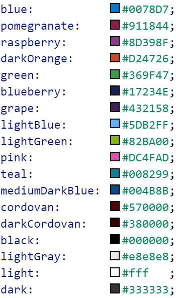

---
# required metadata
title: Design
description: Design object type.
author: shadykdc
manager: AnnBe
ms.date: 08/01/2017
ms.topic: article
ms.prod: 
ms.service: dynamics-ax-applications
ms.technology: 
# optional metadata
# ms.search.form:
audience: Developer
# ms.devlang: 
ms.reviewer: robinr
ms.search.scope: 
# ms.tgt_pltfrm: 
# ms.custom:
ms.search.region: Global
# ms.search.industry: 
ms.author: kashea
ms.search.validFrom:
ms.dyn365.ops.version:
---

# Design Type

[!INCLUDE [banner](../../../../includes/banner.md)]

Design object type.
For more information on design, please reference the [Design Introduction](../../scenarios/client-api-design-overview.md).

### Hierarchy

Design  &nbsp;&nbsp;&nbsp;└─ [PageLinkDesign](view-model-control-pagelink-ipagelink-ipagelinkdesign.md)  &nbsp;&nbsp;&nbsp;└─ [ContainerControlDesign](view-model-control-container-icontainercontrol-icontainercontroldesign.md)  &nbsp;&nbsp;&nbsp;└─ [InputControlDesign](view-model-control-basecontrol-iinputcontrol-iinputcontroldesign.md)  &nbsp;&nbsp;&nbsp;└─ [ImageDesign](view-model-control-image-iimage-iimagedesign.md)  

## Index

### Properties

* [alignItems](view-model-ipage-idesign.md#alignitems)
* [alignSelf](view-model-ipage-idesign.md#alignself)
* [bindings](view-model-ipage-idesign.md#bindings)
* [border](view-model-ipage-idesign.md#border)
* [color](view-model-ipage-idesign.md#color)
* [flexFlow](view-model-ipage-idesign.md#flexflow)
* [flexSize](view-model-ipage-idesign.md#flexsize)
* [fontSize](view-model-ipage-idesign.md#fontsize)
* [fontWeight](view-model-ipage-idesign.md#fontweight)
* [justifyItems](view-model-ipage-idesign.md#justifyitems)
* [label](view-model-ipage-idesign.md#label)
* [labelPosition](view-model-ipage-idesign.md#labelposition)
* [name](view-model-ipage-idesign.md#name)
* [padding](view-model-ipage-idesign.md#padding)
* [type](view-model-ipage-idesign.md#type)

## Properties

### alignItems

alignItems: string (optional) 

This property is an alias for the CSS property "align-items".
Please refer to [this web page](https://css-tricks.com/snippets/css/a-guide-to-flexbox) for documentation on the "align-items" property.

### alignSelf

alignSelf: string (optional) 

### bindings

bindings: any (optional) 

### border

border: "none" &#124; "solid" &#124; "left" &#124; "right" &#124; "top" &#124; "bottom" (optional) 

The border behavior of a control. This property will not be inherited by the children.

### color

color: string (optional) 

The foreground color of the container.
This will modify the color of all headers, items, labels, and icons within the container. 
Consider setting the background color at the same time as necessary when setting this attribute. 
Note: if color is set to "theme", the theme color of the app will be used. 
The following colors are available:  

### flexFlow

flexFlow: string (optional) 

Specifying this property makes the component a flex container component.
This property is an alias for the CSS property "flex-flow".
Please refer to [this web page](https://css-tricks.com/snippets/css/a-guide-to-flexbox) for documentation on the "flex-flow" property.

### flexSize

flexSize: string (optional) 

One number or two numbers written as a string. E.g. "(size to grow) [(size-to-shrink)]" to accommodate available space in the immediate flex container.
This property is an alias for the CSS property "flex". Please refer to
[this web page](https://css-tricks.com/snippets/css/a-guide-to-flexbox) for documentation on the "flex" property.

### fontSize

fontSize: "medium" &#124; "xx-small" &#124; "x-small" &#124; "small" &#124; "large" &#124; "x-large" &#124; "xx-large" (optional) 

The proportional text size

### fontWeight

fontWeight: "normal" &#124; "bold" (optional) 

Normal or bold text.

### justifyItems

justifyItems: "flex-start" &#124; "flex-end" &#124; "center" &#124; "space-between" (optional) 

This property is an alias for the CSS property "justify-content".
Please refer to [this web page](https://css-tricks.com/snippets/css/a-guide-to-flexbox) for documentation on the "justify-content" property.

### label

label: string (optional) 

### labelPosition

labelPosition: "stacked" &#124; "hidden" &#124; "inline" (optional) 

Determines how a label is positioned, if at all. By default, labelPosition is set to stacked.

### name

name: string (optional) 

### padding

padding: "none" &#124; "small" &#124; "std" (optional) 

Allows specifying the component's padding behavior.
A component will inherit the padding behavior specified by its parent container components.

### type

type: [ControlType](../modules/view-model-control-basecontrol-icontrol.md#controltype) (optional) 

The type of the control as a string.

