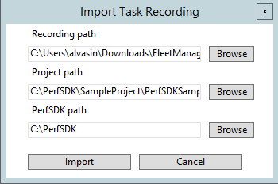
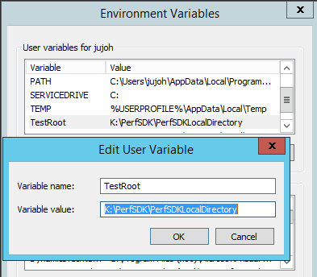
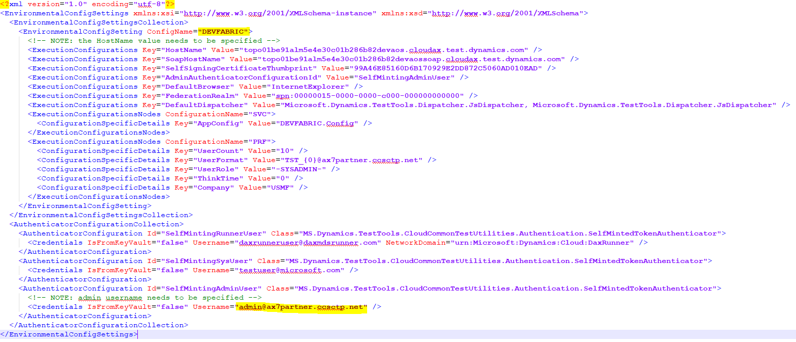
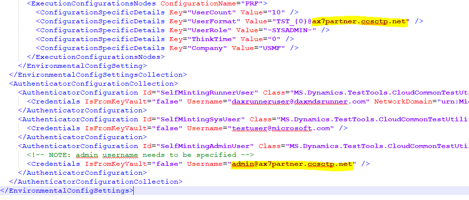
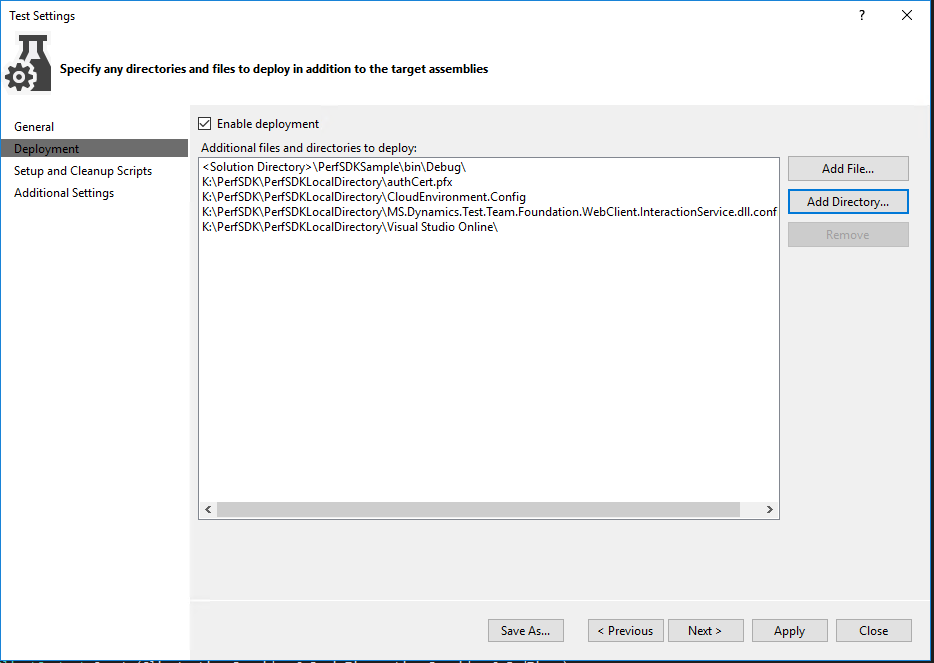
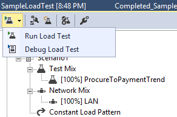
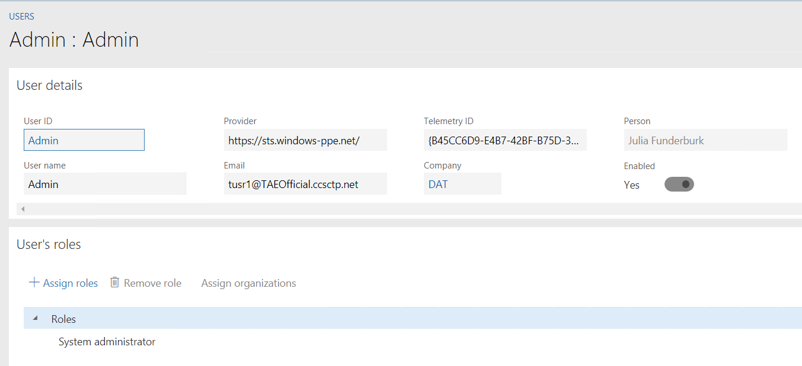
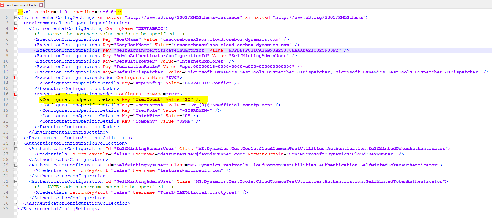

---
# required metadata

title: Performance SDK and multiuser testing via Visual Studio Online
description: This topic introduces the Performance SDK and shows how to do multiuser testing via Visual Studio Online. 
author: jujoh
manager: AnnBe
ms.date: 04/24/2018
ms.topic: article
ms.prod: 
ms.service: dynamics-ax-platform
ms.technology: 

# optional metadata

# ms.search.form: 
# ROBOTS: 
audience: Developer
# ms.devlang: 
ms.reviewer: margoc
ms.search.scope: Operations
# ms.tgt_pltfrm: 
ms.custom: 9954
ms.assetid: 7b605810-e4da-4eb8-9a26-5389f99befcf
ms.search.region: Global
# ms.search.industry: 
ms.author: jujoh
ms.search.validFrom: 2016-02-28
ms.dyn365.ops.version: AX 7.0.0

---

# Performance SDK and multiuser testing via Visual Studio Online

[!INCLUDE [banner](../includes/banner.md)]

This topic describes the Performance software development kit (SDK) and shows how to do multiuser testing via Microsoft Visual Studio Online. It also describes how to convert a scenario that you recorded in Task recorder to a single-user test and then a multiuser test.

> [!NOTE]
> You must have access the environment as an administrator. For more information, see [Access instances](../dev-tools/access-instances.md).

## Prerequisites

- Microsoft Visual Studio 2015 Enterprise
- A deployment that has volume data
- The Performance SDK (The SDK will likely be in K:\\PerfSDK\\PerfSDKLocalDirectory. However, depending on your environment, it might be in C:\\PerfSDK.)

## Create a single-user C# test from an XML recording

To view a video that shows how to create a single-user test, go to [https://mix.office.com/watch/qtdlasy2rcf3](https://mix.office.com/watch/qtdlasy2rcf3).

1. Use Task recorder to create a recording of the scenario that you want to test. 

    > [!IMPORTANT]
    > If your recording doesn't start on the default dashboard page, the test won't be able to run.

2. Start Microsoft Visual Studio as an administrator, and build the **PerfSDKSample** project. This project is in the **PerfSDK** folder. If you've already built the project, skip this step.
3. Select **Dynamics 365** &gt; **Addins** &gt; **Create C# perf test from recording**.
4. In the **Import Task Recording** dialog box, enter the required details, and then select **Import**.

    [](./media/perf103a.png)

    A C# test is generated in the Generated folder for the project that you selected.

## Run a single-user performance test by using the Performance SDK

1. In Control Panel in Microsoft Windows, select **System and Security** &gt; **System** &gt; **Advanced System Settings**. Verify that the **TestRoot** environment variable is set to the path of the PerfSDK folder.

    [](./media/EnvironmentVariable.PNG)

2. Download the **selenium-dotnet-strongnamed-2.42.0.zip** and **IEDriverServer\_Win32\_2.42.0.zip** files from [http://selenium-release.storage.googleapis.com/index.html?path=2.42/](http://selenium-release.storage.googleapis.com/index.html?path=2.42/).
3. Extract the files. Copy the dynamic-link libraries (DLLs) from the **selenium-dotnet-strongnamed-2.42.0.zip\net40** folder to the **PerfSDK\\Common\\External\\Selenium** folder.  Copy the **IEDriverServer.exe** from the **IEDriverServer_Win32_2.42.0.zip** to the **PerfSDK\\Common\\External\\Selenium** folder as well.

    [](./media/perf103d.png)

4. Add a reference to the **WebDriver.dll** in the **PerfSDK\\Common\\External\\Selenium** folder to your Visual Studio project.    

5. Generate and install a certificate. To generate a certificate file, open a Command Prompt window as an administrator, and run the following commands. When you're prompted for a private key password, select **None**.

    ```
    "C:\Program Files (x86)\Windows Kits\8.1\bin\x64\makecert" -n "CN=127.0.0.1" -ss Root -sr LocalMachine -a sha256 -len 2048 -cy end -r -eku 1.3.6.1.5.5.7.3.1 -sv c:\temp\authcert.pvk c:\temp\authcert.cer

    "c:\Program Files (x86)\Windows Kits\8.1\bin\x64\pvk2pfx" -pvk c:\temp\authCert.pvk -spc c:\temp\authcert.cer -pfx c:\temp\authcert.pfx
    ```

    Note the following elements in these commands:

    - **-n "CN=127.0.0.1"** gives a human-readable name to the certificate. It's very important that the name of this certificate be **127.0.0.1**. Otherwise, the single-user tests won't be able to run.
    - **-eku 1.3.6.1.5.5.7.3.1** gives the purpose of the certificate. It indicates that the certificate can be used as a Secure Sockets Layer (SSL) server certificate.

    After the script has finished running, you should see the following files in **C:\\Temp**:

    - authcert.pfx
    - authcert.cer 
    - authcert.pvk

6. Install the **authcert.pfx** and **authcert.cer** certificate files. When you install these files, make sure that you select **Local Machine**. Copy the **authcert.pfx** file to the **PerfSDK** folder.
7. Open a Microsoft Windows PowerShell window as an administrator, and run the following commands to get the thumbprint of the installed certificate.

    ```
    cd Cert:\LocalMachine\My
    Get-ChildItem | Where-Object { $_.Subject -like "CN=127.0.0.1" }
    ```

8. In the **CloudEnvironment.Config** file, enter the thumbprint as the value for the **SelfSigningCertificateThumbprint** key.

    [](./media/config-thumbprint.jpg)

9. Follow these steps to update the **wif.config** file so that Application Object Server (AOS) trusts the certificate:

    1. Start Microsoft Internet Information Services (IIS), and find **Microsoft Dynamics 365 for Finance and Operations** in the list of sites.
    2. Select **Explore**, and find the **wif.config** file.

        [](./media/wifconfig.jpg)

    3. In the **wif.config** file, find the authority that is named **AxTokenIssuer**. You must add your thumbprint to the list of thumbprints for this authority.

        [](./media/PerfSDKUpdatedWifConfig.PNG)

    4. Restart IIS.

10. In Visual Studio, open the **PerfSDKSample** project, and find the **PurchaseReq.cs** file. This file is a sample single-user test. In the file, comment out the following lines.

    ```
    if (this.TestContext !=null)
    {
        timerProvider = new TimerProvider(this.TestContext);
    }
    ```

    [](./media/perf103e.png)

11. Modify the **CloudEnvironment.Config** file by entering your admin user name. Here is an example.

    > [!NOTE]
    > **ConfigName** must be set to **DEVFABRIC**. 

    [](./media/PerfSDKCloudEnvironmentAdminUser.PNG) 

12. In the **CloudEnvironment.Config** file, enter your endpoint.

    > [!NOTE]
    > If the environment is enabled for Application Request Routing (ARR), you have two endpoints. Here is an example:
    >
    > - apr-arr8aos**soap**.axcloud.test.dynamics.com
    > - apr-arr8aos.axcloud.test.dynamics.com
    >
    > In this case, you must enter both endpoints in the CloudEnvironment.Config file.
    >
    > [](./media/perf103upd.png)

13. Select **Test** &gt; **Test settings**, set **Default processor architecture** to **x64**, and then build the solution.
14. Select **Test** &gt; **Windows** &gt; **Test Explorer** to view the list of tests.

    > [!NOTE]
    > Sometimes, Visual Studio might not update the list of tests after you create a test script from a task recording. In this case, restart Visual Studio, and then reopen Test Explorer.

    Your new test will be named **TestMethod**. If you change the method name of TestMethod, your test will receive an individual name. 

You can now run the test. When you run the test, Internet Explorer should be started, and it should replay the scenario that you recorded.

## Create a multiuser test from a single-user test

After you create a single-user test by using the information in the previous section, you can convert it to a multiuser test. Add **MS.Dynamics.TestTools.UIHelpers.Core;** to your test script, and find the following line in the **TestSetup** method.

```
Client = DispatchedClient.DefaultInstance;
```

Replace that line with the following lines.

```
DispatchedClientHelper helper = new DispatchedClientHelper();
Client = helper.GetClient();
```

The test script that was generated by the Task Importer might contain a line that resembles the following line.

```
UserContextRole _context = new UserContextRole(UserManagement.AdminUser);
```

Remove this line from any tests that will be run as load tests. This code is required only for single-user tests and has a negative effect on the performance of load tests.

Make sure that the values that you entered when you made the task recording are randomized. You might have to use the Data Expansion Tool first to generate test data.

## Set up Visual Studio Team Services for multiuser testing

For this example, you will use the ProcureToPay.cs file. To start Visual Studio, you must sign in to the [Visual Studio Team Services portal](https://app.vssps.visualstudio.com/profile/view), and then select **Open in Visual Studio**.

> [!NOTE]
> You must complete this step only one time. After you've signed in to Visual Studio Team Services, the settings are saved.

[](./media/vsonline-5.jpg)

1. Open the **PerfSDKSample** project.
2. In the **CloudEnvironment.Config** file, update the **UserFormat** entry so that it reflects the admin user URL. For example, for `admin@example.com`, use **TST\_{0}@example.com** as the user format. Additionally, change the **UserCount** value to the number of users that you want to have in your performance test.

    [](./media/PerfSDKUserFormatExample.PNG)

3. Open a Command Prompt window, and navigate to the **PerfSDK** folder. Run the following command to create test users for your environment.

    ```
    MS.Dynamics.Performance.CreateUsers.exe [UserCount] [CompanyCode]
    ```

    You can create as many users as you want. For example, the following command creates 150 test users for the USMF company.

    ```
    MS.Dynamics.Performance.CreateUsers.exe 150 USMF
    ```

4. Sign in to your endpoint as the admin user, and verify that users were created in the system.

### Test the sandbox environment

Up to this point, the instructions have assumed that you have a developer topology where the AOS machine is also your development machine. To run load tests in Visual Studio Team Services, the environment that you test must be a sandbox environment. You must complete a few additional steps to establish trust between the sandbox environment and the computer that runs the load tests. The computer that runs the load tests can be either your development machine or the test agent that is created by Visual Studio Online.

1. Establish a Remote Desktop connection to your sandbox AOS machine, and copy over the **.cer** file. Double-click the file to install it. When you're prompted for the certificate store, select **Personal**.
2. Start IIS, and find **AOSService** in the list of sites. Then select **Explore**, and find the **wif.config** file. In the **wif.config** file, find the authority that is named **AxTokenIssuer**. You must add your thumbprint to the list of thumbprints for this authority. (Use the values from the certificate that you generated earlier.)

    [](./media/PerfSDKUpdatedWifConfig.PNG)

3. Restart IIS.

You can now run performance tests against the topology.

> [!NOTE]
> If your topology has multiple AOS machines, you must install the certificate and update the wif.config file on every AOS machine.

## Run the performance test

1. In the Visual Studio editor, open the **ProcureToPay.cs** file, and append the following lines in the **TestSetup** method.

    ```
    var testroot = System.Environment.GetEnvironmentVariable("DeploymentDir"); 
    if (string.IsNullOrEmpty(testroot)) 
    {
        testroot = System.IO.Directory.GetCurrentDirectory(); 
    } 
    Environment.SetEnvironmentVariable("testroot", testroot);
    ```

2. Download the installer (.msi) file for Microsoft ODBC Driver 13 for SQL Server from [https://www.microsoft.com/en-us/download/details.aspx?id=50420](https://www.microsoft.com/en-us/download/details.aspx?id=50420). (Select the 64-bit version of the .msi file.) Put the file in the **Visual Studio Online** folder in the **PerfSDK** directory.
3. Modify the contents of the **setup.cmd** file in the **Visual Studio Online** folder so that they match the following code.

    ```
    setx testroot "%DeploymentDirectory%"
    ECHO Installing D365 prerequisites
    ECHO MSIEXEC /a %DeploymentDirectory%\msodbcsql /passive /norestart IACCEPTMSODBCSQLLICENSETERMS=YES
    MSIEXEC /a %DeploymentDirectory%\msodbcsql /passive /norestart IACCEPTMSODBCSQLLICENSETERMS=YES
    %windir%\sysnative\windowspowershell\v1.0\powershell.exe -File %DeploymentDirectory%\install-wif.ps1
    Md %DeploymentDirectory%\Common\Team\Foundation\Performance\Framework
    %DeploymentDirectory%\CloudCtuFakeACSInstall.cmd %DeploymentDirectory%\authcert.pfx
    ```

4. Modify the contents of the **CloudCtuFakeACSInstall.cmd** file so that the **Import** command has an empty string instead of **'password'**. The third line of the script should resemble the following line.

    ```
    set MyStoreInstallCmd= .... $pfxcert.Import('%TestCertPath%', '', 'Exportable,PersistKeySet')....
    ```

5. In your solution files, double-click the **vsonline.testsettings** file to modify the test settings.
6. In the **Test Settings** dialog box, on the **Deployment** tab, use the following settings:

    - Select the **Enable deployment** check box.
    - In the **Additional files and directories to deploy** field, make sure that the following files and directories are listed:

        - &lt;Solution Directory&gt;\\PerfSDKSample\\bin\\Debug\\
        - C:\\PerfSDK\\CloudEnvironment.Config
        - C:\\PerfSDK\\authcert.pfx
        - C:\\PerfSDK\\MS.Dynamics.Test.Team.Foundation.WebClient.InteractionService.dll.config
        - C:\\PerfSDK\\Visual Studio Online\\

        [](./media/PerfSDKOnlineTestSettings.PNG)

        > [!NOTE]
        > Your PerfSDK folder might differ.

7. On the **Setup and Cleanup Scripts** tab, select the **setup.cmd** file that is in the **Visual Studio Online** folder in the **PerfSDK** directory.
8. On the **Additional Settings** tab, select **Run tests in 64 bit process on 64 bit machine**.
9. To run the test, open the **SampleLoadTest.loadtest** file, and select **Run Load Test**.

    [](./media/perf103u.png)

    When the test has finished running, you should see a summary that shows transaction results. Here is an example.

    [](./media/perf103v.png)

10. To view various indicators for the test controller and test scenario, you can switch to the **Graphs** view.

    [](./media/perf103w.png)

    > [!NOTE]
    > While tests are being run, information about your system isn't available in this view. To access this information, you must use Microsoft Dynamics Lifecycle Services (LCS) to monitor the CPU and memory usage of your AOS machine. Alternatively, you can set up perfmon directly on the AOS machine and set up the Microsoft Azure portal to monitor Microsoft SQL Server usage of Database Transaction Units (DTUs).

## Troubleshooting

### No client was opened in the time-out period
This issue affects only single-user tests. When the test is running, a web client opens, but a website is never loaded. Instead, there is an empty web client that has a white screen, and the following message appears at the top of the page: "This is the initial start page for the WebDriver server." The test will eventually time out and fail, and an error message will be shown.

#### Error example

```
Initialization method <Test class name>.TestSetup threw exception. System.TimeoutException: System.TimeoutException: No client was opened in the timeout period.
```

#### Solution
Follow steps 4 through 8 in the "Run a single-user performance test by using the Performance SDK" section of this topic. That section explains how to create a correct certificate for this type of test. It also explains how to add the thumbprint of the certificate to the wif.config file.

### Zoom factor

This issue affects only single-user tests. 

#### Error example

```
Initialization method <Test class name>.TestSetup threw exception. System.InvalidOperationException: System.InvalidOperationException: Unexpected error launching Internet Explorer. Browser zoom level was set to 200%. It should be set to 100% (NoSuchDriver).
```

#### Solution

In Internet Explorer, you can change the zoom factor to 100 percent by changing the following registry keys:

- Computer\\HKEY\_CURRENT\_USER\\SOFTWARE\\Microsoft\\Internet Explorer\\Zoom\\ResetZoomOnStartup = 0
- Computer\\HKEY\_CURRENT\_USER\\SOFTWARE\\Microsoft\\Internet Explorer\\Zoom\\ResetZoomOnStartup2 = 0
- Computer\\HKEY\_CURRENT\_USER\\SOFTWARE\\Microsoft\\Internet Explorer\\Zoom\\Zoomfactor = 80000
 
Depending on the version of the local machine that is used, before you start the Remote Desktop Protocol (RDP) session, you might have to select **Change the size of text, apps and other items**. This field is available in **Display settings** in Windows. 
 
If those steps don't work, try to change the size of your remote desktop before you start the RDP session, so that the default zoom level in Internet Explorer is 100 percent.

### Certificate thumbprint errors

#### Error example

```
Initialization method MS.Dynamics.Performance.Application.TaskRecorder.TestRecord1Base.TestSetup threw exception. 
System.TypeInitializationException: System.TypeInitializationException: The type initializer for 
'MS.Dynamics.TestTools.CloudCommonTestUtilities.Authentication.UserManagement' threw an exception. --> 
MS.Dynamics.TestTools.CloudCommonTestUtilities.Exceptions.WebAuthenticationException: 
Failed finding the certificate for minting tokens by thumbprint: b4f01d2fc42718198852cd23957fc60a3e4bca2e
```

#### Solution

You might receive the error message for several reasons:

- The certificate thumbprint that you copied into the CloudEnvironment.Config and wif.config files includes invisible Unicode characters. To determine whether the thumbprint contains invisible Unicode characters, paste it into a Unicode code converter, and see whether extra characters appear in the **HTML/XML** field. For example, you can use the  Unicode converter that is available at [https://r12a.github.io/apps/conversion/](https://r12a.github.io/apps/conversion/).

    
 
- The certificate wasn't installed on the AOS machine. To verify that the certificate can be found on the AOS machine, run the following Windows PowerShell script.

    ```
    cd Cert:\LocalMachine\My
    Get-ChildItem | Where-Object { $_.Subject -like "CN=<name of your certificate>" }
    ```

    If the thumbprint doesn't appear in the Windows PowerShell console after you run the script, the certificate can't be found. To fix the issue, copy and install the .cer file that you created earlier in this topic to the AOS machine.
 
- If this issue occurs when you run load tests, the setup scripts might not have installed the corresponding .pfx file correctly. Verify that the password that is specified in the CloudCtuFakeACSInstall.cmd file matches the password that was set when the certificate was created.
 
    
 
### No endpoint is listening

This issue can occur when you run single-user or multiuser tests, or when you create users by using MS.Dynamics.Performance.CreateUsers.exe.

#### Error example

The tests or user creation process fails, and the following error message is shown.

```
System.TypeInitializationException: The type initializer for 'MS.Dynamics.TestTools.CloudCommonTestUtilities.Authentication.UserManagement' threw an exception. ---> System.ServiceModel.EndpointNotFoundException: There was no endpoint listening at <web address> that could accept the message. This is often caused by an incorrect address or SOAP action. 
```

#### Solution

This issue occurs when the host that is specified in the CloudEnvironment.Config file can't be accessed from the machine that is trying to run the tests or create users.
 
In the CloudEnvironment.Config file, review the values that are specified by the following keys:

- &lt;ExecutionConfigurations Key="HostName" Value="&lt;web address of host&gt;" /&gt;
- &lt;ExecutionConfigurations Key="SoapHostName" Value="&lt;web address of SOAP&gt;" /&gt;

The web addresses that are specified by these keys must be the environment that you're testing. In a web browser on your developer machine, make sure that you can open the web address that is specified by the **HostName** key.

For online load tests, the environment that is specified by the **HostName** key in the CloudEnvironment.Config file must be publicly accessible from any machine. Therefore, if you must test a one-box environment, you won't be able to run the load test by using Visual Studio Online, because the endpoint won't be accessible outside the one-box environment.

### Users can't be enumerated

This issue can occur when you run multiuser tests, or when you create users by using MS.Dynamics.Performance.CreateUsers.exe.

#### Error example

```
System.TypeInitializationException: The type initializer for 'MS.Dynamics.TestTools.CloudCommonTestUtilities.Authentication.UserManagement' threw an exception. ---> System.InvalidOperationException: Could not enumerate AX users ---> System.ServiceModel.FaultException'1[System.ComponentModel.Win32Exception]: Forbidden
```

#### Solution

Two scenarios can cause this error:

- The user who is specified as **SelfMintingAdminUser** in the CloudEnvironment.config file must have the System Administrator role. This issue occurs when the System Administrator role isn't assigned to the user who is specified as **SelfMintingAdminUser**. To verify that you've specified the correct user, you can sign in to the endpoint and view the user's roles.

    

- The user who is specified as **SelfMintingAdminUser** in the CloudEnvironment.config file has a **Provider** other than `"<https://sts.windows-ppe.net/>"` or `"<https://sts.windows.net/>"`. Sometimes, a company-specific domain is included in the **Provider** field for the admin user. To work around this issue, in Finance and Operations, create a user who has any name and email address. Assign the System Administrator role to the new user. You don't have to link the user to a real Azure Active Directory user. Specify this new admin user as **SelfMintingAdminUser** in the CloudEnvironment.config file.

### The HTTP request was forbidden with client authentication scheme 'Anonymous'

#### Error example

```
Initialization method <Test class name>.TestSetup threw exception. System.ServiceModel.Security.MessageSecurityException: System.ServiceModel.Security.MessageSecurityException: The HTTP request was forbidden with client authentication scheme 'Anonymous'. ---> System.Net.WebException: The remote server returned an error: (403) Forbidden..
```

#### Solution

Two known scenarios can cause this error:

- The test users are created by running MS.Dynamics.Performance.CreateUsers.exe without any arguments. Here is an example.

    ```
    MS.Dynamics.Performance.CreateUsers.exe
    ```

    If the CreateUsers script is run without any arguments, the email addresses of test users that are created won't be correctly formatted. If these users are used to run the tests, the tests will generate the forbidden request error. You can verify that this scenario is causing the error by viewing the users in Microsoft Dynamics 365 for Finance and Operations. The incorrect email addresses of the test users will resemble the email addresses in the following illustration.

    [](./media/PerfSDKBadUserFormat.PNG)

    To resolve the issue, delete the test users who have incorrectly formatted email addresses. Rerun the CreateUsers script, and specify the user count and company as shown here.

    ```
    MS.Dynamics.Performance.CreateUsers.exe [UserCount] [CompanyCode]
    ```

- The number of users that you specify in the **UserCount** field in the CloudEnvironment.Config file exceeds the number of test users that you created by running MS.Dynamics.Performance.CreateUsers.exe. Make sure that you created at least as many test users as you request in the CloudEnvironment.Config file.
 
    

### At least one security token in the message could not be validated

This issue can occur when you run multiuser tests, or when you create users by using MS.Dynamics.Performance.CreateUsers.exe. It tends to occur when the AOS machine differs from the developer machine. 

#### Error example

```
System.TypeInitializationException: The type initializer for 'MS.Dynamics.TestTools.CloudCommonTestUtilities.Authentication.UserManagement' threw an exception. ---> System.ServiceModel.Security.MessageSecurityException: An unsecured or incorrectly secured fault was received from the other party. See the inner FaultException for the fault code and detail. ---> System.ServiceModel.FaultException: At least one security token in the message could not be validated.
```

#### Solution

This issue occurs when the AOS endpoint can't validate the thumbprint of the certificate that you created. There are two possible causes:

- The certificate wasn't installed on the AOS machine. To fix the issue, copy the .cer file that you created earlier in this topic to the AOS machine, and install it.
- The thumbprint of the certificate wasn't added to the wif.config file on the AOS machine. To fix the issue, see step 8 in the "Run a single-user performance test by using the Performance SDK" section for information about how to add the certificate to the wif.config file. Be sure to restart IIS after you modify the wif.config file.
 
### MS.Dynamics.Test.Team.Foundation.WebClient.InteractionService.dll.config is missing from the deployment items

This issue usually occurs only when you run load tests.

#### Error example

```
<Test class name>.TestSetup threw exception. System.InvalidOperationException: System.InvalidOperationException: Could not find endpoint element with name 'ClientCommunicationManager' and contract 'Microsoft.Dynamics.Client.InteractionService.Communication.Reliable.IReliableCommunicationManager' in the ServiceModel client configuration section. This might be because no configuration file was found for your application, or because no endpoint element matching this name could be found in the client element.. at System.ServiceModel.Description.ConfigLoader.LoadChannelBehaviors(ServiceEndpoint serviceEndpoint, String configurationName)
```

#### Solution

This issue occurs when the system can't find the MS.Dynamics.Test.Team.Foundation.WebClient.InteractionService.dll.config file when the load tests are run, because the file wasn't added as a deployment item. Verify whether the MS.Dynamics.Test.Team.Foundation.WebClient.InteractionService.dll.config file is in the Out folder for the test run: 

&lt;solution path&gt;\\TestResults\\&lt;your test run&gt;\\Out

If the file is missing, add it to the deployment items in the test settings.
 
> [!IMPORTANT]
> There are two files that have very similar names. The name of one file ends in **\*.dll**, and the name of the other file ends in **\*.dll.config**. The **\*.dll.config** file must be in the deployment items in the test settings.
 
### CloudEnvironment.Config is missing from the deployment items

This issue usually occurs only when you run load tests.

#### Error example

```
Initialization method <Test class name>.TestSetup threw exception. 
System.TypeInitializationException: System.TypeInitializationException: The type initializer for 'MS.Dynamics.TestTools.CloudCommonTestUtilities.Authentication.UserManagement' threw an exception. ---> MS.Dynamics.TestTools.TestLogging.EvaluateException: Assert.Fail failed. DateTime="10/13/2017 14:42:55" "The type initializer for 'MS.Dynamics.TestTools.CloudCommonTestUtilities.Authentication.SecretSettingsHelper' threw an exception.".
```

#### Solution

This issue occurs when the CloudEnvironment.Config file isn't present when the tests are run. The issue typically occurs when you run load tests and the CloudEnvironment.Config file wasn't added as a deployment item. Verify whether the CloudEnvironment.Config file is in the Out folder for the test run:

&lt;solution path&gt;\\TestResults\\&lt;your test run&gt;\\Out

If the file is missing, add it to the deployment items in the test settings.


### InteractiveClientId wasn't specified in the settings

#### Error example

```
The type initializer for 'MS.Dynamics.TestTools.CloudCommonTestUtilities.Authentication.SecretSettingsHelper' threw an exception. --->
Microsoft.CE.VaultSDK.SecretProviderException: InteractiveClientId was not specified in settings
```

#### Solution

This issue occurs when the **SelfSigningCertificateThumbprint** field is left blank in the CloudEnvironment.Config file. In the CloudEnvironment.Config file, find the following line, and paste in the thumbprint of the certificate that you created and installed.

```
<ExecutionConfigurations Key="SelfSigningCertificateThumbprint" Value="" />
```

### The remote host forcibly closed an existing connection

#### Error example

```
System.TypeInitializationException: System.TypeInitializationException: The type initializer for
'MS.Dynamics.TestTools.CloudCommonTestUtilities.Authentication.UserManagement' threw an exception. --->
System.ServiceModel.CommunicationException: An error occurred while making the HTTP request to
<Host name>/Services/AxUserManagement/Service.svc/ws2007FedHttp. This could be due to the fact 
that the server certificate is not configured properly with HTTP.SYS in the HTTPS case. This could also be caused 
by a mismatch of the security binding between the client and the server.** ---> System.Net.WebException: 
The underlying connection was closed: An unexpected error occurred on a send. ---> System.IO.IOException: 
Unable to read data from the transport connection: An existing connection was forcibly closed by the remote host. ---> 
System.Net.Sockets.SocketException: An existing connection was forcibly closed by the remote host. 
```

#### Solution

Run the following Windows PowerShell script on the development machine.

```
Set-ItemProperty HKLM:\SOFTWARE\Microsoft\.NETFramework\v4.0.30319 -Name SchUseStrongCrypto -Value 1 -Type dword -Force -Confirm:$false
if ((Test-Path HKLM:\SOFTWARE\Wow6432Node\Microsoft\.NETFramework\v4.0.30319)) 
{
    Set-ItemProperty HKLM:\SOFTWARE\Wow6432Node\Microsoft\.NETFramework\v4.0.30319 -Name SchUseStrongCrypto -Value 1 -Type dword -Force -Confirm:$false 
}
```

### Service w3svc was not found on computer

This error only occurs when you run load tests by using Visual Studio Online.

#### Error example
```
Test method MS.Dynamics.Performance.Application.GFM.PDLTrend.ProcureToPayTrend.ProcureToPaymentTrend threw exception: 
System.TypeInitializationException: The type initializer for 'MS.Dynamics.TestTools.CloudCommonTestUtilities.Authentication.UserManagement' threw an exception. ---> System.InvalidOperationException: Service w3svc was not found on computer '.'. ---> System.ComponentModel.Win32Exception: The specified service does not exist as an installed service
```

#### Solution

A hotfix is available that resolves this issue. The Microsoft Knowledge Base (KB) number is 4095640.
