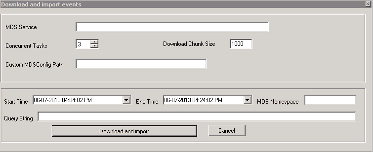
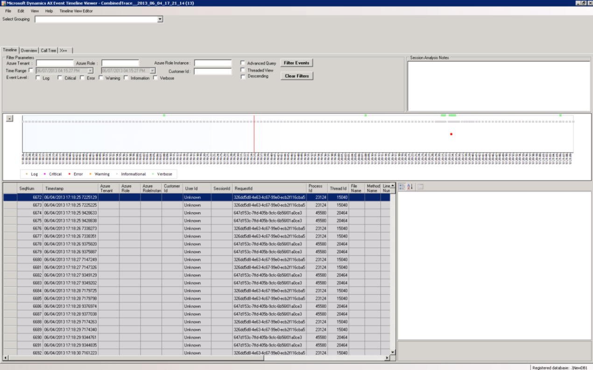
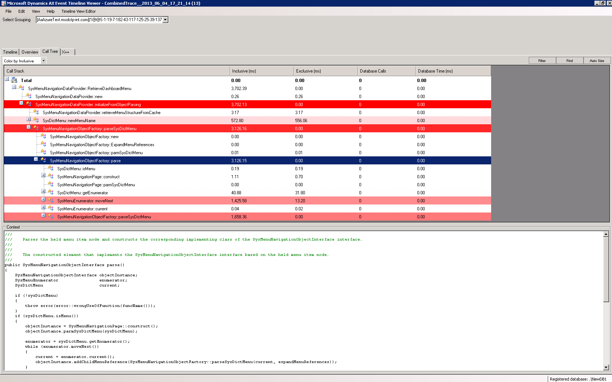

---
# required metadata

title: Diagnose problems and analyze performance issues using Trace parser
description: This topic explains how you can use the Trace parser to consume traces and analyze performance in your deployment. 
author: RobinARH
manager: AnnBe
ms.date: 10/19/2017
ms.topic: article
ms.prod: 
ms.service: dynamics-ax-platform
ms.technology: 

# optional metadata

# ms.search.form: 
# ROBOTS: 
audience: Developer
# ms.devlang: 
ms.reviewer: robinr
ms.search.scope: Operations
# ms.tgt_pltfrm: 
ms.custom: 13441
ms.assetid: eb0fbbaf-07d4-4a02-85e8-0d4f7920a0b9
ms.search.region: Global
# ms.search.industry: 
ms.author: chwolf
ms.search.validFrom: 2016-02-28
ms.dyn365.ops.version: AX 7.0.0

---

# Diagnose problems and analyze performance issues using Trace parser

[!include[banner](../includes/banner.md)]

This topic explains how you can use the Trace parser to consume traces and analyze performance in your Microsoft Dynamics 365 for Finance and Operations deployment. You can use the Trace Parser to find and diagnose various types of errors. You can also use the tool to visualize execution of X++ methods, as well as the execution call tree.

**Note:** There are many more features in the Trace parser are similar to Microsoft Dynamics AX 2012. See <http://blogs.msdn.com/axperf> for more information.

## Finding the Trace parser
Trace parser should be preinstalled with your developer deployment or VHD. The install location is here: C:\\Program Files (x86)\\Microsoft Dynamics AX\\Microsoft.Dynamics.AX.Tracing.TraceParser.exe In case it is not installed you can find the "traceparser.msi" in C:\\PerfSDK. If the for any reason the PerfSDK is not installed you can find the .msi here: C:\\Services\\PerfSDK\\Scripts.

## Capturing events
There are two ways that you can obtain the data that you will analyze in the Trace parser. They include:

-   Capture events from the local installation.
    -   If the **Select Trace** window isn’t already open, go to the **File** menu and click **Open trace**. In the **Select Trace** window, click **Capture Events**. After selecting your providers, click **Start**. The Trace Parser tool will start listening to all the providers and capturing the events. Capturing stops when you click **Stop and Import**.
-   Open an existing ETL (Windows Event) file that was captured using tools such as Logman. 

## Viewing traces
**Timeline view** The Timeline tab is the first tab that you see after you import a trace into the Trace Parser. This tab is shown in the following illustration.  The **Timeline** tab has the following major components:

-   The **Select Grouping** drop-down allows you to group based on a variety of categories, such as Customer ID, Username, Session Name, etc. Groupings will display maximum and minimum timestamp of events, total number of events, and lowest event level within the grouping.
-   List of all events in a threaded or unthreaded view.
-   Property grid displayed for the selected event.
-   Timeline chart for all the selected events.
-   Filtering of events.
-   Session analysis notes.

**Call tree view** By selecting the **Call Tree** tab, you can see the call tree for all X++ methods. The tab is shown below.  Similarly, you can display the **X++** tab to view a list of all the X++ methods. They will be sorted by fields such as Inclusive/Exclusive durations, RPC, or Database calls. Note that these are similar to the corresponding tabs in Trace Parser and have the same behavior.

See also
--------

[Developer home page](..\dev-tools\developer-home-page.md)

