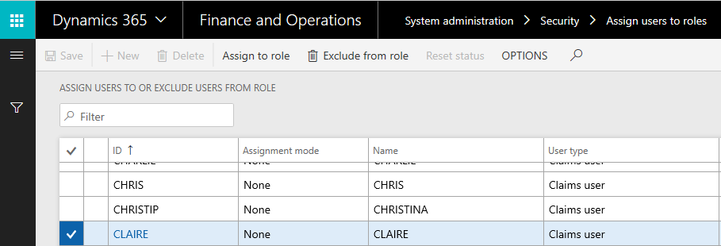

# Batch Manager Role 

Previously, users needed to have the Sysadmin/IT Admin security Role in order to manage batch job, We have provided a more targeted role, Batch Manager, which grants users the permission to copy batch, change who will execute jobs and specify time ranges during which jobs can execute. 

Uses

- Manually Set up the batch that require sysadmin or IT admin
- Use Less Privileged User to set up ad hock Batch Jobs

 
Batch Maintain Security Privilege can be granted to normal user to create an adhock batch Job by assigning the Batch Job Manager Role to this User

> [!Note]
> This feature is available as of platform update 20.

## Assign the Batch Manager Role to a User

1.	Go to System administration > Security > Assign users to roles.
2.	Click on the Batch Job Manager and on the left Pane Click on Manually Assign /exclude user
3.	Select the Desired User and Click on Assign to Role

 
 
 

4.	Close the Form 

## Run By user

This functionality will give Batch Managers the ability to specify a specific User to run the Batch Job. This is very useful when you want to

- Change the Current User who runs the Job if they are no longer active
- Quickly set a user while copying the Batch Jobs from a company to another

  

You can use this functionality in Copy Batch Job as well
 

