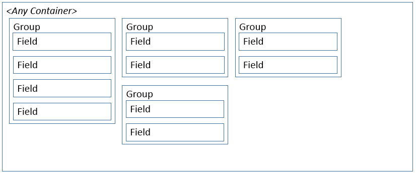
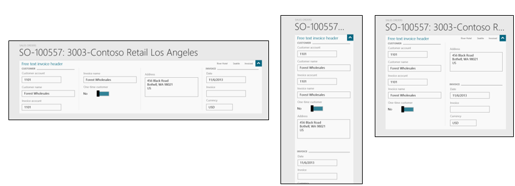
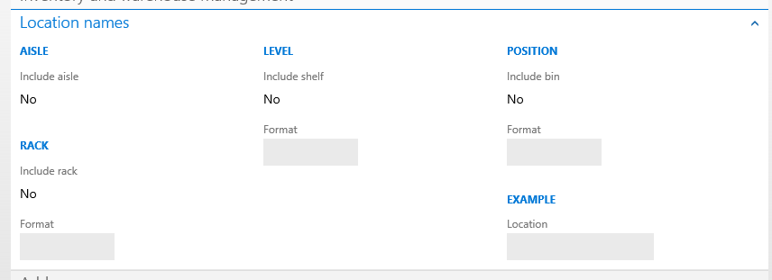
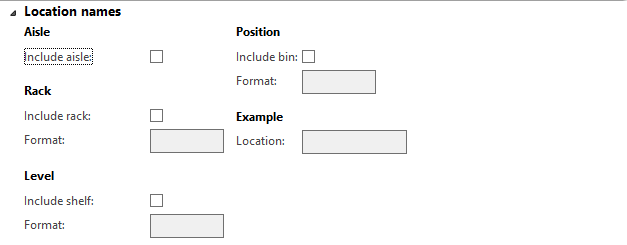

---
# required metadata

title: Fields and Field Groups subpattern
description: This article provides information about the Field and Field Groups form subpattern. This is the most common data entry subpattern. It uses a dynamic number of columns to present multiple fields or groups of fields.
author: jasongre
manager: AnnBe
ms.date: 06/20/2017
ms.topic: article
ms.prod: 
ms.service: dynamics-ax-platform
ms.technology: 

# optional metadata

# ms.search.form: 
# ROBOTS: 
audience: Developer
# ms.devlang: 
ms.reviewer: robinr
ms.search.scope: Operations
# ms.tgt_pltfrm: 
ms.custom: 12384
ms.assetid: f3bf8d00-8e6d-4af7-ab7e-3ff47fce9e21
ms.search.region: Global
# ms.search.industry: 
ms.author: jasongre
ms.search.validFrom: 2016-02-28
ms.dyn365.ops.version: AX 7.0.0

---

# Fields and Field Groups subpattern

[!include[banner](../includes/banner.md)]

This article provides information about the Field and Field Groups form subpattern. This is the most common data entry subpattern. It uses a dynamic number of columns to present multiple fields or groups of fields.

Usage
-----

Field and Field Groups is the most common data entry subpattern and uses a dynamic number of columns to present multiple fields or groups of fields. This subpattern is not used with controls that have dynamic height or width (for example Grid, Tree, RadioButton, ListBox, or ListView), or controls that have larger height or width (for example, Chart). The group controls within this pattern can be used either to group fields under a label or to bind to a table field group.

### Typical contents

-   Groups or Fields as immediate children of the FastTab
-   Groups containing Fields
-   Can contain other subpatterns:
    -   Horizontal fields and button group

## Wireframe

## Pattern changes
Here are the main changes to this pattern since Microsoft Dynamics AX 2012:

-   Removed explicit columns and the use of groups to force fields into two or three (or more) columns.
-   Changed from fixed columns to dynamic columns.

## Model
### High-level structure

- \[Container\] (Columns=Fill)

    - *FieldGroups (Group) \[0..N\]*

        - Fields ($Field) \[1..N\]
        - *ActionableFields (Group) \[0..N\]* mimics the Horizontal Fields and Button Group subpattern

    - *Fields ($Field) \[0..N\]*
    - *ActionableFields (Group) \[0..N\]*

### Core components

-   Apply the FieldsAndFieldGroups subpattern to the container control.
-   Address BP Warnings:
    -   No additional BP checks are required beyond the AX6.3 BP that were checks carried forward.

### Related patterns

-   [Horizontal Fields and Buttons Group](horizontal-fields-buttons-group-subpattern.md)

## UX guidelines
The verification checklist shows the steps for manually verifying that the form complies with UX guidelines. This checklist doesn't include any guidelines that will be enforced automatically through the development environment. Open the form in a browser, and walk through these steps.

-   **Standard form guidelines:**
    -   Standard form guidelines have been consolidated into the [General Form Guidelines](general-form-guidelines.md)document.
-   **Fields and Field Groups guidelines:**
    -   The fields in groups should flow across the entire page. 
    -   When possible, remove unnecessary field group labels.
    -   Verify that you have an understandable grouping for your fields.
    -   Either all fields should be in Groups that have labels, or no Group labels should be shown.

## Examples
Form: **InventLocation (LocationNames)** 

## Resources
### Typically used by patterns

-   [Simple List and Details](simple-list-details-form-pattern.md)
-   [Table of Contents](table-of-contents-form-pattern.md)
-   [Details Master](details-master-form-pattern.md)
-   [Details Transaction](details-transaction-form-pattern.md)

## Appendix
### Frequently asked questions

This section will have answers to frequently asked questions that are related to this guideline/pattern.

### Open issues

-   Tooling must allow explicit use of the HorizontalFieldsButtonsGroup subpattern instead of mimicking content in the pattern definition.

### AX 2012 content

**InventLocation** 
