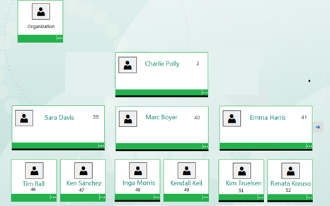
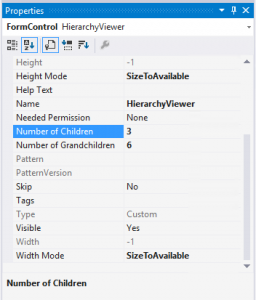

---
# required metadata

title: HierarchyViewer control
description: This article provides information about the HierarchyViewer control, which lets you represent hierarchical relationships for people, products, or organizations.
author: RobinARH
manager: AnnBe
ms.date: 06/20/2017
ms.topic: article
ms.prod: 
ms.service: dynamics-ax-platform
ms.technology: 

# optional metadata

# ms.search.form: 
# ROBOTS: 
audience: Developer
# ms.devlang: 
ms.reviewer: robinr
ms.search.scope: Operations
# ms.tgt_pltfrm: 
ms.custom: 31081
ms.assetid: 09358d27-6edc-420a-a7b6-83785b8ba0c6
ms.search.region: Global
# ms.search.industry: 
ms.author: tlefor
ms.search.validFrom: 2016-02-28
ms.dyn365.ops.version: AX 7.0.0

---

# HierarchyViewer control

[!INCLUDE [banner](../includes/banner.md)]

This article provides information about the HierarchyViewer control, which lets you represent hierarchical relationships for people, products, or organizations.

Overview
--------

The HierarchyViewer control lets you represent hierarchical relationships for people, products, or organizations. It's used primarily as a graphical means to help you understand hierarchical relationships in a traditional top-down manner, and as way to navigate to the entity that is represented by the focused node. The HierarchyViewer control lets you walk through deeply nested, multilevel content in a compact space. The control expands and collapses nodes to control the parts of the tree structure that are shown. Because it's an unbound control, the HierarchyViewer data is managed by an abstraction class and is used primarily as a way to visualize data in a simple tree relationship. For hierarchy data in a traditional tree, there is a standard tree control. 

 

The HierarchyViewer control shows, at most, three levels on a single branch at any time. A breadcrumb trail shows the path of parents down the current tree branch. The top level shows the current top node and will always have one member. This member isn't necessarily the root. The second level, the child node, can have an indefinite number of member nodes. By default, three of these member nodes are shown on each page. The number of member nodes that is shown can be set by using the **Number of children** property. The control will page right and left through the members of the child level. The last level, the grandchild node, can have an indefinite number of member nodes. The number of visible member nodes is controlled by the **Number of Grandchildren** property. The HierarchyViewer control will page up and down through members of the grandchild level. The interactive display of nodes requires no business logic.

## Business logic interaction
The HierarchyViewer control offers data visualization and navigation. The HierarchyViewer control is a read-only control. It can be used to select an entity (employee, product, or organization), and corresponding data can then be managed though other display and input fields on the form, outside the HierarchyViewer control. This is accomplished by a selection event that is raised on each user focus on each node.

    public void init(){
        …    
        // HierarchyViewer is the auto-declared name for the control.
        // handleNodeSelected is your event handler.
        HierarchyViewer.notfiyNodeSelected += eventhandler(element.handleNodeSelected);
    }
    public void handeNodeSelected(int _nodeId)
    {
        // do something
    }

## Authoring a HierarchyViewer instance
To create a HierarchyViewer instance:

1.  In the form designer, add an instance of HierarchyViewer to your form.
2.  In the **Properties** pane, accept the default number of visible children and grandchildren, or set new values. 

The HierarchyViewer control is primarily a visually interactive way of navigating or interrogating nodes in a static manner. The HierarchyViewer control isn't bound to a data source. Instead, the control is managed by a corresponding controller class that extends the base **HierarcyDesignerBase**. You initialize that class with data, and bind to the control instance and the visible fields of the HierarchyViewer node.

A typical use of the control is to initialize a server-side “in-memory” map of the hierarchy and then dynamically update the control as the user interactively explores the hierarchy by using load-on-demand semantics.

    public void init()
    {
        HcmPositionNode node;
        nodeMap = new Map(Types::Int64, Types::Class);
        hierarchyMap = new Map(Types::Int64, Types::Int64);
        firstNodeId = 0;
        // Initialize the organization node
        node = HcmPositionNode::newParameters(this.getNextNodeId(), HcmPositionNodeType::Enterprise, -1, 0, "@SYS317690", "");
        rootNode = node;
        if (selectedNode == null)
        {
            selectedNode = rootNode;
        }
        this.insertNewNodeAndUpdateParent(node);
    }

Override the **applyBuild** method of the control. This is where you will pass the instance of your controller class.

    public void applyBuild()
    {
        super();
        YourControllerClass controller = new YourControllerClass();
        this.initControl(controller);
    }

You don’t have to populate the whole node structure. Instead, you can populate nodes on demand.

    public void initHcmPositionFromCurrentNode(HcmPosition _hcmPosition)
    protected void insertNewNodeAndLoadDescendants(HcmPositionNode _node, int _depth, HcmPositionNode _parentNode = null, Common _common = null)
    protected void loadNodeDescendants(HcmPositionNode _node, int _depth, Common _common = null)

## Changing node visuals
You can't change node visuals. The intended design is for the control to offer a set of unbound controls that have a default layout that you can manipulate by using an **ExtendedStyle** property to offer a predefined set of alternatives that the author can select.

