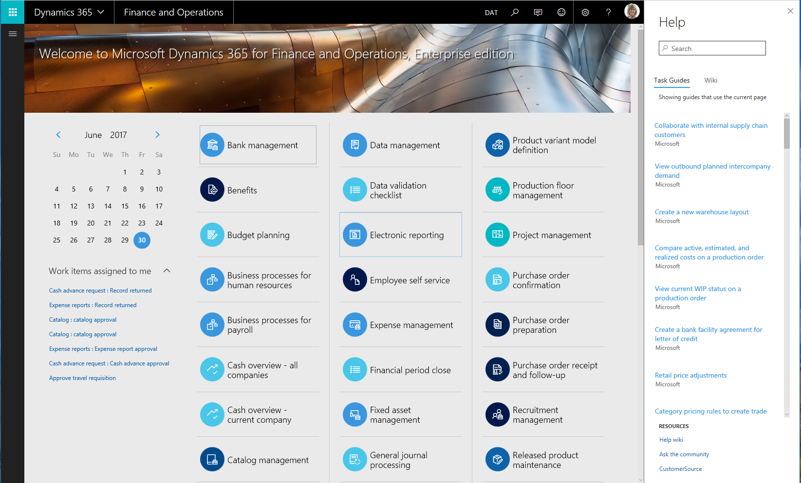
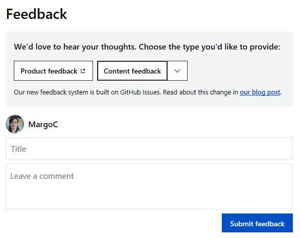
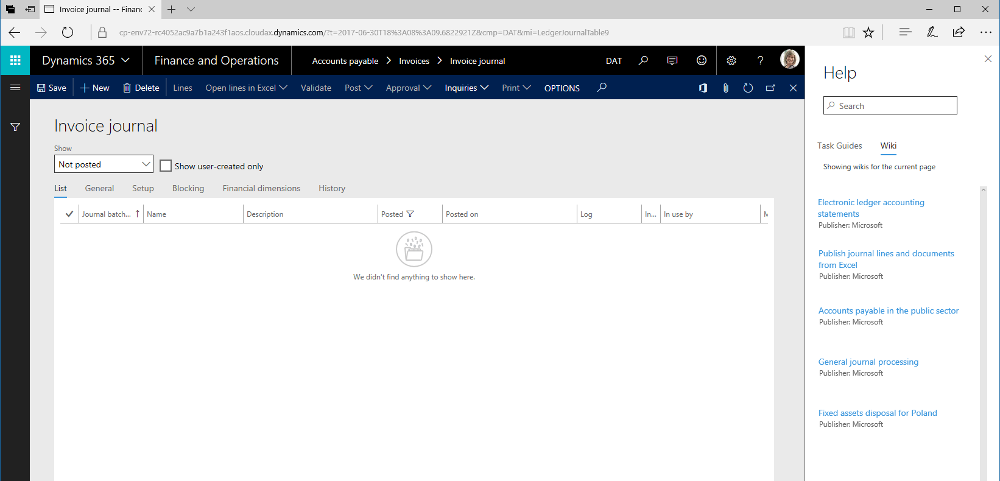

---
# required metadata

title: Finance and Operations Help system
description: This topic provides an overview of the components of the Microsoft Dynamics 365 for Finance and Operations Help system.
author: margoc
manager: AnnBe
ms.date: 11/13/2018
ms.topic: article
ms.prod: 
ms.service: dynamics-ax-platform
ms.technology: 

# optional metadata

ms.search.form: SystemParameters
# ROBOTS: 
audience: Application User, Developer, IT Pro
# ms.devlang: 
ms.reviewer: margoc
ms.search.scope: Core, Operations
# ms.tgt_pltfrm: 
ms.custom: 16381
ms.assetid: 018c148c-9cbd-41e0-8186-d75dbf66288f
ms.search.region: Global
# ms.search.industry: 
ms.author: margoc
ms.search.validFrom: 2016-02-28
ms.dyn365.ops.version: AX 7.0.0

---

# Finance and Operations Help system

[!include [banner](../includes/banner.md)]

This topic provides an overview of the components of the Microsoft Dynamics 365 for Finance and Operations Help system. 

> [!NOTE] 
> The following products are closely related: Dynamics 365 for Finance and Operations; Dynamics 365 for Retail; and Dynamics 365 for Talent. The same functionality may appear in all 3 products. As a result, in topics that are primarily related to Retail, the product name will be Dynamics 365 for Retail; in topics that are primarily related to Talent, the product name will be Dynamics 365 for Talent; and in topics that are related to the core product, the product name will be Dynamics 365 for Finance and Operations. Topics that are written for one product may apply to the same functionality in a related product.

The Help system is shared by the following products:
- Dynamics 365 for Finance and Operations
- Dynamics 365 for Retail
- Dynamics 365 for Talent

Finance and Operations includes a Help system that is based on two main components:

-   A documentation site
-   Task guides

You can access help from the Help pane in whichever product you are using. The following screenshot shows Finance and Operations.

> [!IMPORTANT]
> **Task guides** are not currently available for Retail, or in the Help pane for Talent (a few task guides are available in the Getting Started pane for Talent). Procedural help is available on the docs.microsoft.com site ([docs.microsoft.com/dynamics365/unified-operations](../../index.md)) for both Retail and Talent.

## Help on docs.microsoft.com

The docs.microsoft.com site ([docs.microsoft.com/dynamics365/unified-operations](../../index.md)) is the primary source of product documentation for Finance and Operations. The site offers the following features:

-   **Access to the most up-to-date content** – The site gives us a faster and more flexible way to create, deliver, and update product documentation. Therefore, it helps to ensure that you have access to the latest technical information.
-   **Content that is written by experts** – The site provides a richer set of product documentation that can be enhanced by community members both inside and outside Microsoft.
-   **Access to different types of content** – The site lets you quickly access different types of content about Finance and Operations, such as task guides, videos, and topics.
-   **Content that supports your business processes** – The site includes business process–focused content that takes advantage of the Business Process Modeler (BPM) in Microsoft Dynamics Lifecycle Services (LCS).

### Searching on docs.microsoft.com
We get a lot of questions about how to search for our content. On our site, if you start from a page about Finance and Operations, we scope your search to just be for Finance and Operations content. You can remove the scoping by clicking the X next to Unified Operations in the search box. 

You can also find our content with any search engine. We recommend that for best results, you use a site search, such as 
site:docs.microsoft.com dynamics 365 "search term".  

### The docs.microsoft.com table of contents
Finance and Operations and Retail all share a single table of contents on the docs site, which enables customers to see the context of the topic they are in. It also enables you to use the Filter control above the table of contents to find topics that you are looking for. 

You can get help on other Dynamics 365 products by searching for them, or by clicking Dynamics 365 in the site breadcrumb to get to our hub page. 

### Use an RSS feed
To subscribe to an RSS feed of all updates to the Unified Operations content, use the following link from a browser that supports RSS feeds, such as Internet Explorer, or an RSS feed manager: 

[RSS feed](https://docs.microsoft.com/api/search/rss?locale=en-us&$filter=scopes%2Fany(t%3A%20t%20eq%20%27Unified%20Operations%27))

### Give feedback 
We really like customer feedback. You can either comment or suggest changes to our content through GitHub. For more information about our feedback system, see [this blog post](https://docs.microsoft.com/teamblog/a-new-feedback-system-is-coming-to-docs).

#### Leave us feedback 
If you have feedback or questions about a topic, leave us a comment at the bottom of the page.  

1. Click **Feedback** to get to the comments at the bottom of the page, and then click either **Product feedback**, or **Sign in to give documentation feedback**.

2. Start typing your comments, and then click **Submit feedback**.

##### Suggest a change or contribute content through GitHub
To suggest a change, you'll need to have a GitHub account, and sign a Contributor License Agreement.  After you submit a pull request, we'll review your proposed changes. If necessary, we'll discuss them internally, and then get back to you.  

To get started, click the **Edit** (pencil) button on a topic, or go to our repo at https://github.com/MicrosoftDocs/dynamics-365-unified-operations-public. 

For more information, please refer to our contributor's guide: https://github.com/MicrosoftDocs/dynamics-365-unified-operations-public/blob/live/CONTRIBUTING.md. 

> [!NOTE]
> We only accept contributions to our English content set at this time.  

## Task guides
A Task guide is a controlled, guided, interactive experience that leads you through the steps of a task, or business process. You can open (play) a Task guide from the Help pane. When you first click a Task guide, the Help pane will show the step-by-step instructions for the task. Localized Task guides are now available. 

Microsoft shipped task guide libraries for releases through December 2017 for Finance and Operations. The section [Accessing Task guides from the Help pane](help-overview.md#accessing-task-guides-from-the-help-pane) describes how to find the correct task guides for your product. 

To begin the guided, interactive experience, click **Start task guide** at the bottom of the Help pane. A black pointer opens and indicates the action that you must perform. Follow the directions that appear in the UI, and enter data as directed. 

> [!IMPORTANT] 
> The data that you enter when you play a task guide is real. If you're in a production environment, the data will be entered in the company that you’re currently using.

You can use Task recorder to create your own custom task guides. For more information, see [Create documentation or training by using task recordings](../dev-itpro/user-interface/task-recorder-training-docs.md).

## In-product Help
To access Help content within Finance and Operations, either click the **Help** (**?**) icon and then choose Help or press Ctrl+Shift+?. In both cases, the Help pane opens. From the Help pane, you can access articles or task guides. 

### Accessing help topics from the Help pane

From the Help pane, you can access articles that apply to the Finance and Operations client. When you first open the Help pane and click the **Help** tab, you’ll see the articles that apply to the page that you’re currently on in Finance and Operations. If no articles are found, you can enter keywords to refine your search. When you click an article in the Help pane, a new tab opens in your browser and displays the article. 

> [!IMPORTANT]
> This section does not apply to Dynamics 365 for Talent. The Help system for Talent is automatically connected to Task guides for the product. Also, you cannot create custom Task guides for Talent. 

### Accessing Task guides from the Help pane

Before you can access Task guides from the Help pane, a System administrator has to go to the **System parameters** page in Finance and Operations and configure some settings. 

> [!NOTE]
> -   In order to configure help, you must be signed in with an account in the same tenant as the tenant in which Finance and Operations is deployed.
> -   It is not possible to connect to an LCS library from an instance of Finance and Operations running in a local virtual hard drive (VHD).

On the **System parameters** page, follow these steps:

1.  **Important:** The first time that you open the Help tab, you must connect to Lifecycle Services. Be sure to click the link in the middle of the form, wait for the connection, close the dialog box, and then click **OK** to get to the parameters form.

2.  Select the Lifecycle Services project to connect to.
3.  Select BPM libraries (within the selected project) to retrieve task recordings from.
    - For Finance and Operations, for Microsoft content, select the February 2017 QPC Unified Library for Microsoft Dynamics 365 for Finance and Operations. 
    - For Retail, we will be releasing a library in July. 
    - You do not need to select a library for Talent—the connection to the correct library is established for you. 

4.  Set the display order of the BPM libraries. This determines the order in which task recordings from the libraries will appear in the Help pane.

After a System administrator has completed these steps, you can open the Help pane and click the **Task guides** tab. You'll now see the Task guides that apply to the page that you’re currently on in Finance and Operations. If no Task guides are found, you can enter keywords to refine your search. After you click a Task guide in the Help pane, the Help pane shows the step-by-step instructions, and you can play the task guide. 

### Where are the translated Task guides for Microsoft libraries?

Translated Task guides are released in libraries with "All languages" in the title. In Finance and Operations, to see localized Task guide help, make sure that you are connected to an appropriate library. The language that a Task guide appears in is controlled for each user by the Language settings under **Options** &gt; **Preferences**. 
-   If a Task guide has been translated, when you open that Task guide all the text of the Task guide will appear in your selected language.
-   If a Task guide has not yet been translated, when you open it, only some of the text (the text of the controls) will appear in your selected language.

## Creating custom help
You can create help for your users by creating custom task guides, or connect your own website to the Help pane. For details, see: 
- [How to create a task recording to use as documentation or training](../../dev-itpro/user-interface/task-recorder.md).
- [Create Custom Help for Finance and Operations (white paper)](https://go.microsoft.com/fwlink/?linkid=2041185)

## Additional resources

- [Finance and Operations help system (downloadable fact sheet)](https://mbs.microsoft.com/customersource/global/AX/learning/fact-sheets/msdaxhelpsystemfactsheet)
- [Task Recorder](../../dev-itpro/user-interface/task-recorder.md)
- [Create documentation or training using Task recordings](../../dev-itpro/user-interface/task-recorder.md)

The following table lists our websites. Sites that have an asterisk (\*) next to the name require that you sign in by using an account that is associated with a service plan.

| Site                                                                     | Description                                                                                                                                                                                                                                |
|--------------------------------------------------------------------------|--------------------------------------------------------------------------------------------------------------------------------------------------------------------------------------------------------------------------------------------|
| [Docs.microsoft.com](/dynamics365/) | Hosts or links to all product documentation for Dynamics 365.                                                                                                                                                               |
| [Microsoft Learn](https://docs.microsoft.com/learn/) | Microsoft's free eLearning site.                                                                                                                                                               |
| [Lifecycle Services](https://lcs.dynamics.com/en/)\*                      | Provides a cloud-based collaborative workspace that customers and partners can use to manage Dynamics 365 for Finance and Operations projects from pre-sales to implementation and operations. This site is useful in all phases of an implementation. |
| [Support blog](http://aka.ms/AXSupportBlog)                              | Provides tips and tricks that are posted by the Dynamics 365 for Finance and Operations Support team.                                                                                                                                                  |
| [Docs.microsoft.com/previous versions](https://docs.microsoft.com/en-us/previous-versions/dynamics/)                                             | Hosts content from previous releases.                                                                                                                                                                       |
| [Dynamics Community](https://community.dynamics.com/)                  | Hosts blogs, forums, and videos.                                                                                                                                                                                                           |
| [Microsoft.com/dynamics365/](https://www.microsoft.com/en-us/dynamics365/home)                 | Provides evaluation and sales information.                                                                                                                                                                                                 |
| [CustomerSource](https://mbs.microsoft.com/customersource/)\*                      | Hosts some training resources for Finance and Operations,  downloadable reports and white papers, and is the primary support site for service plan holders. May require a service plan to access some resources on the site.     |

