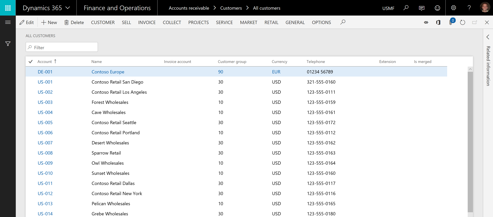
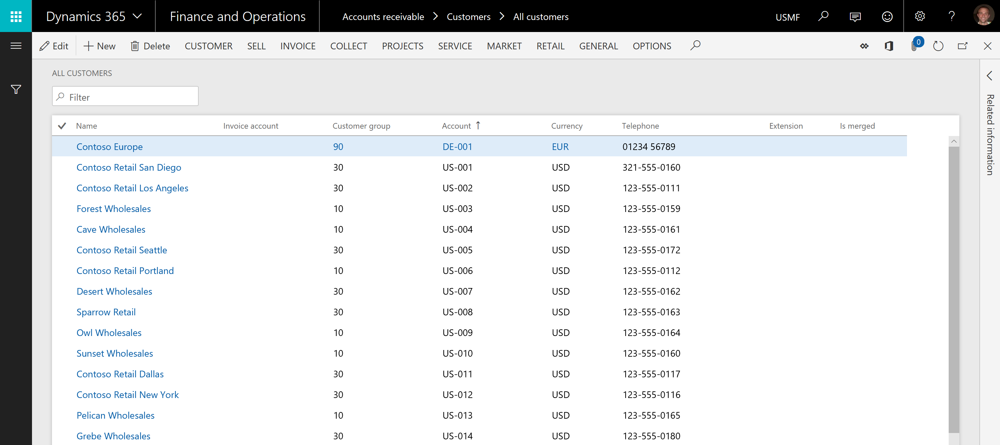
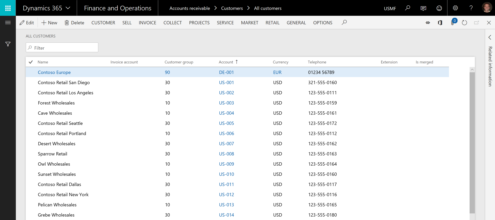

---
# required metadata

title: What's new or changed in Dynamics 365 for Finance and Operations platform update 21 (October 2018)
description: This topic describes features that are either new or changed in Dynamics 365 for Finance and Operation platform update 21. This version was released in October 2018.
author: tonyafehr
manager: AnnBe
ms.date: 10/09/2018
ms.topic: article
ms.prod: 
ms.service: dynamics-ax-platform
ms.technology: 

# optional metadata

# ms.search.form: 
# ROBOTS: 
audience: Developer, IT Pro
# ms.devlang: 
ms.reviewer: tfehr
ms.search.scope:  Operations
# ms.tgt_pltfrm: 
ms.custom: 
ms.assetid: a765a61c-52a3-47c5-b579-68b9249c592b
ms.search.region: Global
# ms.search.industry: 
ms.author: tfehr
ms.search.validFrom: 2017-09-30 
ms.dyn365.ops.version: Platform 21

---
# What's new or changed in Dynamics 365 for Finance and Operations platform update 21 (October 2018)

[!include [banner](../includes/banner.md)]

This topic describes features that are either new or changed in Dynamics 365 for Finance and Operations platform update 21. This version was released in October 2018 and has a build number of 7.0.5073.

## Dynamics 365 October '18 release notes
Wondering about upcoming and recently released capabilities in any of our business apps or platform? 

[Check out the October '18 release notes](https://go.microsoft.com/fwlink/?linkid=870424). We've captured all the details, end to end, top to bottom, in a single document that you can use for planning. 

## Bug fixes
For information about the bug fixes included in each of the updates that are part of Platform update 21, sign in to Lifecycle Services (LCS) and view the KB article.

## Extensibility enhancements

The release notes contain information about [the second wave of platform extensibility enhancements for the October 2018 release](/BusinessApplication-ReleaseNotes/October18/dynamics365-finance-operations/platform-extensibility2) which are coming with Platform update 21. There are eleven enhancements detailed with one of the highlights being the new ability to put the next call inside a chain of command method within a try-finally block to facilitate standard exception handling.

## TransientSqlConnectionError X++ exception
During an X++ SQL query execution, when a transient SQL connection error occurs on the server side, a TransientSqlConnectionError X++ exception will occur. Depending on the application requirements, the application should catch and handle the exception.

This exception usually occurs during a large transaction or when the database is under a lot of processing pressure.

The TransientSqlConnectionError exception is not catchable within the transaction. The X++ transaction that encounters this exception is canceled (calling **ttsAbort**) before the exception occurs. This means that you need to use the catch block to identify the transient SQL connection error instead of a generic X++ error exception, and then retry the outermost transaction or retry application code logic in a new session. This exception allows the application to be designed for transient server failures.

If an application transaction takes a long time to process, you can use multiple incremental delays to catch the TransientSqlConnectionError exception. Retrying your application code in a new session is most likely to succeed after you have caught the exception.

For more information, see [SQL connection error X++ exception](../../dev-itpro/dev-ref/sql-connection-error.md).

## Sticky default actions in grids
Many grids in Finance and Operations have a defined *default action*. This is a single column in the grid where the value in every row always appears as a hyperlink, as opposed to other columns where only the value in the active row appears as a hyperlink. This default action always appears on the first textual column in a grid before any user personalization is applied. For example, consider the **Account** column in the **Customer** list below.

The **sticky default action** feature, which is available starting in Platform update 21, controls where the default action column appears in the grid after personalizations that change the order or visibility of columns are applied.   

With sticky default actions off, which corresponds to how default actions work prior to Platform update 21, the default action hyperlink would change to whatever column is the first textual column after personalizations are applied. For example, if you move the **Account** column to be fourth column in the grid (or alternatively if you hide the **Account** column), the hyperlink representing the default action moves to the **Name** column. 

With sticky default actions on, the default action hyperlink will be on the same column regardless of any personalizations applied to the form. This means that for this customer list, the **Account** column will continue to be the default action column regardless of whether the **Account** column is moved or hidden.

With Platform update 21, the sticky default action feature is off, but a system administrator can turn it on for an environment. To turn on this feature, go to the **Client performance options** page under **System administration** and find the **Enable sticky default action** option.  
